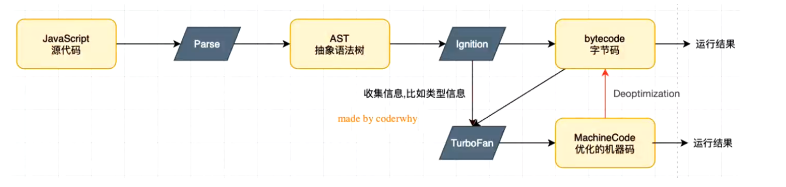
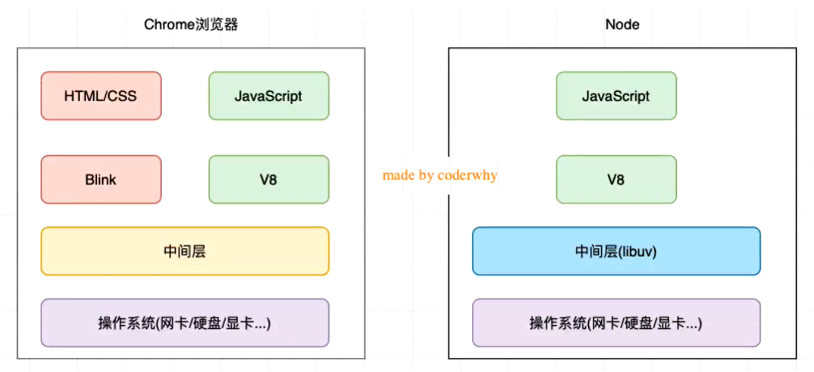
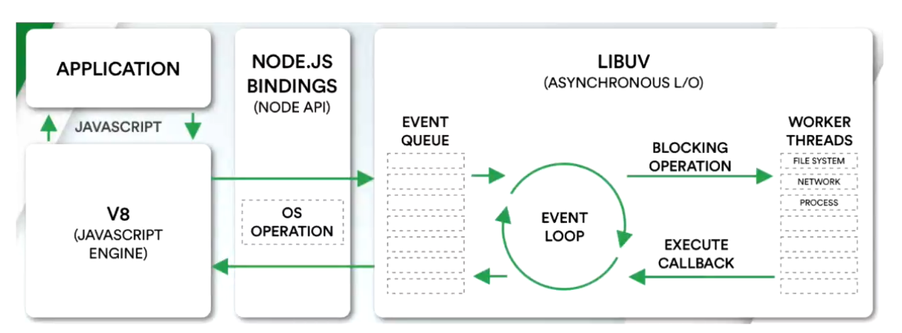

# 邂逅 NodeJS

## 目录

- [邂逅 NodeJS](#邂逅-nodejs)
  - [目录](#目录)
  - [JS 引擎解析流程](#js-引擎解析流程)
  - [V8 引擎原理](#v8-引擎原理)
  - [Chrome 浏览器和 NodeJS 架构区别](#chrome-浏览器和-nodejs-架构区别)
  - [NodeJS 详细架构](#nodejs-详细架构)

## JS 引擎解析流程

## V8 引擎原理

## Chrome 浏览器和 NodeJS 架构区别

## NodeJS 详细架构

