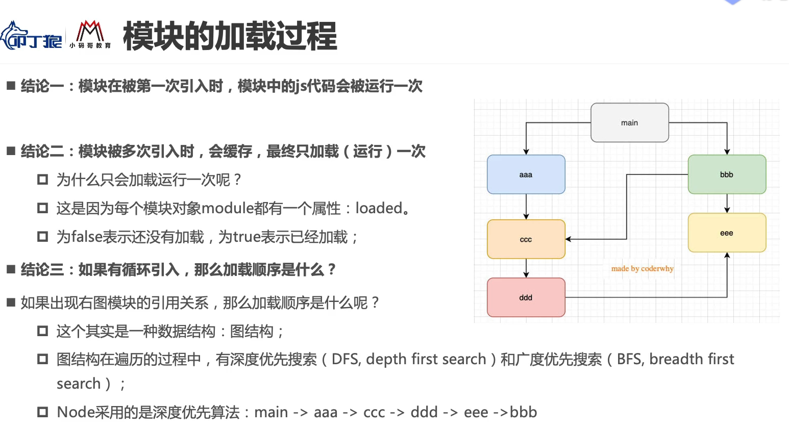
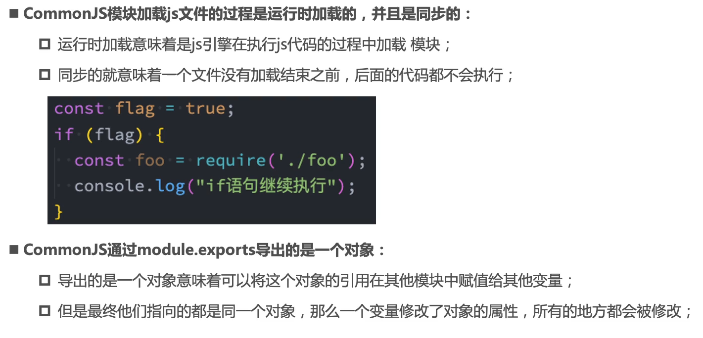

# 模块化开发和原理解析

## 目录

- [模块化开发和原理解析](#模块化开发和原理解析)
  - [目录](#目录)
  - [模块加载解析](#模块加载解析)
  - [源码阅读](#源码阅读)
    - [Module 类的定义](#module-类的定义)
    - [require 函数的实现](#require-函数的实现)
  - [认识 ES Module](#认识-es-module)
    - [与 CommonJS 的不同之处](#与-commonjs-的不同之处)
    - [浏览器 ESM 开发的报错](#浏览器-esm-开发的报错)
    - [import() 函数](#import-函数)
  - [CommonJS 加载过程](#commonjs-加载过程)
  - [ES Module 加载过程](#es-module-加载过程)

## 模块加载解析

## 源码阅读

### Module 类的定义

### require 函数的实现

## 认识 ES Module

### 与 CommonJS 的不同之处

- ESM 使用了 import 和 export 关键字
  - 注意是关键字，而不是 require 函数或 exports 对象
  - 代码在执行时，需要 JS 引擎针对**关键字**进行一次解析
- 采用了编译期的静态分析，并且也加入了动态引用的方式
- 采用 ESM 将自动使用严格模式 use strict

### 浏览器 ESM 开发的报错

### import() 函数

当通过 import 关键字加载模块时，不可以将其放置在逻辑代码中，否则会在 JS 引擎解析代码期间报**语法错误**。

这时一方面可以使用 CJS require() 函数，函数在代码运行时可以执行。

推荐使用 ESM import() 函数，返回 promise 对象。

## CommonJS 加载过程

## ES Module 加载过程

