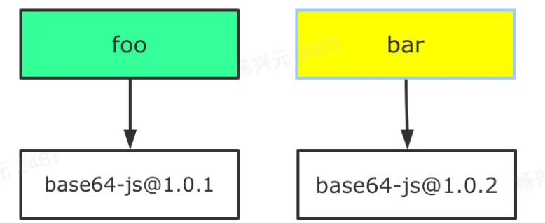
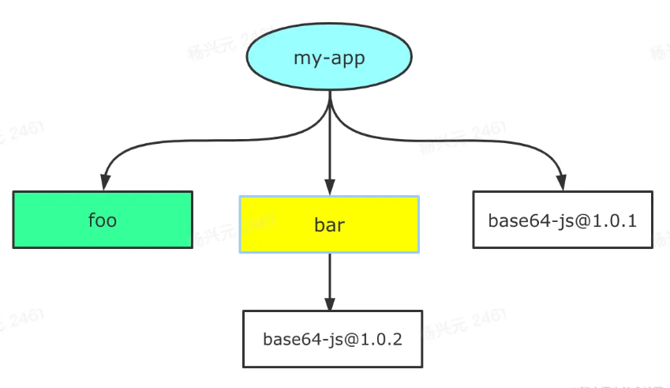
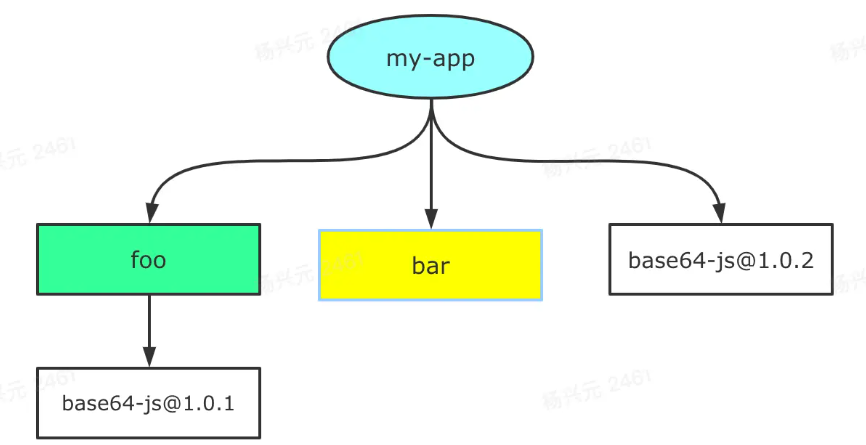

# 包管理工具深入解析

## 目录

- [包管理工具深入解析](#包管理工具深入解析)
  - [目录](#目录)
  - [package.json](#packagejson)
    - [属性解析](#属性解析)
    - [版本管理](#版本管理)
  - [npm install 执行流程](#npm-install-执行流程)
    - [npm install 携带参数](#npm-install-携带参数)
    - [扁平化依赖](#扁平化依赖)
    - [扁平化依赖 带来的 不确定性](#扁平化依赖-带来的-不确定性)
  - [查看本地 npm 缓存](#查看本地-npm-缓存)
  - [查看 npm 下载源或修改](#查看-npm-下载源或修改)
  - [npm 其他命令](#npm-其他命令)
  - [其他工具补充](#其他工具补充)

## package.json

### 属性解析

- name（必填）
  - 项目名称
- version（必填）
  - 项目的版本号
- description
  - 描述信息，（可以作为项目的基本描述）
- author
  - 作者相关信息
- license
  - 开源协议
- private
  - 当前项目是否私有
  - 属性值为 true，则 npm 不能将其发布
- main
  - 属性值为项目的入口文件
- dependencies
  - 指定开发环境和生产环境需要依赖的包
- devDependencies
  - 指定只在开发环境需要的包
- engines
  - 用于指定 Node 和 npm 的版本号
  - 也可以指定操作系统
- browserslist
  - 用于配置打包后的 JS 浏览器的兼容情况
  - 否则需要手动添加 polyfill 用于支持某些语法

### 版本管理

- 依赖中的包版本遵从 semver 版本规范
- 版本格式
  - 主版本号.次版本号.修订号
- 主版本号
  - 做了不兼容的 API 修改
- 次版本号
  - 做了向下兼容的功能性新增
- 修订号
  - 做了向下兼容的问题修正
- 先行版本号及版本编译信息可以加到“主版本号.次版本号.修订号”的后面，作为延申
- 符号含义
  - ^x.y.z
    - 表示 x 保持不变，y 和 z 永远安装最新版本
  - ~x.y.z
    - 表示 x 和 y 保持不变，z 永远安装最新版本

## npm install 执行流程


- npm install（检测是否有 package-lock.json 文件）
  - 没有 package-lock.json 文件
    1. 分析依赖关系
    2. 从 registry 仓库下载压缩包，（或从镜像源仓库）
    3. 获取到压缩包后对压缩包进行缓存（该流程从 npm5 开始）
    4. 将压缩包解压到项目的 node_module 文件夹中
  - 有 package-lock.json 文件
    1. 检测 package-lock.json 中包的版本是否符合 package.json 的版本要求（按照 semver 版本规范检测）
       - 若不一致，则重新构建依赖关系，然后走顶层流程
       - 若一致，则进行下一步
    2. 查找缓存
       - 若没有找到，从 registry 仓库下载，直接走顶层流程
       - 若查找到，则进行下一步
    3. 获取缓存中的压缩文件，并将其解压到 node_modules 文件夹中

### npm install 携带参数

- -P, --save-prod: Package will appear in your dependencies. This is the default unless -D or -O are present.
- -D, --save-dev: Package will appear in your devDependencies.
- -O, --save-optional: Package will appear in your optionalDependencies.
- --no-save: Prevents saving to dependencies.

When using any of the above options to save dependencies to your package.json, there are two additional, optional flags:

- -E, --save-exact: Saved dependencies will be configured with an exact version rather than using npm's default semver range operator.
- -B, --save-bundle: Saved dependencies will also be added to your bundleDependencies list.

Further, if you have an npm-shrinkwrap.json or package-lock.json then it will be updated as well.

### 扁平化依赖

npm1、npm2 在本地 node_modules 内部呈现嵌套结构

```javascript
node_modules
└─ foo
   ├─ index.js
   ├─ package.json
   └─ node_modules
      └─ bar
         ├─ index.js
         └─ package.json
```

缺点：

1. 依赖层级过深，会导致文件路径过长，尤其在 windows 系统下更甚
2. 大量重复的包被安装，导致 node_modules 文件体积过大
3. 模块实例不能共享
   - 比如，React 有一些内部变量，在两个不同包引入的 React 不是同一模块实例，因此无法共享内部变量

npm3、yarn 通过**扁平化依赖**的方式解决上述问题，扁平化依赖的目录结构如下：

```javascript
node_modules
├─ foo
|  ├─ index.js
|  └─ package.json
└─ bar
   ├─ index.js
   └─ package.json
```

所有的依赖在 node_modules 目录下，不再有很深层次的嵌套关系。在安装新的依赖时，根据 node require 机制，会不停向上级的 node_modules 寻找，如果找到相同版本的依赖包就不会重复安装，解决了大量包重复安装的问题，而且依赖层级也不会太深。

新的问题

1. 依赖结构的**不确定性**
2. 扁平化算法本身的**复杂度**很高，耗时较长
3. 项目中仍然可以**非法访问**没有声明过依赖的包

### 扁平化依赖 带来的 不确定性

假设现在项目依赖两个包 foo、bar，这两个包的依赖如下图所示



那么 npm/yarn install 之后，再经过扁平化处理，得出的目录一样结构是怎样的？

扁平化处理结果-01



扁平化处理结果-02



答案：都有可能，具体取决于 foo 和 bar 在 package.json 中的位置，如果 foo 的依赖声明位于 bar 之前，那么就是扁平化处理结果-01，反之则为扁平化处理结果-02。

而上述问题，也是创造 lock 文件的原因，无论是 package-lock.json(npm 5.x) 还是 yarn.lock，都是为了保证 install 之后产生确定的 node_modules 结构。

当然，npm、yarn 本身仍然存在 扁平化算法复杂 和 package 非法访问的问题，影响性能和安全。

此处推荐 **pnpm 管理工具**，详情见[关于现代包管理器的深度思考——为什么现在我更推荐 pnpm 而不是 npm/yarn?](https://juejin.cn/post/6932046455733485575#heading-2)

## 查看本地 npm 缓存

```shell
npm config get cache
```

然后根据文件路径去查找

## 查看 npm 下载源或修改

```shell
npm config get registry // 获取源
npm config set registry url // 修改源
```

## npm 其他命令

- npm rebuild
  - 强制重新 build
- npm cache clean
  - 清除缓存

## 其他工具补充

- yarn
- cnpm
- npx
  - 常用它来调用项目中的某个模块的指令
  - This command allows you to run an arbitrary command from an npm package (either one installed locally, or fetched remotely), in a similar context as running it via npm run.
