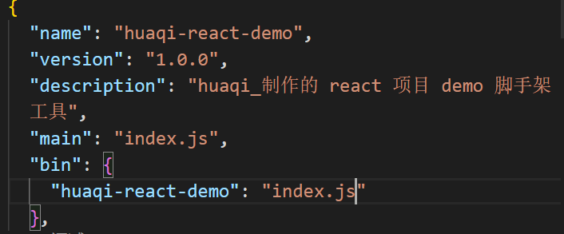

# 脚手架工具实现

## 目录

- [脚手架工具实现](#脚手架工具实现)
  - [目录](#目录)
  - [Shebang](#shebang)
  - [package.json 的 bin 属性](#packagejson-的-bin-属性)
    - [npm link](#npm-link)
  - [内置库使用](#内置库使用)
    - [spawn 的跨平台设置](#spawn-的跨平台设置)
  - [辅助工具库](#辅助工具库)

## Shebang

```shell
#!

寻找到该文件时，即执行 node 命令
#!/usr/bin/env node

```

Shebang（也称 Hashbang）,由 # 和 ！构成的字符序列，其出现在文本文件的第一行的前两个字符。

在文件中存在 Shebang 的情况下，类 Unix 操作系统的程序加载器会分析 Shebang 后的内容，将这些内容作为解释器指令，并调用该指令，并将载有 Shebang 的文件路径作为该解释器的参数。

## package.json 的 bin 属性



此时通过 **npm link**  命令可将全局 npm 命令 /usr/local/bin/huaqi-react-demo 与当前文件夹的 index 文件联系起来。

综上，在 cmd 中键入 huaqi-react-demo，则会寻找到当前文件夹中的 index.js。由于该文件已经配置了 Shabang，会自动执行 node ，相当于 node index.js。

### npm link

First, npm link in a package folder will create a symlink in the global folder {prefix}/lib/node_modules/\<package> that links to the package where the npm link command was executed. It will also link any bins in the package to {prefix}/bin/{name}. Note that npm link uses the global prefix (see npm prefix -g for its value).

Next, in some other location, npm link package-name will create a symbolic link from globally-installed package-name to node_modules/ of the current folder.

## 内置库使用

- child_process/spawn
  - 子进程相关
  - 用于输出 clone 模板时的信息
- util/promisify
  - 回调函数转 Promise 格式
  - 用于流程化 clone 项目

### spawn 的跨平台设置

在 windows 系统，当执行 npm 相关命令时，实际执行的是 npm.cmd 批处理，而在 windows 上，.cmd、bat 批处理是无法脱离 cmd.exe 这一解释器而单独运行的。

因此，可以显式地调用 cmd

```javascript
spawn('cmd', ['/c', 'npm'], {
  stdio: "inhert"
})
```

或者在调用 spawn 函数时，设置 option shell 属性为 true ，隐式地调用 cmd。（NodeJS V6 版本引入）

```javascript
spawn("npm", {
  stdio: "inhert",
  shell: true
})
```

另外，虽然 Linux、macOS 等系统上不需要设置 shell 选项，命令也能够正常运行；调用 cmd 也不会妨碍命令的执行，只是会额外产生一个本不必要的 shell 进程，影响性能；

因此，如果想要编写跨平台的 spawn 命令，而又不想增加额外的开销，可以使用如下代码

```javascript
const process = require("process");
const { spawn } = require("child_process");

spawn("npm", {
  stdio: "inhert",
  shell: process.platform === "win32" // 仅在当前运行环境为 windows 时，才使用 shell
})

```

如果想要兼容 NodeJS V6 一下版本，可以使用第三方模块 cross-spawn

使用该模块，可以在调用 spawn 函数时，自动根据当前的运行平台，决定是否生成一个 shell 来执行所给的命令

- 支持低于 V6 的 NodeJS 版本
- 跨平台支持 shebang
- 对命令和参数种的字符进行转义更为方便

安装

```shell
npm install cross-spawn
```

使用

```javascript
const spawn = require("cross-spawn");

spawn("npm", {
  stdio: "inherit"
})
```

## 辅助工具库

- [命令行工具库 commander.js](https://github.com/tj/commander.js)
- [github 下载库 download-git-repo](https://www.npmjs.com/package/download-git-repo)
- [打开浏览器库 open](https://www.npmjs.com/package/open)
- [编译模板库 ejs](https://www.npmjs.com/package/ejs)
