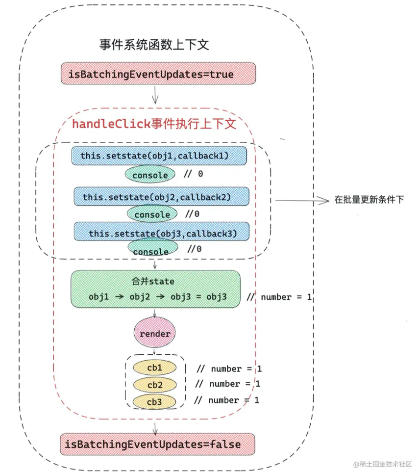

# 玄学 state

## 目录

- [玄学 state](#玄学-state)
  - [目录](#目录)
  - [一个问题 state 到底是同步还是异步？](#一个问题-state-到底是同步还是异步)
    - [React 的三种模式](#react-的三种模式)
  - [类组件的 state](#类组件的-state)
    - [setState 用法](#setstate-用法)
      - [基本用法](#基本用法)
    - [类组件如何限制 state 更新视图](#类组件如何限制-state-更新视图)
    - [setState 原理揭秘](#setstate-原理揭秘)
      - [React 的 batchUpdate 批量更新何时加入？](#react-的-batchupdate-批量更新何时加入)

## 一个问题 state 到底是同步还是异步？

鉴于 batchUpdate 批量更新概念，可以认为 state 是异步的，但是**不属于微任务、宏任务**，它的执行时期在所有同步任务之后，在所有微任务之前。

React 中的批处理简单来说就是将多个状态更新合并为一次重新渲染，以获得更好的性能，React 只能在组件的声明周期函数或者合成事件函数中进行批处理。

默认情况下，React 不会对 Promise、setTimeout 以及原生事件进行批处理。

**注**：上述解释仅适用于 React V17 及之前的版本。React V18 对所有的状态更新会自动进行批处理。

### React 的三种模式

- legacy
  - 平时使用的基本都是 legacy 模式下的 React
- blocking
  - 可以认为是 concurrent 的优雅降级版本和过渡版本
- concurrent
  - React V18 将 concurrent 模式作为默认版本，该模式下会开启一些新功能
  - 在 concurrent 模式下，会采用不同的 State 更新逻辑

**注**：本文还是围绕 legacy 模式下的 state。

## 类组件的 state

### setState 用法

React 项目中 state 的改变会引起 UI 的变化，类组件中的 setState 方法是控制组件更新、视图渲染的主要方式。

#### 基本用法

setState(obj, callback);

- obj
  - 对象类型，则为即将合并的 state
  - 函数类型，当前组件的 state 和 props 将作为参数，返回值用于合并新的 state
- callback 函数
  - 该函数的执行上下文中可以获取当前 setState 更新后的最新的 state 的值
  - 可以作为依赖 state 变化的副作用函数
  - 可以用于做一些基于 DOM 的操作

```javascript
// 第一个参数为 function 类型
this.setState((state, props) => {
  return { number: 1 };
})
// 第一个参数为 object 类型
this.setState({ number: 1 }, () => {
  // 获取最新的 number
  console.log(this.state.number);
})
```

如果一次事件中触发了一次 setState，React 底层主要做了哪些事？

1. setState 会产生当前更新的优先级
   - 老版本使用 expirationTime
   - 新版本使用 lane
2. React 从 fiber Root 根部 fiber 向下调和子节点
   - 调和阶段将对比发生更新的地方，
     1. 对比 expirationTime，找到发生更新的组件
     2. 合并 state
     3. 触发 render 函数
     4. 得到新的 UI 图层
     5. 完成 render 阶段
3. commit 阶段
   - 替换真实 DOM，完成此次更新流程
   - 执行 setState 中的 callback 函数，如上的 *() => {console.log(this.state.number) }*，到此真正完成了一次 setState 全过程

上述流程图示:


### 类组件如何限制 state 更新视图

1. pureComponent 可以对 state 和 props 进行**浅比较**
   - 如果没有发生变化，组件不更新
2. shouldComponentUpdate 生命周期可以通过判断前后 state 变化来决定组件是否更新
   1. 需要更新，返回 true
   2. 不需要更新，返回 false

### setState 原理揭秘

类组件初始化过程中，绑定了负责更新的 Updater 对象。调用 setState 方法，在 React 底层实际上是调用 Updater 对象的 enqueueSetState() 方法

```javascript
enqueueSetState() {
  // 每调用一次 setState，React 都会创建一个 update 对象
  const update = createUpdate(expirationTime, 
  suspenseConfig);
  // callback 可以理解为 setState 回调函数（第二个参数）
  callback && (update.callback = callback);
  // enqueueUpdate 将当前的 update 传入当前 fiber 的待更新队列中
  enqueueUpdate(fiber, update);
  // 开始调度更新
  scheduleUpdateOnFiber(fiber, expirationTime);
}
```

总结：**enqueueSetState** 实际上是创建一个 update 对象，然后放入当前 fiber 对象的待更新队列中，最后开启调度更新。

#### React 的 batchUpdate 批量更新何时加入？

**前置知识**：事件系统。**state 更新、UI 交互**，都离不开用户触发的事件，比如点击事件，表单输入等，React 采用事件合成的形式，每一个事件都是由 React 事件系统统一调度的。由此可见，State 批量更新和事件系统息息相关。

```javascript
// 在 legacy 模式下，所有的事件都经过此函数统一处理
function dispatchEventForLegacyPluginSystem() {
  // handleTopLevel 事件处理函数
  batchedEventUpdates(handleTopLevel, bookKeeping);
}

function batchedEventUpdates(fn, a) {
  // 开启批量更新
  isBatchingEventUpdates = true;

  try {
    // 执行事件处理函数
    // 比如一次点击事件触发 setState，那么将在该函数中执行
    return batchedEventUpdatesImpl(fn, a, b);
  } finally {
    // try 中的 return 不会影响 finally 执行
    // 完成一次事件的批量更新
    isBatchingEventUpdates = false;
  }
}
```

由上述代码可知，scheduleUpdateOnFiber() 根据 isBatchingEventUpdates 判断是否进行批量更新。

代码示例：

```javascript
export default class Index extends React.Component {
  state = {
    number: 0
  }
  handleClick = () =>{ 
    this.setState({
      number: this.state.number + 1,
    }, () => {
      console.log(`callback1_${this.state.number}`);
    });
    console.log(this.state.number);

    this.setState({
      number: this.state.number + 1,
    }, () => {
      console.log(`callback2_${this.state.number}`);
    });
    console.log(this.state.number);

    this.setState({
      number: this.state.number + 1,
    }, () => {
      console.log(`callback3_${this.state.number}`);
    });
    console.log(this.state.number);
  }

  render() {
    return <div>
          { this.state.number }
          <button onClick={ this.handleClick }>number++</button>
    </div>
  }
}
```

点击按钮将打印：0，0，0，callback1 1, callback 2 1, callback3 1

上述代码在整个 React 上下文执行栈中的状态：



异步操作代码里面的批量更新规则会被打破，比如在上述代码的 handleClick() 使用 Promise 或者 setTimeout：

```javascript
handleClick = () => {
  setTimeout(() => {
     this.setState({
      number: this.state.number + 1,
    }, () => {
      console.log(`callback1_${this.state.number}`);
    });
    console.log(this.state.number);

    this.setState({
      number: this.state.number + 1,
    }, () => {
      console.log(`callback2_${this.state.number}`);
    });
    console.log(this.state.number);

    this.setState({
      number: this.state.number + 1,
    }, () => {
      console.log(`callback3_${this.state.number}`);
    });
    console.log(this.state.number);
  
  })
}
```


**提问**：如何在如上异步环境中，继续开启批量更新模式？

React-DOM 提供了批量更新方法 unstable_batchedUpdates(),可以手动控制批量更新

```javascript
import ReactDOM from "react-dom";
const { unstable_batchUpdates } = ReactDOM;

setTimeOut(() => {
  unstable_batchedUpdates(() => {
     this.setState({
      number: this.state.number + 1,
    }, () => {
      console.log(`callback1_${this.state.number}`);
    });
    console.log(this.state.number);

    this.setState({
      number: this.state.number + 1,
    }, () => {
      console.log(`callback2_${this.state.number}`);
    });
    console.log(this.state.number);

    this.setState({
      number: this.state.number + 1,
    }, () => {
      console.log(`callback3_${this.state.number}`);
    });
    console.log(this.state.number);
  })
})
```

点击按钮将打印：0、0、0、callback1 1、callback2 1、callback3 1

在实际工作中，unstable_batchedUpdates() 可以用于 Ajax 数据交互后，合并多次 setState，或者多次 useState。

使用 Ajax 时，所有的数据交互都在异步环境下，如果没有使用批量更新处理，一次数据交互多次改变 state 会促使视图多次渲染。

**提问**：如何提升更新优先级？

React-dom 提供了 flushSync，可以将回调函数中的更新任务，放在一个较高的优先级中。React 设定了很多不同优先级的更新任务。如果一此更新任务在 flushSync 回调函数内部，那么将获得一个较高优先级的更新：

```javascript
handleClick = () => {
  setTimeout(() => {
    this.setState({ number: 1 });
  });
  this.setState({ number: 2 });
  ReactDOM.flushSync(() => {
    this.setState({ number: 3 });
  });
  this.setState({ number: 4 });
}

render() {
  console.log(this.state.number);
  return ...
}
```

打印：3、4、1

1. 首先 flushSync() 为 this.setState({ number：3 }) 设定了高优先级的更新，所以 2 和 3 被批量更新到 3，然后打印 3
2. number 更新为 4，并打印
3. 最后更新 setTimeout 中的 number = 1

**flushSync 补充说明**：flushSync 在不同条件下，会合并之前的 setState/useState，可以理解为，如果发现 flushSync,会先执行更新，如果之前有未更新的 setState/useState，会一起合并更新。

笔者认为，flushSync 可以理解为设定了一个界限，遇到该界限时，执行一次批量更新。

综上，React 中同一级别更新的优先级关系为：

flushSync 中的 setState --> 正常执行上下文中的 setState --> setTimeout/Promise 中的 setState
