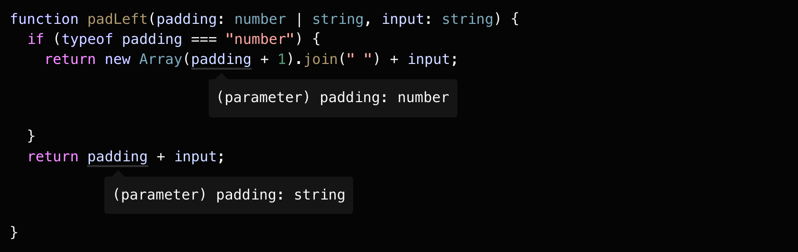

# 类型收窄（Narrowing）

## 目录

- [类型收窄（Narrowing）](#类型收窄narrowing)
  - [目录](#目录)
  - [Narrowing 介绍](#narrowing-介绍)
    - [编辑器中体现类型收窄的作用](#编辑器中体现类型收窄的作用)
  - [typeof 类型保护（type guards）](#typeof-类型保护type-guards)
  - [真值收窄（Truthiness narrowing）](#真值收窄truthiness-narrowing)
    - [另一种真值检查收窄类型的方式 ! 操作符](#另一种真值检查收窄类型的方式--操作符)

## Narrowing 介绍

以一个函数为例

```typescript
function padLeft(padding: number | string, input: string): string {
    throw new Error("Not implemented yet!");
}
```

该函数要实现的功能为：

如果参数 padding 是一个数字，则在 input 前添加同等数量的空格；

如果 padding 是一个字符串，则直接添加到 input 前面。

初始版本：

```typescript
function padLeft(padding: number | string, input: string) {
    return new Array(padding + 1).join(" ") + input;
    // Operator '+' cannot be applied to types 'string | number' and 'number'.
}
```

上述版本中，编辑器会在 **padding + 1** 这行代码处标红，显示一个错误。

TS 发出警告，如果将一个 number 类型（即例子中的数字 1）和联合类型 number | string 相加，也许并不会达到预想中的结果。

优化版本：

```typescript
function padLeft(padding: number | string, input: string) {
    if (typeof padding === "number") {
        return new Array(padding + 1).join(" ") + input;
    } 
    return padding + input;
}
```

上述优化版本的代码，虽说看起来并没有什么有意思的地方，但实际上，TS 在背后做了很多东西。

TS 要学者分析这些使用了静态类型的值在运行时的具体类型。目前 TS 已经实现了比如 if/else、三元运算符、循环、真值检查等情况下的类型分析。

在优化版本的 if 语句中，TS 会认你为 **typeof padding === number**，是一种特殊形式的代码，称之为**类型保护（type guard）**，TS 会沿着执行时可能的路径，分析值在给定的位置上最具体的类型。

TS 的类型检查器会考虑到这些类型保护和赋值语句，而这个**将类型推导为更精确类型的过程，即为收窄（narrowing）。**

### 编辑器中体现类型收窄的作用

在编辑器中，可以观察 padding 到不同代码区域的类型。

在 if 语句中，padding 类型被推导为更精确的 number 类型；

在剩余的 return 语句中，padding 类型被推导为更精确的 string 类型。



## typeof 类型保护（type guards）

JS 提供的 typeof 操作符，可以返回一个值在运行时的基本类型信息，有如下字符串可能值：

- "string"
- "number"
- "bigInt"
- "boolean"
- "symbol"
- "undefined"
- "object"
- "function"

注意：typeof null === "object"

typeof 操作符在很多 JS 库中有着广泛的应用，TS 已经可以做到理解并在不同的分支中将类型收窄。

在 TS 中，检查 typeof 返回的值是一种类型保护。

TS 知道 typeof 不同值的结果，也能识别 JS 中一些怪异的地方。

```typescript
function printAll(strs: string | string[] | null) {
    if (typeof strs === "object") {
        for (const s of strs) {
            // Object is possibly 'null'.
            console.log(s);
        }
    } else if (typeof strs === "string") {
        console.log(strs);
    } else {
        // do nothing
    }
}
```

在上述的 printAll() 函数中，通过 typeof 尝试判断 strs 是否是一个数组类型（即 一个对象），但是未考虑到 typeof null === "object"。而这是 JS 的一个历史遗留问题。

## 真值收窄（Truthiness narrowing）

在 JS 中，可以在条件语句中使用任何表达式，比如 &&、||、! 等，举个例子，if 语句中不需要条件的结果总是 boolean 类型

```typescript
function getUsersOnlineMessage(numUsersOnline: number) {
    if (numUsersOnline) {
        return `There are ${numUserOnline} online now!`;
    }
    return "Nobody's here. :(";
}
```

上述代码中的 if 语句判断，是因为 JS 会做**隐式类型转换**，诸如 0、-0、NaN、""、0n、null、undefined 这些**假值**，会被转换为 false，其他值则会被转换为 true。

当然亦可以使用 Boolean() 函数或更加简短的 !! 符号将变量强制转换为 boolean 值。

```typescript
// both of these result in "true"
Boolean("hello"); // type: boolean, value: true
!!"world"; // type: true, value: true
```

借助于 JS 的隐式类型转换用于防范 null 和 undefined 这种值非常流行。对于上述 printAll() 函数可以做如下优化：

```typescript
function printAll(strs: string | string[] | null) {
    // 此处修改，成功避免了 strs === null 的情况
    if (strs && typeof strs === "object") {
        for (const s of strs) {
            console.log(s);
        }
    } else if (typeof strs === "string") {
        console.log(strs);
    }
}
```

但是仍要注意，基本类型的真值检查很容易导致错误，如果对 printAll() 做如下修改：

```typescript
function printAll(strs: string | string[] | null) {
    /* 
    !!!!!!!!
    DON'T DO THIS!
    KEEP READING
    !!!!!!!!
     */
    if (strs) {
        if (typeof strs === "object") {
            for (const s of strs) {
                console.log(s);
            }
        } else if (typeof strs === "string") {
            console.log(strs);
        }
    }
}
```

如果将原本的函数体的内的内容包裹在 if (strs) 真值检查里，会导致一个问题，即**无法正确处理空字符串**的情况。

如果 strs === ""，此时 if (strs) 真值检查判断为 fasle，此时函数不会做任何事，显然这是错误的。

### 另一种真值检查收窄类型的方式 ! 操作符

```typescript
function multiplyAll(values: number[] | undefined, factor: number): number[] | undefined {
    if (!values) {
        return values;
        // (parameter) values: undefined
    } else {
        return values.map(x => x * factor);
        // (parameter) values: number[]
    }
}
```
