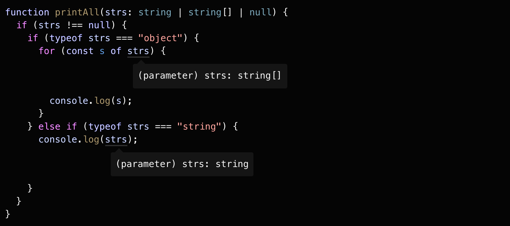
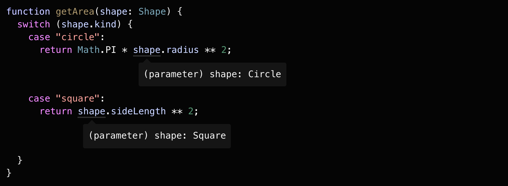

# 类型收窄（Narrowing）

## 目录

- [类型收窄（Narrowing）](#类型收窄narrowing)
  - [目录](#目录)
  - [Narrowing 介绍](#narrowing-介绍)
    - [编辑器中体现类型收窄的作用](#编辑器中体现类型收窄的作用)
  - [typeof 类型保护（Type guards）](#typeof-类型保护type-guards)
  - [真值收窄（Truthiness narrowing）](#真值收窄truthiness-narrowing)
    - [另一种真值检查收窄类型的方式 ! 操作符](#另一种真值检查收窄类型的方式--操作符)
  - [等值收窄（Equality narrowing）](#等值收窄equality-narrowing)
    - [JS 的宽松相等操作符的使用](#js-的宽松相等操作符的使用)
  - [in 操作符收窄](#in-操作符收窄)
  - [instanceof 收窄](#instanceof-收窄)
  - [赋值语句收窄（Assignments）](#赋值语句收窄assignments)
  - [控制流分析（Control flow analysis）](#控制流分析control-flow-analysis)
  - [类型判断式（Type predicates）](#类型判断式type-predicates)
    - [类型判断式的使用](#类型判断式的使用)
    - [isFish() 作为筛选指标](#isfish-作为筛选指标)
  - [可辨别联合（Discriminated unions）](#可辨别联合discriminated-unions)
    - [可辩别联合的应用](#可辩别联合的应用)
  - [never 类型](#never-类型)
  - [穷尽检查（Exhaustiveness checking）](#穷尽检查exhaustiveness-checking)

## Narrowing 介绍

以一个函数为例

```typescript
function padLeft(padding: number | string, input: string): string {
    throw new Error("Not implemented yet!");
}
```

该函数要实现的功能为：

如果参数 padding 是一个数字，则在 input 前添加同等数量的空格；

如果 padding 是一个字符串，则直接添加到 input 前面。

初始版本：

```typescript
function padLeft(padding: number | string, input: string) {
    return new Array(padding + 1).join(" ") + input;
    // Operator '+' cannot be applied to types 'string | number' and 'number'.
}
```

上述版本中，编辑器会在 **padding + 1** 这行代码处标红，显示一个错误。

TS 发出警告，如果将一个 number 类型（即例子中的数字 1）和联合类型 number | string 相加，也许并不会达到预想中的结果。

优化版本：

```typescript
function padLeft(padding: number | string, input: string) {
    if (typeof padding === "number") {
        return new Array(padding + 1).join(" ") + input;
    } 
    return padding + input;
}
```

上述优化版本的代码，虽说看起来并没有什么有意思的地方，但实际上，TS 在背后做了很多东西。

TS 要学者分析这些使用了静态类型的值在运行时的具体类型。目前 TS 已经实现了比如 if/else、三元运算符、循环、真值检查等情况下的类型分析。

在优化版本的 if 语句中，TS 会认你为 **typeof padding === number**，是一种特殊形式的代码，称之为**类型保护（type guard）**，TS 会沿着执行时可能的路径，分析值在给定的位置上最具体的类型。

TS 的类型检查器会考虑到这些类型保护和赋值语句，而这个**将类型推导为更精确类型的过程，即为收窄（narrowing）。**

### 编辑器中体现类型收窄的作用

在编辑器中，可以观察 padding 到不同代码区域的类型。

在 if 语句中，padding 类型被推导为更精确的 number 类型；

在剩余的 return 语句中，padding 类型被推导为更精确的 string 类型。


---

## typeof 类型保护（Type guards）

JS 提供的 typeof 操作符，可以返回一个值在运行时的基本类型信息，有如下字符串可能值：

- "string"
- "number"
- "bigInt"
- "boolean"
- "symbol"
- "undefined"
- "object"
- "function"

注意：typeof null === "object"

typeof 操作符在很多 JS 库中有着广泛的应用，TS 已经可以做到理解并在不同的分支中将类型收窄。

在 TS 中，检查 typeof 返回的值是一种类型保护。

TS 知道 typeof 不同值的结果，也能识别 JS 中一些怪异的地方。

```typescript
function printAll(strs: string | string[] | null) {
    if (typeof strs === "object") {
        for (const s of strs) {
            // Object is possibly 'null'.
            console.log(s);
        }
    } else if (typeof strs === "string") {
        console.log(strs);
    } else {
        // do nothing
    }
}
```

在上述的 printAll() 函数中，通过 typeof 尝试判断 strs 是否是一个数组类型（即 一个对象），但是未考虑到 typeof null === "object"。而这是 JS 的一个历史遗留问题。

---

## 真值收窄（Truthiness narrowing）

在 JS 中，可以在条件语句中使用任何表达式，比如 &&、||、! 等，举个例子，if 语句中不需要条件的结果总是 boolean 类型

```typescript
function getUsersOnlineMessage(numUsersOnline: number) {
    if (numUsersOnline) {
        return `There are ${numUserOnline} online now!`;
    }
    return "Nobody's here. :(";
}
```

上述代码中的 if 语句判断，是因为 JS 会做**隐式类型转换**，诸如 0、-0、NaN、""、0n、null、undefined 这些**假值**，会被转换为 false，其他值则会被转换为 true。

当然亦可以使用 Boolean() 函数或更加简短的 !! 符号将变量强制转换为 boolean 值。

```typescript
// both of these result in "true"
Boolean("hello"); // type: boolean, value: true
!!"world"; // type: true, value: true
```

借助于 JS 的隐式类型转换用于防范 null 和 undefined 这种值非常流行。对于上述 printAll() 函数可以做如下优化：

```typescript
function printAll(strs: string | string[] | null) {
    // 此处修改，成功避免了 strs === null 的情况
    if (strs && typeof strs === "object") {
        for (const s of strs) {
            console.log(s);
        }
    } else if (typeof strs === "string") {
        console.log(strs);
    }
}
```

但是仍要注意，基本类型的真值检查很容易导致错误，如果对 printAll() 做如下修改：

```typescript
function printAll(strs: string | string[] | null) {
    /* 
    !!!!!!!!
    DON'T DO THIS!
    KEEP READING
    !!!!!!!!
     */
    if (strs) {
        if (typeof strs === "object") {
            for (const s of strs) {
                console.log(s);
            }
        } else if (typeof strs === "string") {
            console.log(strs);
        }
    }
}
```

如果将原本的函数体的内的内容包裹在 if (strs) 真值检查里，会导致一个问题，即**无法正确处理空字符串**的情况。

如果 strs === ""，此时 if (strs) 真值检查判断为 fasle，此时函数不会做任何事，显然这是错误的。

### 另一种真值检查收窄类型的方式 ! 操作符

```typescript
function multiplyAll(values: number[] | undefined, factor: number): number[] | undefined {
    if (!values) {
        return values;
        // (parameter) values: undefined
    } else {
        return values.map(x => x * factor);
        // (parameter) values: number[]
    }
}
```

---

## 等值收窄（Equality narrowing）

TS 也可以使用 switch 语句和**等值检查**比如 ==、!==、==、!= 去收窄类型，比如：


上述图示中，在 if(x === y) 中进行了等值检查，如果完全相等，鉴于 string 类型是 x 和 y 唯一可能的相同类型。所以在第一个分支中，x 和 y 就一定是 string 类型。

判断具体的字面量值也能让 TS 正确的判断类型。在上一节真值收窄章节中，曾写过一个没有正确处理空字符串情况的 printAll() 函数，现在可以使用一个更具体的等值判断用于排除掉 null 的情况：



### JS 的宽松相等操作符的使用

JS 的宽松相等操作符如 == 和 != 也可以进行等值收窄。在 JS 中，通过 variable == null，并不能准确判断出 variable 就是 null，因为其亦有可能为 undefined。对于 variable == undefined 亦是同理。

对于上述的宽松相等特性，可以方便的判断一个值既不是 null 也不是 undefined：


---

## in 操作符收窄

JS 中的 in 操作符可以判断一个对象中是否有指定的属性名。TS 可以使用此操作符进行类型收窄。

```typescript
type Fish = {
    swim: () => void
};

type Bird = {
    fly: () => void
};

function move(animal: Fish | Bird) {
    if ("swim" in animal) {
        return animal.swim();
        // (parameter) animal: Fish
    }

    return animal.fly();
    // (parameter) animal: Bird
}
```

而如果有可选属性，比如一个人既可以 swim 也可以 fly（借助装备），也可以进行正确的类型收窄：

```typescript
type Fish = {
    swim: () => void
};

type Bird = {
    fly: () => void
};

type Human = {
    swim?: () => void;
    fly?: () => void;
}

function move(animal: Fish | Bird | Human) {
    if ("swim" in animal) {
        animal; // (parameter) animal: Fish | Human
    } else {
        animal; // (parameter) animal: Bird | Human
    }
}
```

---

## instanceof 收窄

instanceof 亦是一种类型保护，TS 可以通过识别 instanceof 进行类型收窄。

```typescript
function logValue(x: Date | string) {
    if (x instanceof Date) {
        console.log(x.toUTCString());
        // (parameter) x: Date
    } else {
        console.log(x.toUpperCase());
        // (parameter) x: string
    }
}
```

---

## 赋值语句收窄（Assignments）

TS 可以根据赋值语句的右值，正确的收窄左值。


**注**：上述图示中，所有的赋值语句都是有效的，由于 x 最初的声明为 string | number，之后可以将 x 更改为 string 或 number 类型，只不过通过赋值更改其类型时，会根据最初的类型声明进行核对。

正式由于上述原因，如果将 x 赋值给一个 boolean 类型，则会报错：


---

## 控制流分析（Control flow analysis）

现在分析 if、while 等条件控制语句中的类型保护

```typescript
function padLeft(padding: number | string, input: string) {
    if (typeof padding === "number") {
        return new Array(padding + 1).join(" ") + input;
    } 

    return padding + input;
}
```

在第一个 if 语句里，因为有 return 语句，TS 通过分析代码，可以对剩余部分 return padding + input 的类型进行判断。

如果 padding 是 number 类型，是**无法达到（unreachable）** 剩余部分的，所以在此就会将 number 类型从 number | string 类型中删除掉。

上述这种基于**可达性**（reachability）的代码分析即为控制流分析（control flow analysis）。TS 在遇到类型保护和赋值语句时，会使用这种方式进行类型收窄。通过使用这种方式，一个变量可以变为不同的类型。


---

## 类型判断式（Type predicates）

在一些文档中，type predicate 会被翻译为**类型谓词**。考虑到 predicate 作为动词还有表明、声明、断言的意思。为区别于类型断言（Type Assertion），这里翻译为类型判断式。

引用解释：

In mathematics, a predicate is commonly understood to be a Boolean-valued function _P_: _X_ -> {true, false}, called the predicate on X.

所谓 predicate 就是一个返回 boolean 值的函数。

### 类型判断式的使用

可以自定义一个类型保护，直接通过代码控制类型的改变。

实现方式就是定义一个函数，而这个函数返回的类型就是类型判断式：

```typescript
function isFish(pet: Fish | Bird): pet is Fish {
    return (pet as Fish).swim !== undefined;
}
```

在上述例子中，**pet is Fish** 就是一个类型判断式。

类型判断式采用 parameterName is Type 的形式，parameterName 必须是当前函数的参数名。

当 isFish() 被传入变量 variable 进行调用，TS 就可以将 variable 收窄到更具体的类型

```typescript
// Both calls to 'swim' and 'fly' are now okay.
let pet = getSmallPet();

if (isFish(pet)) {
    pet.swim(); // let pet: Fish
} else {
    pet.fly(); // let pet: Bird
}
```

此时需要知道，由于 pet 只有两个可能类型，TS 不仅知道 if 分支中 pet 是 Fish 类型，也知道 else 分支中，pet 是 Bird 类型。

### isFish() 作为筛选指标

可以使用 isFish() 在 Fish | Bird 联合类型的数组中，筛选获取只有 Fish 类型的数组：

```typescript
const zoo: (Fish | Bird)[] = [getSmallPet(), getSmallPet(), getSmallPet(), getSmallPet()];

const underWater1: Fish[] = zoo.filter(isFish);

// or, equivalently
const underWater2: Fish[] = zoo.filter(isFish) as Fish[];

// 在更复杂的例子中，判断式可能需要重复写
const underWater3: Fish[] = zoo.filter(pet): pet is Fish => {
    if (pet.name === "sharkey") return false;
    return isFish(pet);
}
```

---

## 可辨别联合（Discriminated unions）

试想一个例子，有一个处理 Shape（包括 Circles、Squares）函数，Circles 会记录它的半径属性，Squares 会记录它的边长属性，使用一个 kind 字段用于区分当前处理项是 Circles 还是 Squares，初始的 Shape 定义为：

```typescript
interface Shape {
    // 这里使用联合类型，而不是 string 类型，可以避免一些拼写错误的情况
    kind: "circle" | "square";
    radius?: number;
    sideLength?: number;
}

function handleShape(shape: Shape) {
    // oop!
    if (shape.kind === "rect") {
        // This condition will always return 'false' since the types '"circle" | "square"' have no overlap.
    }
}
```

声明一个获取面积的 getArea 函数，暂且只考虑 Circle 的情况：

```typescript
function getArea(shape: Shape) {
    return Math.PI * shape.radius ** 2; // 圆的面积公式
    // Object is possibly 'undefined'.
}

// 在 strictNullChecks 模式下，TS 会报错，radius 有可能为 undefined

// =============================================

// 添加 kind 判断
function getArea(shape: Shape) {
    if (shape.kind === "circle") {
        return Math.PI * shape.radius ** 2;
        // Object is possibly 'undefined'.
    }
}

// 尽管已经添加 kind === "circle" 的判断，但由于 radius 是一个可选属性，TS 依然会认为 radius 可能是 undefined

// ==========================================

// 添加非空断言
function getArea(shape: Shape) {
    if (shape.kind === "circle") {
        // 此处添加非空断言，表示 shape.radius 一定存在
        return Math.PI * shape.radius! ** 2;
    }
}

// 这时 TS 并没有报错，但这并不是一个好办法。
// radius 在定义时，将其设置为可选属性，但在此处认为其一定存在，前后语义不符。

// ===========================================

// 此时 Shape 的问题在于类型检查器并没有办法根据 kind 属性去判断 radius 或 sideLength 属性是否存在，而这点需要开发者告知类型检查器
// 修改 Shape 的定义

interface Circle {
    kind: "circle";
    radius: number;
}

interface Square {
    kind: "square";
    sideLength: number;
}

type Shape = Circle | Square;

// 在此处，将 Shape 根据 kind 属性分为两个不同的类型，raduis 和 sideLength 在各自的类型中被定义为 required

// =================================================

// 重新定义后，直接获取 raduis
function getArea(shape: Shape) {
    return Math.PI * shape.radius ** 2;
    // Property 'radius' does not exist on type 'Shape'.
    // Property 'radius' does not exist on type 'Square'.
}

// 当前报错，由于 Shape 是一个联合类型，TS 可以识别出 shape 也可能是一个 Square 类型，显然 Square 类型并没有 radius，所以会报错

// ================================================

// 添加 kind 属性检查
function getArea(shape: Shape) {
    if (shape.kind === "circle") {
        return Math.PI * shape.radius ** 2;
    }
}

// 此时，报错被去除了。
```

当联合类型中的每个类型，都包含了一个**共同的字面量类型**的属性，TS 会认为这是一个**可辩别联合（discriminated union）**，可以使用具体成员的类型进行收窄。

在上述例子中，kind 即是一个公共属性，可以作为 Shape 的可辩别（discriminant 属性）。

可辩别联合亦适用于 switch 语句



可辩别联合的关键在于如何定义 Shape，需要告知 TS，Circle 和 Square 是根据 kind 字段彻底分开的两个类型。此时，类型系统就可以在 switch 语句的每个分支里推导出正确的类型。

### 可辩别联合的应用

可辩别联合可以应用在诸如消息模式、客户端服务端的交互、状态管理框架中

在消息模式中，我们会监听和发送不同的事件，这些都是以名字进行区分的，不同的事件还会携带不同的数据，这就应用到了可辩别联合。客户端和服务端的交互、状态管理都是类似的。

---

## never 类型

当进行类型收窄时，如果将所有可能的类型都穷尽了，可以使用 never 类型用于表示一个不可能存在的状态。

---

## 穷尽检查（Exhaustiveness checking）

never 类型可以赋值给任何类型，但是没有类型可以赋值给 never（除了 never 自身）。这意味着可以在 switch 语句中使用 never 做一个穷尽检查。

给上述 getArea 函数添加一个 default，将 shape 赋值给 never 类型，**当出现还没有处理的分支情况时，never 就会发挥作用。**

```typescript
type Shape = Cricle | Square;

function getArea(shape: Shape) {
    switch(shape.kind) {
        case "cricle":
            return Math.PI * shape.radius ** 2;
        case "square":
            return shape.sideLength ** 2;
        default:
            const _exhaustiveCheck: never = shape;
            return _exhaustiveCheck;
    }
}
```

经过上述代码示例的 never 的穷尽检查，当我们给 Shape 联合类型添加一个新成员，却没有做对应处理时，会导致一个 TS 错误

```typescript
interface Triangle {
    kind: "triangle";
    sideLength: number;
}

type Shape = Circle | Square | Triangle;

function getArea(shape: Shape) {
    switch (shape.kind) {
        case "circle":
            return Math.PI * shape.radius ** 2;
        case "square":
            return shape.sideLength ** 2;
        default:
            const _exhaustiveCheck: never = shape;
            // Type 'Triangle' is not assignable to type 'never'.
            return _exhaustiveCheck;
    }
}
```

因为 TS 的收窄特性，代码执行到 default 时，类型被收窄为 Triangle，但由于任何类型都不能赋值给 never 类型，这就会产生一个编译错误。

通过上述方式，可以确保 getArea() 函数总是穷尽了 shape 的可能性。
