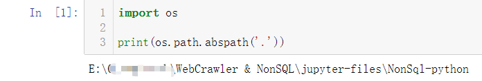
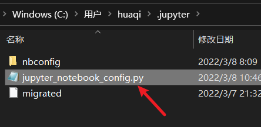

# Anaconda 修改 jupyter notebook 文件默认存储路径

## 目录

- [Anaconda 修改 jupyter notebook 文件默认存储路径](#anaconda-修改-jupyter-notebook-文件默认存储路径)
  - [目录](#目录)
  - [查看当前默认文件路径](#查看当前默认文件路径)
  - [生成 jupyter notebook 配置文件](#生成-jupyter-notebook-配置文件)
  - [修改默认文件存储路径](#修改默认文件存储路径)
  - [修改完成](#修改完成)
  - [写在最后](#写在最后)

## 查看当前默认文件路径
6
于 jupyter notebook 中新建一个 python 文件

运行下列代码以查看文件默认存储路径

```python
import os

print(os.path.abspath('.'))
```

如图：



## 生成 jupyter notebook 配置文件

1、打开 Anaconda 内置的命令行工具


2、输入以下命令

```shell
jupyter notebook --generate-config
```

该操作会输出如下文件：


---

## 修改默认文件存储路径

1、使用编辑器打开上述文件(jupyter_notebook_config.py)，笔者这里使用的是记事本

2、文件内搜索以下内容（ctrl + f）

```shell
c.NotebookApp.notebook_dir
```

3、将路径修改为你想要的文件存储路径

如图：


**注**：

- 删除本行文本前的注释符 "#"
- 路径分隔符使用 "\\"

---

## 修改完成

- 重新启动 jupyter notebook
- 查看你更改的默认路径目录变化

## 写在最后

笔者亲测有效。

win10 64位 于2022/03/08
