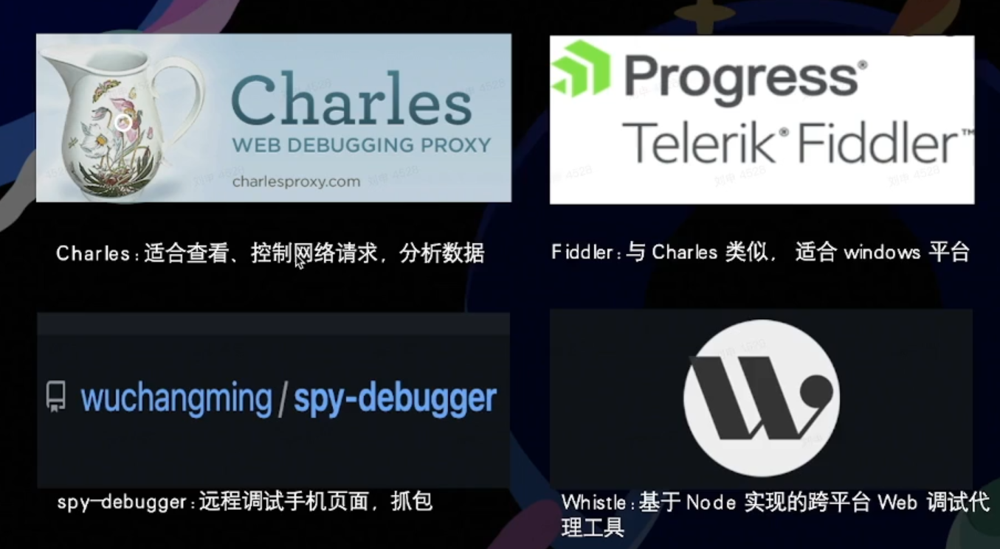

# 前端开发调试知识

## 目录

- [前端开发调试知识](#前端开发调试知识)
  - [目录](#目录)
  - [bug](#bug)
  - [前端 Debug 的特点](#前端-debug-的特点)
  - [Chorme DevTools](#chorme-devtools)
  - [Elements 面板](#elements-面板)
  - [Console 面板](#console-面板)
  - [Sources 面板](#sources-面板)
    - [压缩的代码如何调试？](#压缩的代码如何调试)
      - [如何压缩？](#如何压缩)
      - [代码压缩如何调试？](#代码压缩如何调试)
  - [Performance 面板](#performance-面板)
  - [NetWork 面板](#network-面板)
  - [Application 面板](#application-面板)
  - [移动端 H5 调试](#移动端-h5-调试)
    - [真机调试](#真机调试)
    - [代理工具调试](#代理工具调试)
    - [移动端常用调试工具](#移动端常用调试工具)
  - [常用开发调试技巧](#常用开发调试技巧)
    - [线上即时修改 Overrides](#线上即时修改-overrides)
    - [利用代理解决开发阶段的跨域问题](#利用代理解决开发阶段的跨域问题)

## bug

bug or feature

No Code, No Bug

## 前端 Debug 的特点

1. 多平台
   - 浏览器
   - Hybrid
   - NodeJs
   - 小程序
   - 桌面应用
   - ...
2. 多环境
   - 本地开发环境
   - 线上环境
3. 多工具
   - Chrome devTools
   - Charies
   - Spy-Debugger
   - Whistle
   - vConsole
   - ...
4. 多技巧
   - Console
   - BreakPoint
   - sourceMap
   - 代理
   - ...

## Chorme DevTools

- 修改元素和样式
- Console
- Source Tab
- Performance

## Elements 面板

- 点击 .cls 开启动态修改元素的 class
- 输入字符串可以动态的给元素添加类名
- 勾选/取消类名可以动态的查看类名生效效果
- 点击具体的样式值（字号、颜色、宽度高度等）可以进行编辑，浏览器内容区域实时预览
- Computed 下点击样式里的箭头可以跳转到 styles 面板中的 css 规则

可以使用以下两种方式强制激活伪类

1. 选中具有伪类的元素，点击 :hov
2. DOM 树右键菜单，选中 Force State

## Console 面板

- console.log
- console.warn
- console.error
- console.debug
- console.info
- console.dir
- console.table
  - 具象化展示 JSON 和数组数据

自定义 console 内容时常用的的占位符

- %s
  - 字符串占位符
- %o
  - 对象占位符
- %c
  - 样式占位符
- %d
  - 数字占位符

## Sources 面板

### 压缩的代码如何调试？

前端代码天生具有“开源”属性，出于安全考虑，JavaScript 代码通常会被压缩，压缩后的代码只有一行，变量使用“a”、“b”等替换，整体变得不可阅读。

#### 如何压缩？

webpack 本身集成了相关功能，另外诸如 UglifyJS、terser 亦可以实现代码压缩

#### 代码压缩如何调试？

可以开启 webpack 的 sourceMap 功能，压缩后代码与原先代码的映射关系。

注：项目上线时可将 sourceMap 文件删除。

## Performance 面板

## NetWork 面板

## Application 面板

## 移动端 H5 调试

### 真机调试

### 代理工具调试

### 移动端常用调试工具

## 常用开发调试技巧

### 线上即时修改 Overrides

### 利用代理解决开发阶段的跨域问题

