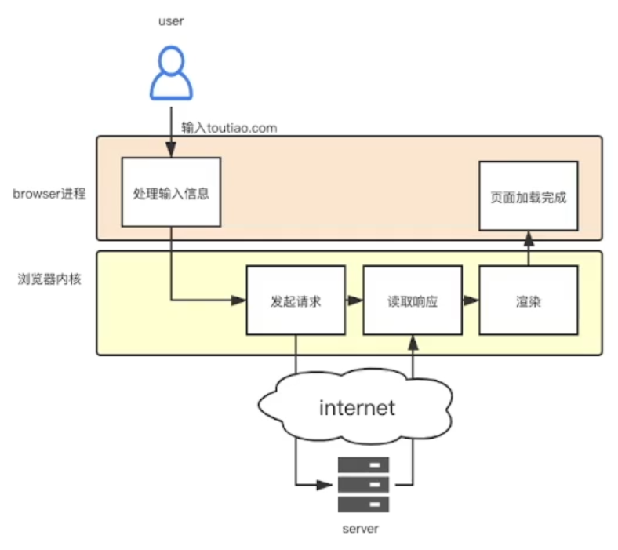
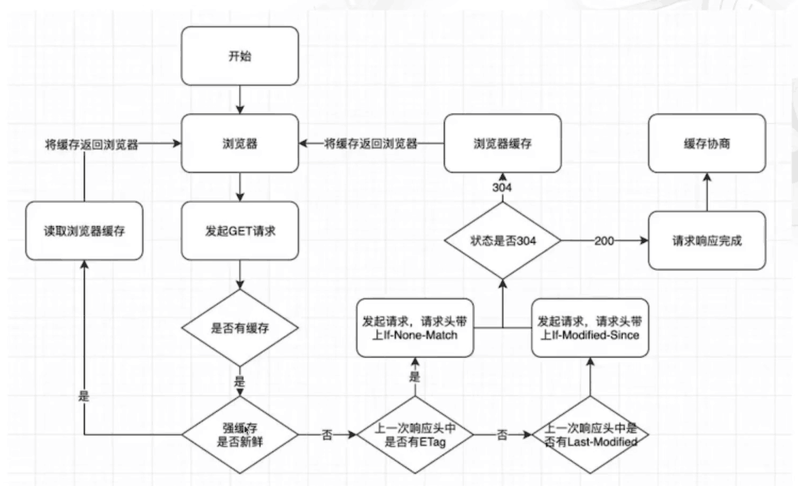
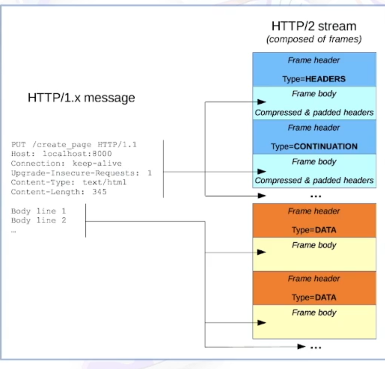
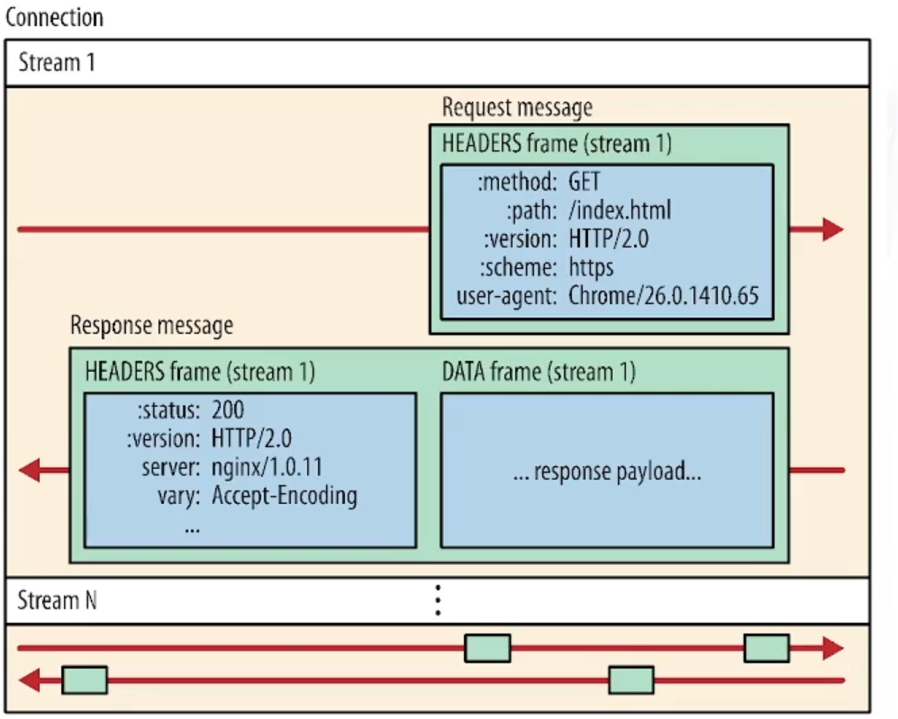
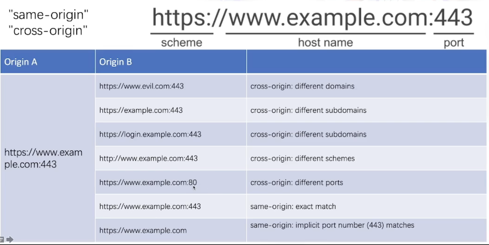
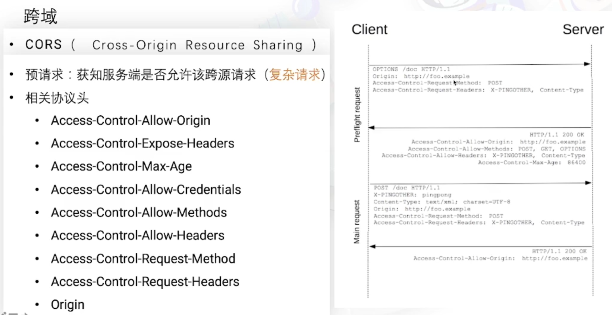
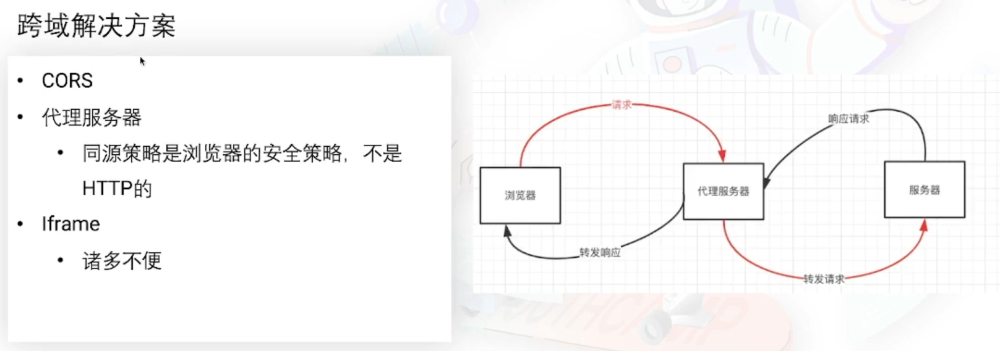
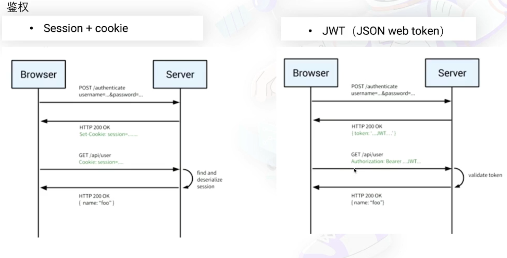
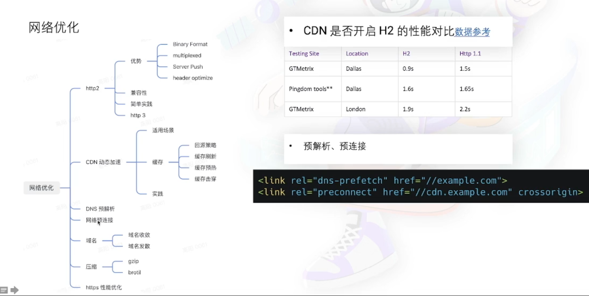
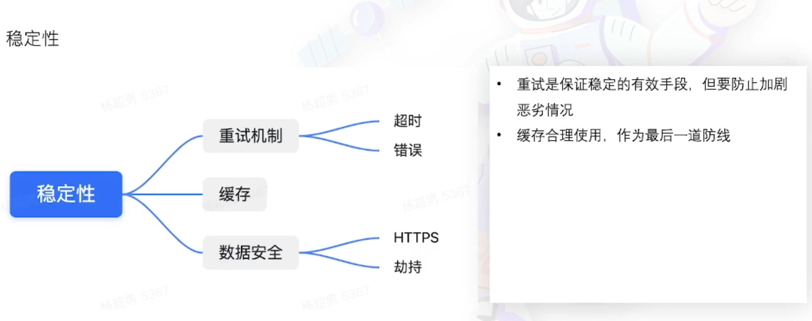

# HTTP 实用指南

## 目录

- [HTTP 实用指南](#http-实用指南)
  - [目录](#目录)
  - [初识 HTTP](#初识-http)
    - [什么是 HTTP](#什么是-http)
  - [协议分析](#协议分析)
    - [报文](#报文)
      - [Method](#method)
      - [状态码](#状态码)
      - [RESTful API](#restful-api)
      - [常用请求头](#常用请求头)
      - [常用响应头](#常用响应头)
      - [缓存](#缓存)
      - [缓存机制](#缓存机制)
      - [cookie](#cookie)
    - [发展](#发展)
      - [HTTP/2 概述](#http2-概述)
  - [场景分析](#场景分析)
    - [静态资源加载](#静态资源加载)
    - [登录](#登录)
      - [表单登录](#表单登录)
  - [实战](#实战)
    - [浏览器篇](#浏览器篇)
    - [node篇](#node篇)
    - [常用的请求库](#常用的请求库)
    - [用户体验](#用户体验)
      - [网络优化](#网络优化)
      - [稳定性](#稳定性)
  - [了解更多](#了解更多)
    - [WebSocket](#websocket)
    - [QUIC Quick UDP Internet Connection](#quic-quick-udp-internet-connection)
  - [课后答疑](#课后答疑)
    - [临时重定向与永久重定向的区别](#临时重定向与永久重定向的区别)
    - [API 的表现层](#api-的表现层)
    - [no-store 会读 CPU 缓存中的内容吗](#no-store-会读-cpu-缓存中的内容吗)
    - [强缓存和协商缓存的应用场景](#强缓存和协商缓存的应用场景)
    - [get、post 的区别](#getpost-的区别)
    - [HTTPS 加密影响网页加载速度](#https-加密影响网页加载速度)
    - [HTML 不建议使用 强缓存](#html-不建议使用-强缓存)
    - [JWT 用户信息鉴别](#jwt-用户信息鉴别)
    - [SPA history 路由跳转](#spa-history-路由跳转)
    - [session 与 cookie 的关系](#session-与-cookie-的关系)
    - [WebSocket 与 http 的关系](#websocket-与-http-的关系)
    - [HTTP3 解决了 HTTP2 的什么问题](#http3-解决了-http2-的什么问题)
    - [中间件解决跨域与 nginx 反向代理解决跨域](#中间件解决跨域与-nginx-反向代理解决跨域)

---

## 初识 HTTP

用户在浏览器输入 URL ---> 页面渲染

### 什么是 HTTP

- Hyper Text Transfer Protocol 超文本传输协议
- 应用层协议，基于 TCP 协议
- 请求 相应
- 简单可扩展
- 无状态

---

## 协议分析

- HTTP/0.9 -- 单行协议
  - 请求 GET /mypage.html
  - 响应只有 HTML 文档
- HTTP/1.0 -- 构建可扩展性
  - 增加 Header
  - 具有状态码
  - 支持多种文档类型
  - ...
- HTTP/1.1 -- 标准化协议
  - 链接复用
  - 缓存
  - 内容协商
  - ...
- HTTP/2 -- 更优异的表现
  - 二进制协议
  - 压缩 Header
  - 服务器推送
  - ...
- HTTP/3 -- 草案

### 报文

#### Method

| Method 种类 | Method 使用                                                      |
| :---------- | :--------------------------------------------------------------- |
| GET         | 请求一个指定资源的表现形式，适用 GET 的请求应该只被用于获取数据  |
| POST        | 用户将实体提交到指定的资源，通常导致在服务器上的状态变化或副作用 |
| PUT         | 用请求有效载荷替换目标资源的所有当前表示                         |
| DELETE      | 删除指定资源                                                     |
| HEAD        | 请求一个与 GET 请求响应相同的响应，但没有响应体                  |
| CONNECT     | 建立一个到由目标资源标识的服务器的隧道                           |
| OPTIONS     | 用于描述目标资源的通信选项                                       |
| TRACE       | 沿着到目标资源的路径执行一个消息环回测试                         |
| PATCH       | 用于对资源应用部分修改                                           |

| Method 分类        | 意义                                                                                   | 包含 Method 种类                                               |
| ------------------ | -------------------------------------------------------------------------------------- | -------------------------------------------------------------- |
| Safe（安全的）     | 不会修改服务器的数据的方法                                                             | GET、HEAD、OPTIONS                                             |
| Idempotent（幂等） | 同样的请求被执行一次与连续执行多次的效果是 **一样** 的，服务器的状态也是 **一样** 的。 | 所有 safe 方法都是 idempotent。GET、HEAD、OPTIONS、PUT、DELETE |

#### 状态码

状态码均由三位数字组成

| 分类 | 意义                                       |
| ---- | ------------------------------------------ |
| 1xx  | 指示信息，表示请求已接收，继续处理         |
| 2xx  | 成功，表示请求已被成功接收、理解、接受     |
| 3xx  | 重定向，要完成请求必须进行更近一步的操作   |
| 4xx  | 客户端错误，请求有语法错误或请求无法实现   |
| 5xx  | 服务器端错误，服务器未能实现**合法**的请求 |

常用状态码

| 种类                | 意义                                                 |
| ------------------- | ---------------------------------------------------- |
| 200 OK              | 客户端请求成功                                       |
| 301                 | 资源（网页等）被永久转移到其他 URL                   |
| 302                 | 临时跳转                                             |
| 401 Unauthorized    | 请求未经授权                                         |
| 404                 | 请求资源不存在，可能是输入了错误的 URL               |
| 500                 | 服务器内部发生了不可预期的错误                       |
| 504 Gateway Timeout | 网关或者代理的服务器无法在规定的时间内获得想要的响应 |

#### RESTful API

RESTful API：一种 API 设计风格

REST: Representational State Transfer

- 每一个 URL 代表一种资源
- 客户端和服务器之间，传递这种资源的某种表现层
- 客户端通过 HTTP method，对服务器端资源进行操作，实现“表现层状态转化”。

示例：

| 请求           | 返回码              | 含义                                                                                                        |
| -------------- | ------------------- | ----------------------------------------------------------------------------------------------------------- |
| GET/zoos       | 200 OK              | 列出所有动物园，服务器成功返回了                                                                            |
| POST/zoos      | 201 CREATED         | 新建一个动动物园，服务器创建成功                                                                            |
| PUT/zoos/ID    | 400 INVALID REQUEST | 更新某个指定动物园的信息（提供该动物园的全部信息）;用户发出的请求有错误，服务器没有进行新建或修改数据的操作 |
| DELETE/zoos/ID | 204 NO CONTENT      | 删除某个动物园，删除数据成功                                                                                |

#### 常用请求头

|                   |                                                                                         |
| ----------------- | --------------------------------------------------------------------------------------- |
| Accept            | 接收类型，表示浏览器支持的 MIME 类型（对标服务端返回的 Content-Type）                   |
| Content-Type      | 客户端发送出去实体内容的类型                                                            |
| Cache-Control     | 指定请求和响应遵循的缓存机制，如 no-cache                                               |
| If-Modified-Since | 对应服务端的 Last-Modified，用于匹配文件是否变动，只能精确到 1s 之内                    |
| Expires           | 缓存控制，在这个时间内不会请求，直接使用缓存，服务端时间                                |
| Max-age           | 代表资源在本地缓存多少秒，有效时间内不会请求，而是使用缓存                              |
| If-None-Match     | 对应服务端的 ETag，用来匹配文件内容是否改变（非常精确）                                 |
| Cookie            | 有 cookie 并且**同域**访问时会自动带上                                                  |
| Referer           | 该页面的来源 URL（适用于所有类型的请求，会精确到详细页面地址，csrf 拦截常用到这个字段） |
| Origin            | 最初的请求是从哪里发起的（只会精确到端口），Origin 比 Referer 更尊重隐私                |
| User-Agent        | 用户客户端的一些必要信息，如 UA 头部等                                                  |

#### 常用响应头

|                             |                                                                 |
| --------------------------- | --------------------------------------------------------------- |
| Content-Type                | 服务端返回的实体内容的类型                                      |
| Cache-Control               | 指定请求和响应遵循的缓存机制，如 no-cache                       |
| Last-Modeified              | 请求资源的最后修改时间                                          |
| Expires                     | 应该在什么时候认为文档已经过期从而不再缓存它                    |
| Max-age                     | 客户端在本地资源应该缓存多少秒，开启 Cache-Cotrol 后有效        |
| ETag                        | 资源的特定版本的标识符，ETags类似于指纹                         |
| Set-Cookie                  | 设置和页面关联的 cookie，服务器通过这个头部把 cookie 传给客户端 |
| Server                      | 服务器的一些相关信息                                            |
| Access-Control-Allow-Origin | 服务器端允许的请求 Origin 头部（譬如为 *）                      |

#### 缓存

- 强缓存
  - Expires, 时间戳
  - Cache-Control
    - 可缓存性
      - no-cache：协商缓存验证
      - no-store：不使用任何缓存
    - 到期
      - max-age：单位是秒，存储的最大周期，相当于请求的时间
    - 重新验证*重新加载
      - must-revalidate：一旦资源过期，在成功向原始服务器验证之前，不能使用
- 协商缓存
  - Etag/If-None-Match：资源的特定版本的标识符，类似于指纹
  - Last-Modified/If-Modified-Since：最后的修改时间

#### 缓存机制

#### cookie

Set-Cookie - reponse

|                                    |                                                                                                                        |
| ---------------------------------- | ---------------------------------------------------------------------------------------------------------------------- |
| Name = value                       | 各种 cookie 的名称和值                                                                                                 |
| Expires = Date                     | Cookie 的有限期，缺省时 Cookie 仅在浏览器关闭之前有效                                                                  |
| Path = Path                        | 限制指定 Cookie 的发送范围的文件目录，默认为当前                                                                       |
| Domain = domain                    | 限制 Cookie 生效的域名，默认为创建 Cookie 的服务域名                                                                   |
| secure                             | 仅在 HTTPS 安全连接时，才可以发送 Cookie                                                                               |
| SameSite = [None \| Strict \| Lax] | None：同站、跨站请求都可发送；Strict：仅在同站发送；Lax：允许与顶级导航一起发送，并将第三方网站发起的 GET 请求一起发送 |

### 发展

#### HTTP/2 概述

HTTP/2：更快、更稳定、更简单

HTTP/2 相关概念

- 帧（frame）：HTTP/2 通信的最小单位，每个帧都包含帧头，至少也会标识初当前帧所属的数据流。
- 数据以二进制格式进行传输
- 消息：与逻辑请求或响应消息对应的完整的一系列帧
- 数据流：已建立的连接内的双向字节流，可以承载一条或多条消息
- 一个消息的帧，无序发送，接收方重组织

HTTP/1.x message 与 HTTP/2 stream 对比

HTTP/2 数据传输图示

HTTP/2 特性

- HTTP/2 连接都是永久的，而且每个来源仅需要一个连接
- 流控制：组织 **发送方** 向 **接收方** 发送大量数据的机制，应用场景如：用户暂停视频时，可阻止服务器继续向客户端发送视频数据，将带宽等资源用于别处
- 服务器推送，应用场景如：主动提前推送 HTML 中引入的静态资源（JS、CSS）（注：现实场景中，并没有这样使用，HTTP 服务与 静态资源 不在同一服务器上）

安全性

- HTTPS：Hypertext Transfer Protocol Secure
- 经过 TSL/SSL 加密
- 对称加密：加密和解密都是使用同一个密钥
- 非对称加密：加密和解密需要使用两个不同的密钥；公钥（public key）和私钥（private key）

---

## 场景分析

### 静态资源加载

静态资源方案：缓存 + CDN + 文件名hash

- 目的：提高静态资源加载速度
  - 提高用户首次访问速度
    - CDN： Content Delivery Network
    - 通过用户就近性和服务负载的判断，CDN 确保内容以一种极为高校的方式为用户的请求提供服务
  - 提高用户多次访问速度
    - 使用浏览器缓存，发送请求时，优先使用可用缓存
- 目的：保持静态资源始终为最新版
  - 服务端通过对比新旧文件的 hash，进而决定是否向用户端发送新的静态资源

### 登录

#### 表单登录

前置知识：

跨域判断

- HTTPS 默认端口 443
- HTTP 默认端口 80

跨域请求

跨域解决方案一：CORS

其他跨域解决方案

表单登陆时请求相关动作

- 向什么地址做了什么动作
  - 使用 POST 方法
  - 目标域名 - <https://sso.toutiao.com>
  - 目标 path - /path_login/v2
- 携带了哪些信息，返回了哪些信息
  - 携带信息
    - Post body，数据格式为 form
    - 希望获取的数据格式为 json
    - 已有的 cookie
  - 返回信息
    - 数据格式 json
    - 种 cookie 的信息

鉴权方案

SSO：单点登录（Single Sign On）

---

## 实战

如何发起请求

### 浏览器篇

AJAX 之 XHR（XMLHttpRequest）
readyState
|     |                  |                                                 |
| --- | ---------------- | ----------------------------------------------- |
| 0   | UNSENT           | 代理被创建，但尚未调用 open() 方法              |
| 1   | OPENED           | open() 方法已经被调用                           |
| 2   | HEADERS_RECEIVED | send() 方法已经被调用，并且头部和状态已经可获得 |
| 3   | LOADING          | 请求中；reponseText 属性已经包含部分数据        |
| 4   | DONE             | 请求操作已完成                                  |

AJAX之Fetch

- XMLHttpRequest 的升级版
- 使用 Promise
- 模块化设计，Response、Request、Header 对象
- 通过数据流处理对象，支持块读取
  
### node篇

标准库：HTTP/HTTPS

- 默认模块，无需安装其他依赖
- 功能有限，不是十分友好

### 常用的请求库

axios

- 支持浏览器、nodejs环境
- 丰富的拦截器

### 用户体验

#### 网络优化

#### 稳定性

## 了解更多

### WebSocket

- 浏览器与服务器进行全双工通讯的网络技术
- 典型场景：实时性要求高，例如聊天室
- URL 使用 wx:// 或 wss:// 等开头

### QUIC Quick UDP Internet Connection

## 课后答疑

### 临时重定向与永久重定向的区别

字面区别，根据业务需要进行自定义

### API 的表现层

content-type 的类型，json、纯文本等，即是表现层。

### no-store 会读 CPU 缓存中的内容吗

no-store 只是决定缓存有效性，并不会影响缓存在哪里读，常见缓存保存在 disk、memory 中

### 强缓存和协商缓存的应用场景

结合业务场景自定义

### get、post 的区别

约定

- get 适用于 **读** 请求，用于获取数据
  - 不会携带过多的实体数据
- post 适用于 **写** 请求，用于提交数据

### HTTPS 加密影响网页加载速度

使用 HTTPS 优化

### HTML 不建议使用 强缓存

浏览器不会对文件类型加以区分，使用相同的处理方法

### JWT 用户信息鉴别

用户信息储存在编码后的 token 中

### SPA history 路由跳转

SPA 不发送请求，使用 JS 进行刷新页面/重新渲染，会重写 history

### session 与 cookie 的关系

两者并没有什么关系

- cookie 是浏览器的机制，规定的标准协议头
- session 服务器生成 session 之后，借用 cookie 存储对应信息

### WebSocket 与 http 的关系

两者是同层次的协议，并没有父子关系，也没有谁基于谁。

### HTTP3 解决了 HTTP2 的什么问题

HTTP3 的重要部分即是 QUIC ，而 QUIC 基于 UDP 协议，使用 UDP 重新设计一套新的信息传输方案，舍弃基于 TCP 的连接建立等一系列过程，优化协议的表现。

### 中间件解决跨域与 nginx 反向代理解决跨域

本质都是绕过浏览器的同源策略
