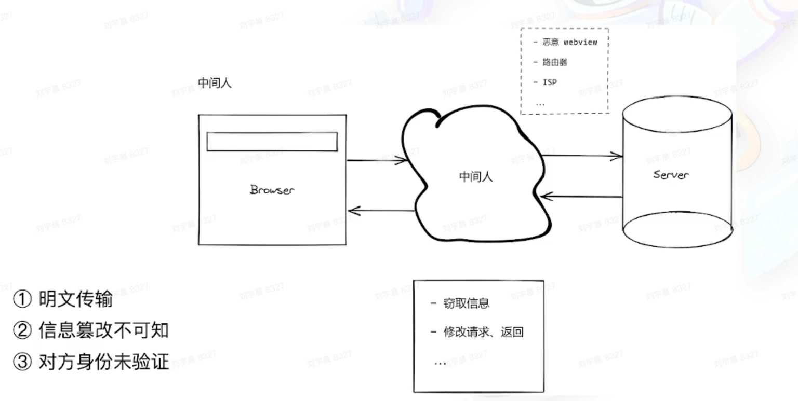

# Web 开发的安全之旅 - 攻击

两个角度看 Web 安全

- hacker - 攻击
- 开发者 - 防御

## 目录

- [Web 开发的安全之旅 - 攻击](#web-开发的安全之旅---攻击)
  - [目录](#目录)
  - [Cross-Site Scripting（XSS）](#cross-site-scriptingxss)
    - [XSS 特点](#xss-特点)
    - [XSS 分类](#xss-分类)
    - [图示](#图示)
  - [Cross-site request forgery（CSRF）](#cross-site-request-forgerycsrf)
    - [CSRF demo](#csrf-demo)
    - [CSRF 特点](#csrf-特点)
  - [Injection](#injection)
    - [SQL Injection](#sql-injection)
    - [SQL Injection demo](#sql-injection-demo)
    - [Injection 不止于 SQL](#injection-不止于-sql)
  - [Denial of Service (DoS)](#denial-of-service-dos)
    - [前置知识](#前置知识)
      - [正则表达式 -- 贪婪模式](#正则表达式----贪婪模式)
    - [ReDoS - 基于正则表达式的 DoS](#redos---基于正则表达式的-dos)
    - [Distributed DoS (DDoS)](#distributed-dos-ddos)
      - [SYN Flood - SYN 泛洪攻击](#syn-flood---syn-泛洪攻击)
  - [传输层相关攻击](#传输层相关攻击)
    - [中间人攻击](#中间人攻击)

## Cross-Site Scripting（XSS）

### XSS 特点

- 通常难以从 UI 上感知（暗地执行脚本）
- 窃取用户信息（cookie/token）
- 绘制 UI（例如弹窗），诱骗用户点击/填写表单


### XSS 分类

- Stored XSS
  - 恶意脚本被存放在数据库中
  - 访问页面 -> 读数据 == 被攻击
  - 危害最大，对全部用户可见
- Reflected XSS
  - 不涉及数据库
  - 从 URL 上攻击
- DOM-based XSS
  - 不需要服务器的参与
  - 恶意攻击的发起 + 执行，全部在浏览器完成
- Mutation-based XSS
  - 利用了浏览器渲染 DOM 的特性（独特优化）
  - 不同浏览器，会有区别（按浏览器进行攻击）

### 图示

Reflected XSS demo


DOM-based XSS


Reflected VS DOM-based


Mutation-based XSS demo


## Cross-site request forgery（CSRF）

### CSRF demo


### CSRF 特点

- 在用户不知情的前提下
- 利用用户权限（cookie）
- 构造指定 HTTP 请求，窃取或修改用户敏感信息

大部分基于 GET 请求

```javascript
<a href="https://bank.com/transfer?to=hacker&amount=100">点我抽奖</a>


```

CSRF beyond GET

```javascript
<form action="https://bank/transfer_tons_of_money" method="POST">
    <input name="amount" value="10000000000" type="hidden" />
    <input name="to" value="hacker" type="hidden" />
</form>
```

## Injection

SQL Injection 是最常见的注入攻击方式

### SQL Injection


### SQL Injection demo

1. 读取请求字段
2. 直接以字符串的形式拼接 SQL 语句

```javascript
// 服务端
public async renderForm(ctx) {
    const { username, form_id } = ctx.query;
    const result = await sql.query(`
        SELECT a, b, c FROM table
        WHERE username = ${username}
        AND form_id = ${form_id}
    `);
    ctx.body = renderForm(result);
}

// 客户端
fetch("/api", {
    method: "POST",
    headers: {
        "Content-Type": "application/json"
    },
    body: JSON.stringify({
        username: "any; DROP TABLE table;"
    })
})

// 最终 sql 语句（致使数据库删除）
`SELECT a, b, c FROM table
WHERE username = any;
DROP TABLE table;
AND form_id = ${form_id}`

```

### Injection 不止于 SQL

- CLI
- OS command
- Server-Side Request Forgery（SSRF），服务端请求伪造
  - 严格而言，SSRF 不属于 injection，但是原理类似

CLI - 执行

```javascript
// 服务端
public async convertVideo(ctx) {
    const { video, options } = ctx.request.body;
    exec(`convert-cli ${video} -o ${options}`);
    ctx.body = "ok";
}

fetch("/api", {
    method: "POST",
    body: JSON.stringify({
        options: `' && rm -rf xxx`
    })
});

const command = `convert-cli video -o && rm -rf xxx`;
```

读取 + 修改

```javascript
location / {
    proxy_pass https:/\/hacker.com;
}
```

- 流量转发到真实第三方
- 第三方扛不住新增流量
- 第三方服务挂掉
- 竞争对手下线

SSRF demo

1. 请求【用户自定义】的 callback URL
2. web server 通常有内网访问权限

```javascript
public async webhook(ctx) {
    // callback 可能是内网 url
    // e.g http://secret.com/get_employ_payrolls
    ctx.body = await fetch(ctx.query.callback);
}

// 访问 callback === 暴露内网信息
```

## Denial of Service (DoS)

DoS 服务拒绝

通过某种方式（构造特定请求），导致服务器资源被显著消耗，来不及响应更多请求，导致请求挤压，进而发生雪崩效应。

### 前置知识

#### 正则表达式 -- 贪婪模式

重复匹配时 [?] vs [no ?] === 满足一个即可 vs 尽量多

```javascript
const greedyRegExp = /a+/; // 有多少匹配多少
const noGreedyRefExp = /a+?/; // 有一个就行
const str = "aaaaaaa";

console.log(str.match(greedyRegExp)[0]); // "aaaaaaa"
console.log(str.match(noGreedyRegExp)[0]); // "a"
```

### ReDoS - 基于正则表达式的 DoS


### Distributed DoS (DDoS)

短时间内，来自大量僵尸设备的请求流量，服务器不能及时完成全部请求，导致请求堆积，进而发生雪崩效应，无法响应新请求。

攻击特点

- 直接访问 IP
- 任意 API
- 消耗大量带宽（耗尽）

#### SYN Flood - SYN 泛洪攻击


## 传输层相关攻击

### 中间人攻击


