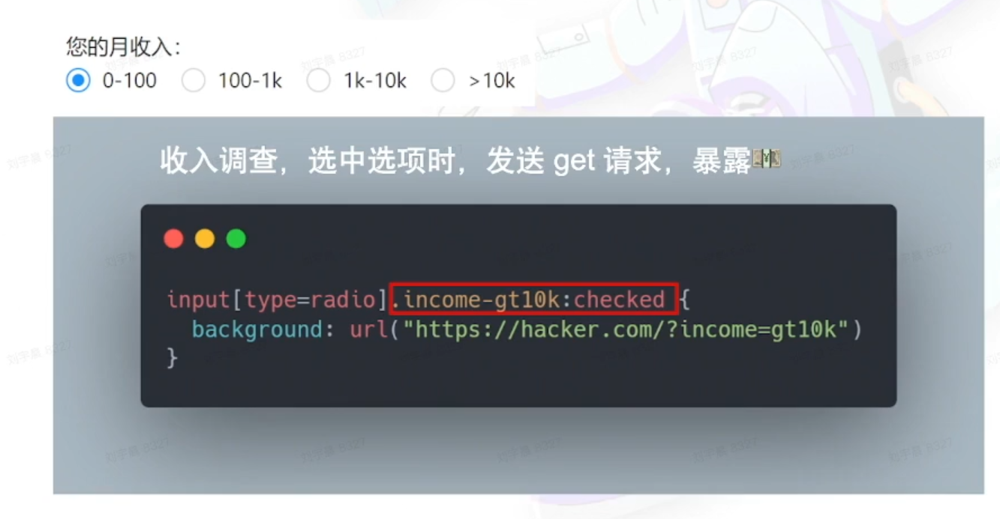
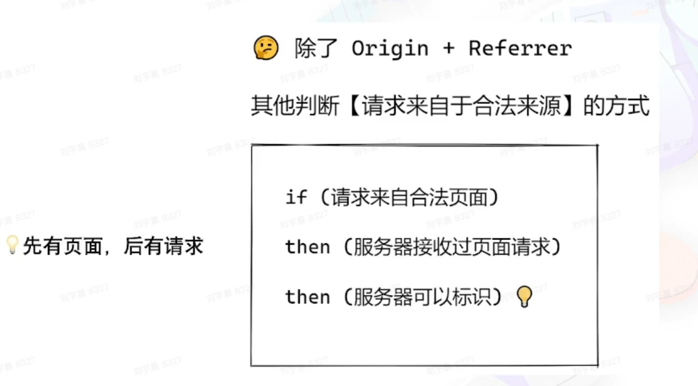
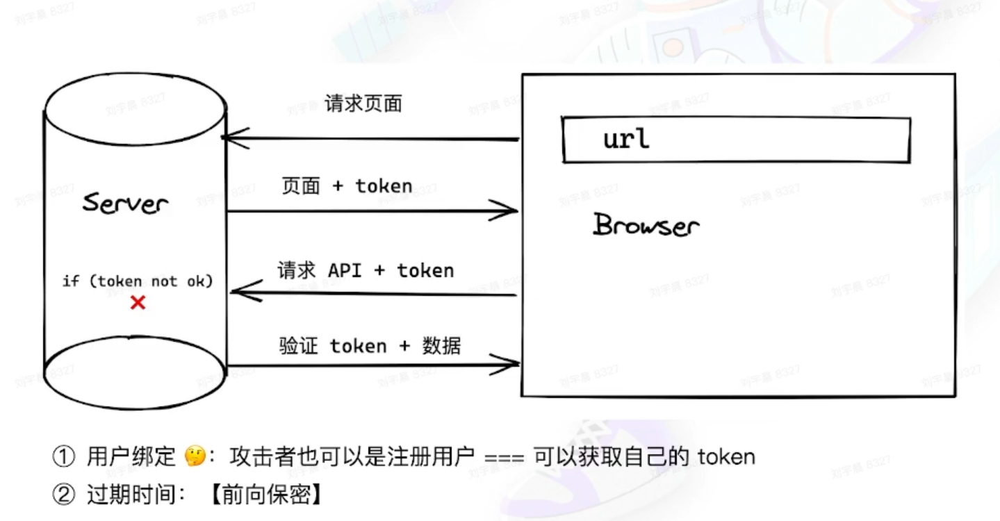
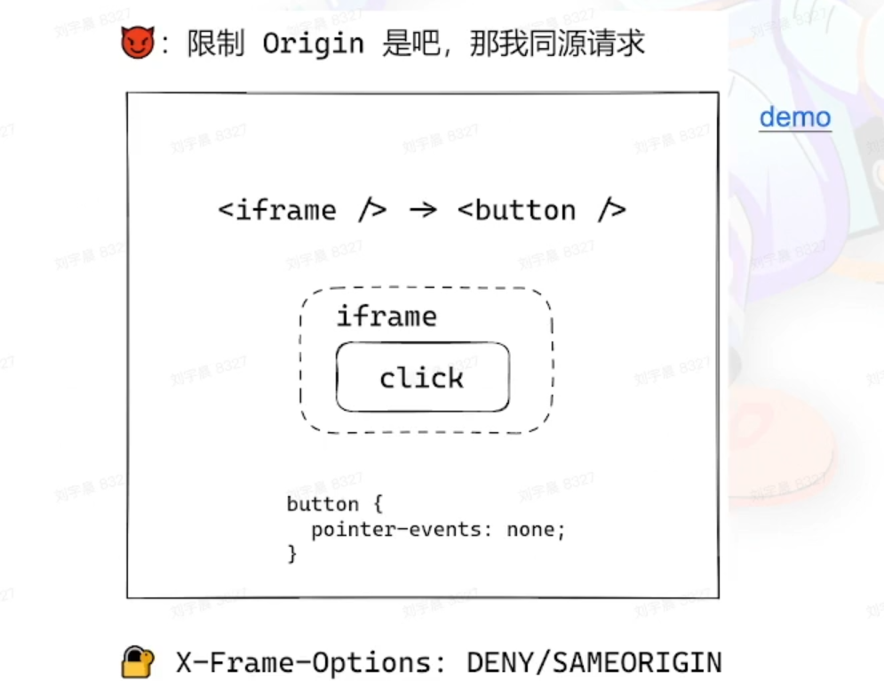
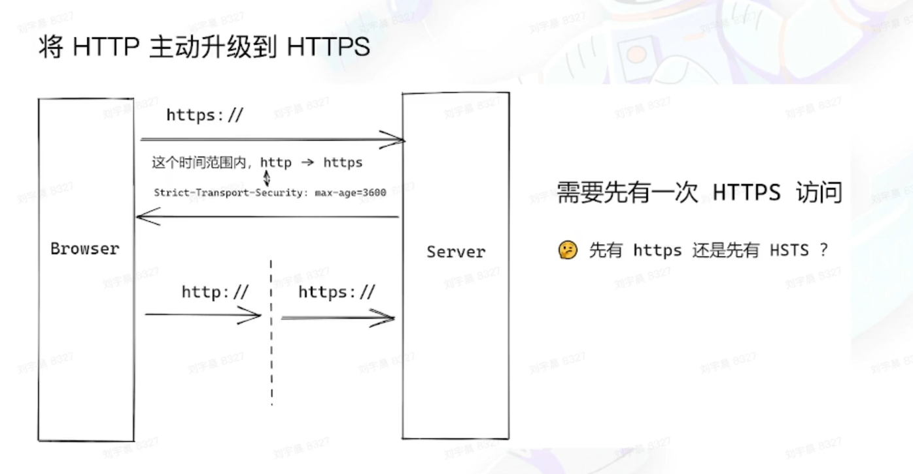
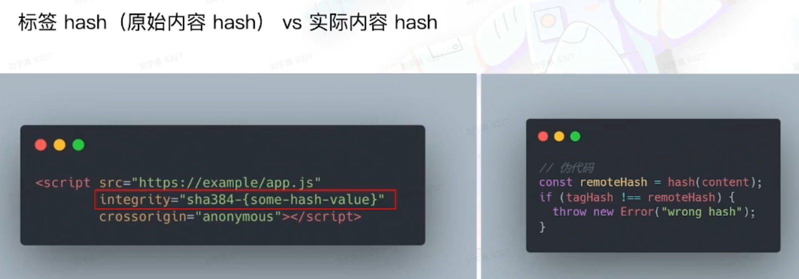

# Web 开发的安全之旅 - 防御

两个角度看 Web 安全

- hacker - 攻击
- 开发者 - 防御

## 目录

- [Web 开发的安全之旅 - 防御](#web-开发的安全之旅---防御)
  - [目录](#目录)
  - [防御 XSS](#防御-xss)
    - [XSS 的防御工具](#xss-的防御工具)
    - [用户需求 - 必须动态生成 DOM](#用户需求---必须动态生成-dom)
      - [！！自定义样式](#自定义样式)
  - [前置知识](#前置知识)
    - [Same-origin Policy（SOP）](#same-origin-policysop)
    - [Content Security Policy（CSP）](#content-security-policycsp)
  - [防御 CSRF](#防御-csrf)
    - [CSRF -- token](#csrf----token)
    - [CSRF -- iframe](#csrf----iframe)
    - [避免用户信息被携带 - SameSite Cookie](#避免用户信息被携带---samesite-cookie)
      - [依赖 Cookie 的第三方服务](#依赖-cookie-的第三方服务)
      - [SameSite VS CORS](#samesite-vs-cors)
    - [总结 - 防御 CSRF 的正确姿势](#总结---防御-csrf-的正确姿势)
  - [防御 Injection](#防御-injection)
    - [防御 SQL Injection](#防御-sql-injection)
    - [防御 beyond SQL Injection](#防御-beyond-sql-injection)
  - [防御 DoS](#防御-dos)
    - [防御基于正则表达式的 DoS](#防御基于正则表达式的-dos)
    - [防御 DDos](#防御-ddos)
  - [防御中间人攻击](#防御中间人攻击)
    - [HTTPS 的一些特性](#https-的一些特性)
    - [TLS 握手](#tls-握手)
    - [HTTPS -- 完整性](#https----完整性)
    - [HTTPS -- 不可抵赖性](#https----不可抵赖性)
    - [HTTP Strict-Transport-Security(HSTS)](#http-strict-transport-securityhsts)
    - [Subresource Intergrity (SRI)](#subresource-intergrity-sri)
  - [补充内容](#补充内容)
    - [Feature Policy / Permission Policy](#feature-policy--permission-policy)
    - [尾声](#尾声)

## 防御 XSS

- 永远不相信用户的提交内容
  - 不直接将用户的提交内容直接转换为 DOM

### XSS 的防御工具

- 前端
  - 主流框架默认防御 XSS
  - google-closure-library
- 服务端（Node）
  - DOMPurify

### 用户需求 - 必须动态生成 DOM

```javascript
// ！！string --> DOM

new DOMParser(); // 对字符串进行转义

// ！！上传 svg (对其内容进行过滤)

<svg>
    <script>alert("xss")</script>
</svg>

// ！！自定义跳转链接
// 尽量不做该功能；若必须做，则进行过滤操作

<a href="javascript:alert('xss')"></a>

```

#### ！！自定义样式



## 前置知识

### Same-origin Policy（SOP）

- 协议
- 域名
- 端口

### Content Security Policy（CSP）

- 哪些源（域名）被认为是安全的
- 来自安全源的脚本可以执行，否则直接报错
- 禁止 eval + inline script

```javascript
// 服务器的响应头部
Content-Security-Policy：script-src 'self' // 同源
Content-Security-Policy：script-src 'self' https:/\/domain

// 浏览器 meta
<meta http-equiv="Content-Security-Policy" content="script-src self">
```

## 防御 CSRF


### CSRF -- token





### CSRF -- iframe



### 避免用户信息被携带 - SameSite Cookie


#### 依赖 Cookie 的第三方服务


#### SameSite VS CORS

| SameSite                           | CORS                  |
| :--------------------------------- | :-------------------- |
| Cookie 发送                        | 资源读写（HTTP 请求） |
| domain vs 页面域名                 | 资源域名 vs 页面域名  |
| "我跟你说个事，出这屋我可就不认了" | 白名单                |

### 总结 - 防御 CSRF 的正确姿势

通过 Node 服务器建立防御 CSRF 的中间件，为所有应用统一使用，而不是 case by case。

## 防御 Injection

### 防御 SQL Injection

1. 找到项目中查询 SQL 的地方
2. 使用 prepared statement

```javascript
PREPARE q FROM 'SELECT user FROM users WHERE gender = ?';
SET @gender = "female";
EXECUTE q USING @gender;
DEALLOCATE PREPARE q;
```

### 防御 beyond SQL Injection

- 最小权限原则
  - sudo || root
- 建立白名单 + 过滤
  - rm
- 对 URL 类型参数进行协议、域名、ip 等限制
  - 访问内容

## 防御 DoS

### 防御基于正则表达式的 DoS

- Code Review
  - 防止写出贪婪正则表达式
- 代码扫描 + 正则性能测试
- 不使用用户提供的正则表达式

### 防御 DDos

- 流量治理
  - 负载均衡
  - API 网关
  - CDN
- 快速自动扩容
- 非核心服务降级

## 防御中间人攻击

使用 HTTPS (HTTP + TLS)

HTTPS (QUIC) 内置了 TLS 1.3

### HTTPS 的一些特性

- 可靠性 - 加密
- 完整性 - MAC 验证
- 不可抵赖性 - 数字签名

### TLS 握手


### HTTPS -- 完整性


### HTTPS -- 不可抵赖性


注：当数字证书的签名算法不够健壮时，签名算法有可能被暴力破解。

### HTTP Strict-Transport-Security(HSTS)



### Subresource Intergrity (SRI)

怎样防御**静态资源被劫持篡改**？

对比静态资源的 hash



## 补充内容

### Feature Policy / Permission Policy

- 一个源（页面）下，可以使用哪些功能
- camera
- microphone
- autoplay
- ...

如果页面被 XSS 攻击，那么可以杜绝页面进行一些窃取用户隐私的危险操作，不能调用 camera、microphone等

### 尾声

- 安全无小事
- 使用的依赖（npm package，甚至 NodeJS）可能成为最薄弱的一环
  - left-pad 事件
  - eslint-scope 事件
  - event-stream 事件
  - npm install 除了可以带来黑洞，还可以带来漏洞
- 保持学习心态
