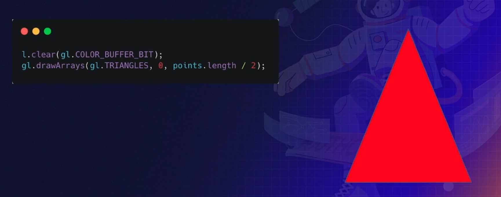

# WebGL 基础

## 目录

- [WebGL 基础](#webgl-基础)
  - [目录](#目录)
  - [Why WebGL / Why GPU](#why-webgl--why-gpu)
  - [Modern Graphic System 现代图形系统](#modern-graphic-system-现代图形系统)
    - [现代图形系统处理流程](#现代图形系统处理流程)
  - [CPU VS GPU](#cpu-vs-gpu)
  - [WebGL & OpenGL](#webgl--opengl)
  - [WebGL Startup](#webgl-startup)
    - [Create WebGL Context](#create-webgl-context)
    - [前置知识 The Shaders](#前置知识-the-shaders)
      - [Vertex Shader 顶点着色器](#vertex-shader-顶点着色器)
      - [Fragment Shader 片段着色器](#fragment-shader-片段着色器)
    - [Create Program](#create-program)
    - [Data to Frame Buffer](#data-to-frame-buffer)
    - [Frame Buffer to GPU](#frame-buffer-to-gpu)
    - [Output](#output)

## Why WebGL / Why GPU

- WebGL 是什么？
  - GPU ≠ WebGL ≠ 3D
- WebGL 为什么不像其他前端技术那么简单？

## Modern Graphic System 现代图形系统


### 现代图形系统处理流程


## CPU VS GPU

CPU 擅长逻辑控制、串行的计算。

GPU 擅长大规模并发计算，即密码破解和图像处理。

## WebGL & OpenGL


## WebGL Startup


### Create WebGL Context

```javascript
// 不考虑兼容性的情况
const canvas = document.querySelector("canvas");
const gl = canvas.getContext("webgl");

// 考虑兼容性的情况
function create3DContext(canvas, options) {
    const names = ["webgl","experimental-webgl","webkit-3d","moz-webgl"];
    // webgl2 新版本 webgl
    if (options.webgl2) names.unshift("webgl2");
    let context = null;
    for (let ii = 0; ii < names.length; ++ii) {
        try {
            context = canvas.getContext(names[ii], options);
        } catch(e) {
            // no-empty
        }
        if (context) {
            break;
        }
    }
    return context;
}
```

### 前置知识 The Shaders

#### Vertex Shader 顶点着色器

串行计算，绘制出构成图形的轮廓。

```c++
attribute vec2 position;

void main() {
    gl_PointSize = 1.0;
    gl_Position = vec4(position, 1.0, 1.0);
}
```

#### Fragment Shader 片段着色器

并行计算，在顶点着色器构成的轮廓内，并行的绘制像素点。

```c++
precision mediump float;

void main() {
    gl_FragColor = vec4(1.0, 0.0, 0.0, 1.0);
}
/* 
  vec4(1.0, 0.0, 0.0, 1.0) 中的四个值可以对比 rgba
  而每个数值都进行了归一化处理，且使用浮点数表示。
  1.0 = 255; 0.0 = 0; 
  上述表示绘制一个 红色的不透明的像素点
 */
```

### Create Program

```javascript
const vertexShader = gl.createShader(gl.VERTEX_SHADER);
gl.shaderSource(vertexShader, vertex);
gl.compileShader(vertexShader);

const fragmentShader = gl.createShader(gl.FRAGMENT_SHADER);
gl.shaderSource(fragmentShader, fragment);
gl.compileShader(fragmentShader);

const program = gl.createProgram();
gl.attachShader(program, vertexShader);
gl.attachShader(program, fragmentShader);
gl.linkProgram(program);

gl.useProgram(program);
```

### Data to Frame Buffer


### Frame Buffer to GPU


### Output


