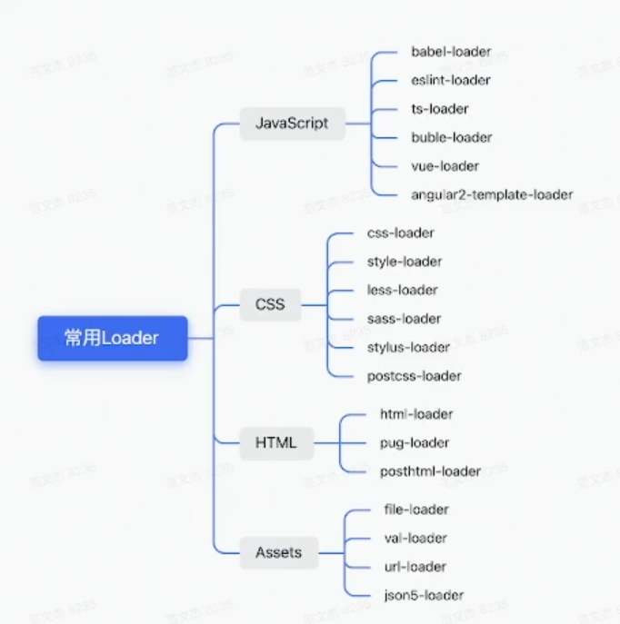
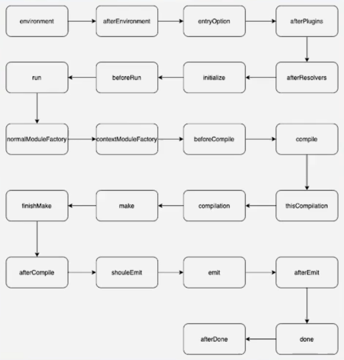

# Webpack 知识体系

## 目录

- [Webpack 知识体系](#webpack-知识体系)
  - [目录](#目录)
  - [为什么要学习 Webpack](#为什么要学习-webpack)
  - [课程目标](#课程目标)
  - [什么是 Webpack](#什么是-webpack)
    - [前端项目由什么构成？ -- 资源](#前端项目由什么构成----资源)
      - [旧时代资源管理](#旧时代资源管理)
    - [工程化工具](#工程化工具)
    - [Webpack 本质是一种前端资源编译、打包工具](#webpack-本质是一种前端资源编译打包工具)
  - [使用 Webpack](#使用-webpack)
    - [核心流程 -- 极度简化版](#核心流程----极度简化版)
    - [Webpack 功能](#webpack-功能)
    - [关于 Webpack 配置文件](#关于-webpack-配置文件)
    - [处理 CSS](#处理-css)
    - [接入 Babel](#接入-babel)
    - [处理 HTML](#处理-html)
  - [Webpack 工具线](#webpack-工具线)
    - [HMR](#hmr)
    - [Tree-Shaking](#tree-shaking)
      - [开启 tree-shaking](#开启-tree-shaking)
    - [其他工具](#其他工具)
  - [理解 Loader](#理解-loader)
    - [核心功能](#核心功能)
    - [常用 Loader 功能](#常用-loader-功能)
    - [Loader 的链式调用](#loader-的链式调用)
    - [Loader 特点](#loader-特点)
  - [Webpack 插件](#webpack-插件)
    - [什么是插件，为什么这样设计](#什么是插件为什么这样设计)
    - [Webpack 编译](#webpack-编译)
    - [理解插件](#理解插件)
      - [插件围绕‘钩子’展开](#插件围绕钩子展开)
  - [如何学习 Webpack](#如何学习-webpack)
    - [入门应用思维导图](#入门应用思维导图)
  - [课后答疑](#课后答疑)
    - [面试要掌握到什么程度](#面试要掌握到什么程度)
    - [require 与 import 导入有什么区别](#require-与-import-导入有什么区别)
    - [Webpack 可以自动 polyfill IE9 吗](#webpack-可以自动-polyfill-ie9-吗)
    - [vite、esbuild、webpack 对比](#viteesbuildwebpack-对比)
    - [loader 与 plugin 的区别](#loader-与-plugin-的区别)
    - [webpack 与 rollup 的区别](#webpack-与-rollup-的区别)
    - [Webpack 的 runtime](#webpack-的-runtime)
    - [webpack 优化场景](#webpack-优化场景)
    - [tree-shaking 存在那个阶段](#tree-shaking-存在那个阶段)

## 为什么要学习 Webpack

- 理解前端“工程化” 概念、工具、目标
- 一个团队总要有那么几个人输入 Webpack，某种程度上可以称为个人的核心竞争力
- 高阶前端必经之路

## 课程目标

- ✅ 理解 Webpack 的基本用法
- ✅ 通过介绍 Webpack 功能、Loader 与 Plugin 组件设计，建立一个知识体系
- ❎ 不会事无巨细，介绍 Webpack 所有
- ❎ 也不是深入源码，讲解底层实现原理

## 什么是 Webpack

### 前端项目由什么构成？ -- 资源

- PNG JPG GIF WEBP
- JS TS
- CSS Less Sass
- Vue JSx Tsx
- html
- ...

#### 旧时代资源管理

于 HTML 中直接引入资源文件

- 依赖手工，过程繁琐
- 当代码文件之间有依赖的时候，就得严格依赖顺序书写
- 开发与生产环境一致，难以接入 TS 或 JS 新特性
- 比较难以接入 Less、Sass 等工具
- JS、图片、CSS 资源管理模型不一致

### 工程化工具

- gulp
- webpack
- vite
- rollup.JS
- browserify

### Webpack 本质是一种前端资源编译、打包工具

- 多份资源文件打包成一个 Bundle
- 支持 Babel、Eslint、TS、CoffeScript、Less、Sass
- 支持模块化处理 css、图片 等资源文件
- 支持 HMR + 开发服务器
- 支持持续监听、持续构建
- 支持代码分离
- 支持 Tree-shaking
- 支持 Sourcemap

## 使用 Webpack

1、安装

```shell
npm i -D webpack webpack-cli
```

2、编辑配置文件

```JS
const path = require("path");

module.exports = {
  // 定义当前项目入口文件
  entry: "./src/index.JS",
  mode: "development",
  devtool: false,
  // 定义当前项目出口文件
  output: {
    filename: "[name].JS",
    path: path.join(__dirname, "./dist"),
  },
};

```

3、执行编译命令

```shell
npx webpack
```

### 核心流程 -- 极度简化版

1. Get Start - 入口处理
   - 从 “entry” 文件开始，启动编译流程
   - 相关配置项
     - entry
     - context
2. Dependencies Lookup - 依赖解析
   - 从 “entry” 文件开始，根据 “require” or “import” 等语句找到依赖资源
   - 相关配置项
     - resolve
     - externals
3. Transform - 资源解析
   - 根据 “module” 配置，调用资源转译器，将 png、css 等非标准 JS 资源转译为 JS 内容
     - 相关配置项
       - module
4. Combine Assets - 资源合并打包
   - 将转译后的资源内容合并打包可直接在浏览器运行的 JS 文件
     - 相关配置项
       - optimization
       - mode
       - target

**注**：整个流程会递归执行 2、3 步骤，直到所有资源处理完毕

### Webpack 功能

一句话总结：模块化 + 一致性

- 多个文件资源合并成一个，减少 http 请求数
- 支持模块化开发
- 支持高级 JS 特性
- 支持 Typescript、CoffeeScript 语言
- 同一图片、CSS、字体 等其他资源的处理模型
- ...

### 关于 Webpack 配置文件

关于 Webpack 的使用方法，基本都围绕“配置”展开，而这些配置大致可划分为两类：

- 流程类
  - 作用于流程中某个 或 若干个环节，直接影响打包效果的配置项
- 工具类
  - 主流程之外，提供更多工程化能力的配置项

配置总览：


使用频率

- entry output
- module plugins
- mode
  - 默认值 production
    - 打包后的文件内容较为简洁
- watch devServer devtools

### 处理 CSS

1、安装相关 Loader

```shell
npm i -D css-loader style-loader
```

2、添加 ‘module’ 的 CSS 处理规则

```javascript
module: {
  // CSS 处理器
  rules: [
    // 正则表达式，匹配 .css 后缀文件
    test: /.css$/,
    // 处理 CSS 文件的loader。注意有先后顺序，索引越靠后越先执行
    use: ["style-loader", "css-loader"]
  ]
}
```

### 接入 Babel

1、安装依赖

```shell
npm i -D @babel/core @babel/preset-env babel-loader
```

2、添加 ‘module’ 的 JS 处理规则

```javascript
module: {
  //...
  rules: [{
    test: /\.js$/,
    use: [{
      loader: "babel-loader",
      options: {
        presets: [
          ['@babel/preset-env']
        ]
      }
    }]    
  }]
}
```

推荐学习的 babel 模块

- @babel/preset-env
- @babel/preset-react
- @babel/preset-typescript

### 处理 HTML

使用 html-webpack-plugin 自动生成 HTML 文件

1、安装依赖

```shell
npm i -D html-webpack-plugin
```

2、 声明产物出口 output

```javascript
const HtmlWebpackPlugin = require('html-webpack-plugin');

module.exports = {
  ...
  plugins: [new HtmlWebpackPlugin()]
}
```

## Webpack 工具线

### HMR

Hot Module Replacement -- 模块热替换

1、开启 HMR

```javascript
module.exports = {
  ...
  // 开启 HMR
  devServer: {
    hot: true
  },

  // 持续监听文件变化
  watch: true
}
```

2、使用新命令启动 Webpack

```shell
npx webpack serve
```

### Tree-Shaking

Tree-Shaking -- 用于删除 dead code

Dead Code

- 代码没有被用到，不可达到
- 代码的执行结果不会被用到
- 代码只读不写
- ...

Tree-Shaking

- 模块导出了，但未被其他模块使用

#### 开启 tree-shaking

简化方法：

```javascript
module.exports = {
  ...
  mode: "production",
  optimization: {
    usedExports: true
  }
}
```

### 其他工具

- 缓存
- Sourcemap
  - 压缩文件与源文件的映射
    - 有利于项目维护
- 性能监控
- 日志
- 代码压缩
- 分包
- ...

## 理解 Loader

### 核心功能

为了处理非标准 JS 资源，设计出资源转译模块 -- Loader 用于将资源转译为标准 JS。

### 常用 Loader 功能

- less-loader
  - 实现 less => css 的转换
- css-loader
  - 将 css 包装为类似 module.epxorts = "${css}" 的内容，包装后的内容符合 JavaScript 语法
- style-loader
  - 将 css 模块处理为 require 语句，并在运行时调用 injectStyle 等函数将内容注入到页面的 style 标签



### Loader 的链式调用


### Loader 特点

- 链式执行
- 支持异步执行
- 分 normal、pitch 两种模式


## Webpack 插件

### 什么是插件，为什么这样设计

- 很多知名的工具，都设计了所谓“插件”架构
- VS Code、Web Storm、Chorme、Firefox
- Babel、Webpack、Rollup、Eslint
- Vue、Redux、Quill、Axios

### Webpack 编译

1. webpack 配置处理
   - 错误检查
   - 增加默认配置
   - ...
2. 编译器的准备工作
   - 处理 Webpack 配置中的 plugin
   - Webpack 自己的一些 plugin
   - 初始化 compiler
   - ...
3. 开始编译主入口
4. resolve 阶段：解析文件路径以及loaders
   - 解析出文件的绝对路径
   - 解析出 inline
   - 解析在 webpack.config.js 中匹配的 loaders
   - 将 loaders 解析为固定格式
   - 解析 loaders 执行文件路径
5. loaders 逐个执行
6. parse 阶段
   - 将文件转为 ast 树
   - 解析 import 和 export 等
7. 递归处理依赖
   - 重复 resolve 阶段
8. module -- 一些优化以及 增强 id
9. 生成 chunk，决定每个 chunk 中包含的 module
10. 生成文件
    - 根据模板生成文件名称
    - 生成文件
      - 这里会再次用到前面 parse 阶段的内容
      - 将 import、export 语句替换为符合 webpack 语法的语句
11. 写文件，结束

这是一个特别复杂的过程

- 新人需要了解整个流程细节，上手成本高
- 功能迭代成本高，牵一发而动全身
- 功能僵化，作为开源项目而言缺乏成长性
- ...

- 心智成本高
- 可维护性低
- 生命力弱

**插件结构精髓**：对扩展开放，对修改封闭

Webpack 本身的很多功能也是基于插件实现的

### 理解插件

#### 插件围绕‘钩子’展开

钩子的核心信息：

1. 时机
   - 编译过程的特定节点，Webpack 会以钩子形式通知插件此刻正在发生什么事情
   - compier.hooks.compilation
2. 上下文
   - 通过 tapable 提供的回调机制，以参数方式传递上下文信息
   - compilation
3. 交互
   - 在上下文参数对象中附带了很多存在 side effect 的交互接口，插件可以通过这些接口改变
   - dependencyFactorires.set

插件时机



---

## 如何学习 Webpack

- 入门应用
  - 理解打包流程
  - 熟悉掌握常用配置项、Loader、插件的使用方法
  - 能够灵活搭建集成 Vue、React、Babel、Eslint、Less、Sass、图片处理等工具的 Webpack
  - 掌握常见脚手架工具的用法，例如：Vue-cli、create-react-app、@angular/cli
- 进阶
  - 理解 Laoder、Plugin 机制
  - 能够自行开发 Webpack 组件
  - 理解常见性能优化手段，并能用于解决实际问题
  - 理解前端工程化概念与生态现状
- 大师级
  - 阅读源码
  - 理解 Webpack 编译
  - 打包原理
  - 甚至能够参与共建

### 入门应用思维导图


## 课后答疑

### 面试要掌握到什么程度

网上有很多相关面试题，主要围绕三种主题：

- Loader 有什么作用，怎么写 Loader，常用 Loader
  - 作用：
    - Loader 主要功能即是对资源进行转译。Webpack 需要支持诸如 CSS、图片等非 JS 文件，故而需要使用 Loader。
  - 常用Loader
    - css-loader
    - style-loader
    - vue-loader
    - file-loader
    - eslint-loader
    - babel-loader
- 插件有什么作用，怎么写插件、插件原理
  - 作用
    - 在 Webpack 的整个生命周期都会起作用的组件
- Bundle、chunk、module 分别是什么含义

### require 与 import 导入有什么区别

- require 是 CMD 的规范
  - reuqire 是动态的
  - 不可以做 tree-shaking
- import 是 ES Moudle 的规范
  - 是静态的，导入导出在编译时通过语法判断
  - 可以做 tree-shaking

### Webpack 可以自动 polyfill IE9 吗

不能，需要通过 babel 实现，webpack 没有polyfill

### vite、esbuild、webpack 对比

- vite
  - 速度快
    - 不需要将文件打包在一起，跳过了 bundle
- webpack
  - 生态强大
  - 兼容性更高

### loader 与 plugin 的区别

loader 的主要职责即是将非 JS 资源转译为 Webpack 支持的 JS 资源

plugin 没有明确的输入输出，其作用贯穿于整个 Webpack 生命周期，可以在任意时间点修改 webpack 内部状态，进而修改 Webpack 的运行流程

### webpack 与 rollup 的区别

- webpack
  - 更注重细节
  - 在整个生命周期内导入了大量的钩子，开放性更强
  - 应用于浏览器场景
- rollup
  - 适用于构建 npm 的场景
  - 构建类库场景

### Webpack 的 runtime

runtime 即是一个框架，许多插件都需要在 runtime 支持下发挥作用

### webpack 优化场景

- 提高编译速度
- 生产环境运行效率（tree-shaking）

### tree-shaking 存在那个阶段

生成 act 前，还是 act generate 后

在生成 act 之后，做 tree-shaking
