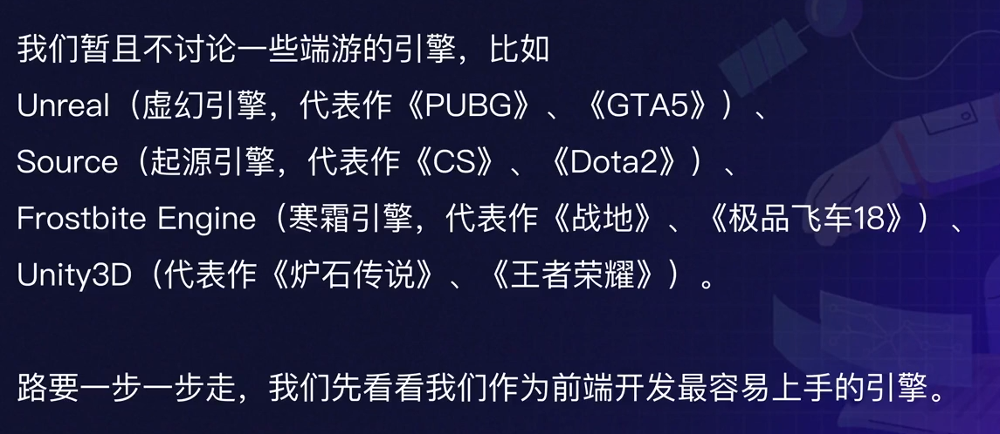
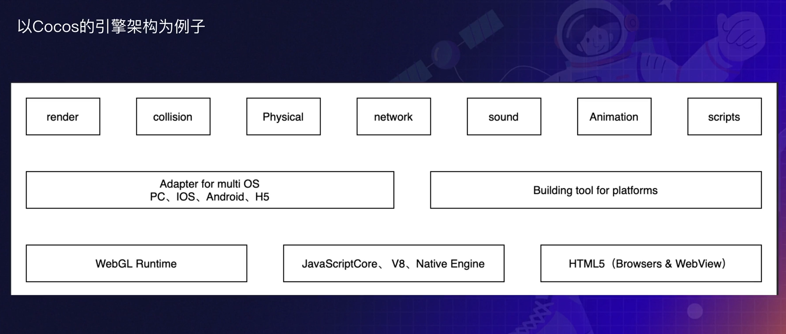
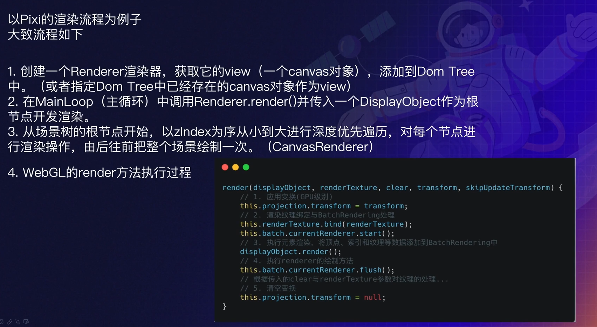
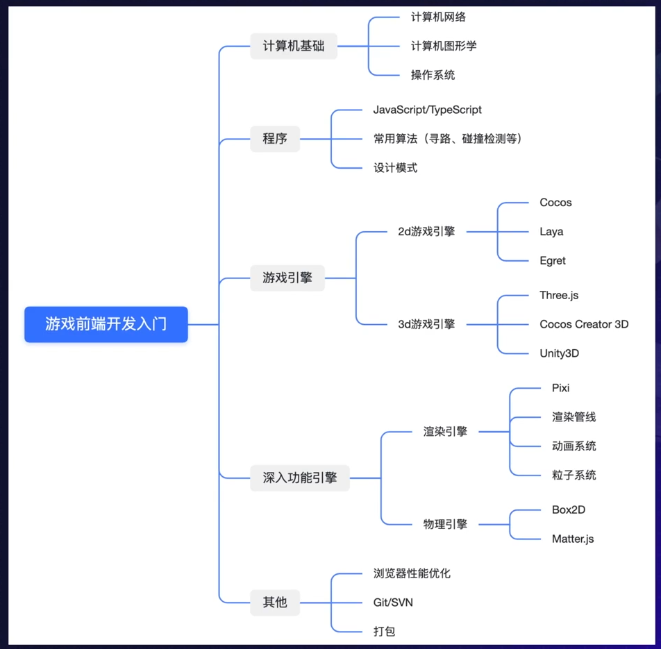
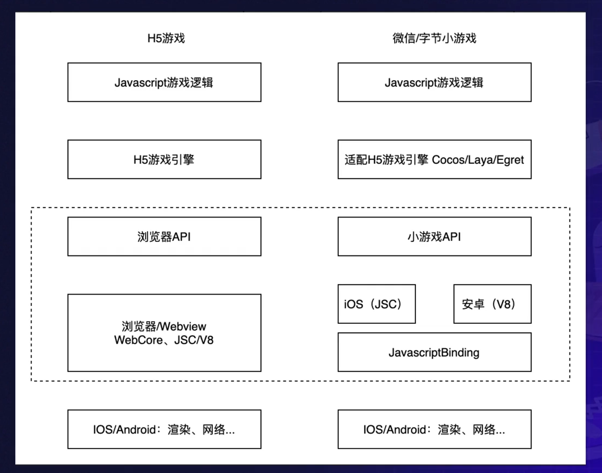

# 小游戏开发

## 目录

- [小游戏开发](#小游戏开发)
  - [目录](#目录)
  - [前端场景下的游戏开发](#前端场景下的游戏开发)
    - [开发链路和角色](#开发链路和角色)
    - [为什么要用游戏引擎](#为什么要用游戏引擎)
    - [前端开发过渡到游戏开发](#前端开发过渡到游戏开发)
  - [游戏引擎](#游戏引擎)
    - [市面上常见的游戏引擎](#市面上常见的游戏引擎)
      - [端游引擎](#端游引擎)
      - [特定类型的客户端游戏引擎](#特定类型的客户端游戏引擎)
      - [Web 游戏引擎](#web-游戏引擎)
    - [功能引擎](#功能引擎)
    - [2D游戏引擎的技术架构](#2d游戏引擎的技术架构)
    - [Web游戏引擎的渲染原理](#web游戏引擎的渲染原理)
  - [游戏前端开发入门技能树](#游戏前端开发入门技能树)
  - [游戏发布平台的差异性](#游戏发布平台的差异性)

## 前端场景下的游戏开发

### 开发链路和角色

### 为什么要用游戏引擎

游戏引擎最大的优势：渲染

### 前端开发过渡到游戏开发

## 游戏引擎

### 市面上常见的游戏引擎

#### 端游引擎

#### 特定类型的客户端游戏引擎

- The NVL Maker - 文字冒险游戏制作器
  - No Code 形式开发，只需要写文字脚本再加上一定的配置就可以生成一个文字冒险游戏
  - 由于缺乏迭代和运营，该游戏引擎比较小众
- RPG Maker - 关卡类型游戏
  - Low Code 形式开发

#### Web 游戏引擎

- Cocos
  - 优势
    - 平台支持能力好
    - 完善的游戏功能支持
    - 生态较好
  - 缺点
    - 3D 能力仍在建设中
    - 版本迭代过快
- Laya
  - 优势
    - 3D 能力比较成熟
    - 支持 JS、TS、AS
    - 引擎体积小
  - 缺点
    - 界面能力不友好
    - 生态很差
- Egret
  - 优势
    - 工具链比较完善
    - 第三方库支持好
    - 企业定制能力强
  - 缺点
    - 更新迭代遭遇瓶颈
    - 生态较差
- CreateJS & Phaser
  - 没有可视化界面
  - 多个库的集合
  - CreateJS
    - EASELJS - 控制素材展示与组合
    - TWEENJS - 控制素材缓动动画
    - SOUNDJS - 控制声音
    - PRELOADJS - 控制加载
  - Phaser
    - 在 CreateJS 提供的功能的基础上
    - 摄像机
    - 物理引擎
    - 内置浏览器
    - 插件系统
    - ...

### 功能引擎

### 2D游戏引擎的技术架构

### Web游戏引擎的渲染原理

## 游戏前端开发入门技能树

## 游戏发布平台的差异性

