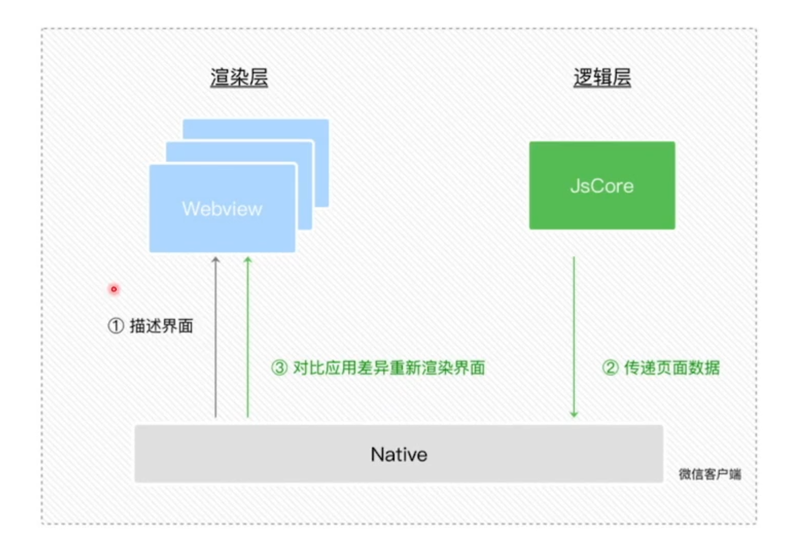
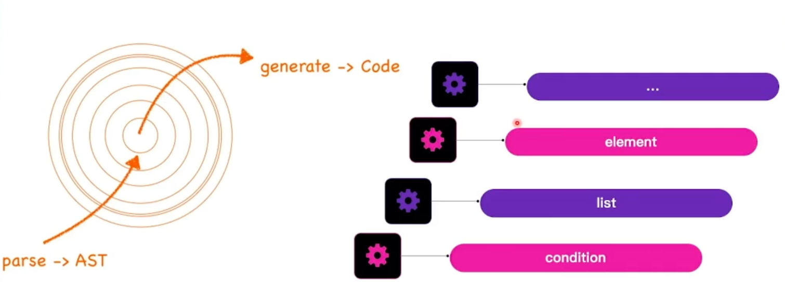
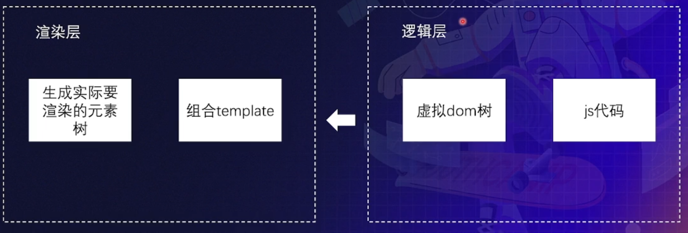

# 小程序技术全解

课程目标：

- 认识和了解小程序的业务产品价值
- 学习和掌握小程序相关技术原理

## 目录

- [小程序技术全解](#小程序技术全解)
  - [目录](#目录)
  - [业务价值](#业务价值)
    - [与 Web 区别](#与-web-区别)
    - [三大价值](#三大价值)
  - [技术解析](#技术解析)
    - [探索方案](#探索方案)
      - [开发门槛低](#开发门槛低)
      - [接近原生的使用体验](#接近原生的使用体验)
      - [安全管控](#安全管控)
    - [总结](#总结)
  - [相关拓展](#相关拓展)
    - [跨端框架](#跨端框架)
    - [跨端框架原理](#跨端框架原理)
      - [编译时](#编译时)
      - [运行时](#运行时)
  - [Q&A](#qa)
    - [跨端框架技术选型](#跨端框架技术选型)

## 业务价值

### 与 Web 区别

- 有着固定的语法以及统一的版本管理，平台可以方便的进行审核
- 平台能够控制各个入口，如二维码，文章内嵌，端内分享。入口上也能带来更好的用户体验
- 小程序基于特殊的架构，在流畅度上比 Web 更好，有更优秀的跳转体验

### 三大价值

- 渠道价值
  - 由于小程序的便捷性，依托于超级平台，小程序能够充分为很多场景导流，如美团和美团优选微信小程序带来的流量占比分别为 40% 和 80%
- 业务探索价值
  - 相比原生 APP 来说，小程序的开发难度和成本都降低很多，这就创造了很多场景开发者能够用小程序来快速试错，不断探索新的业务价值
- 数字升级价值
  - 线下到线上如何做？从轻消费类的快餐、茶饮到地产汽车等大宗消费，小程序都显示了良好的容错空间

## 技术解析

第三方开发应用最简单最方便的方式

WebView + JSBridge

问题：

- 无网络的情况体验不佳
- 网页切换体验不佳
- **如何管控保证安全**

### 探索方案

- 开发门槛低
- 接近原生的使用体验
- 能够保证安全可控

#### 开发门槛低

HTML + CSS + JS

#### 接近原生的使用体验

- 资源加载
- 渲染
- 页面切换
  - 多 WebView
  - 页面跳转时，并不进行页面销毁

#### 安全管控

独立 JS 沙箱（禁止原生 DOM API）

不操作 DOM 如何控制页面渲染

Data -> 根据数据处理 DOM -> 页面

### 总结

小程序原理

**注**：小程序性能瓶颈主要在于 数据传递。

## 相关拓展

### 跨端框架

- 复杂应用构建
- 一次开发可以跨多端

|      | remax    | taro       | megalo | mpvue | uni-app  |
| ---- | -------- | ---------- | ------ | ----- | -------- |
| 语法 | react    | react、vue | vue    | vue   | vue      |
| 厂家 | 蚂蚁金服 | 京东       | 网易   | 美团  | Hbuilder |

### 跨端框架原理

- 编译时
- 运行时

#### 编译时

**缺陷**：无法完全抹平差异

#### 运行时

大多数跨端框架选择此种方式

- 虚拟 DOM
- Template 组件

在一些场景下相比小程序原生语法性能会更差

## Q&A

### 跨端框架技术选型

- vue
  - uni-app
- react
  - taro
