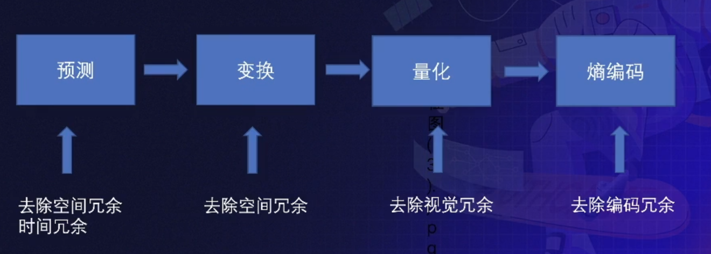
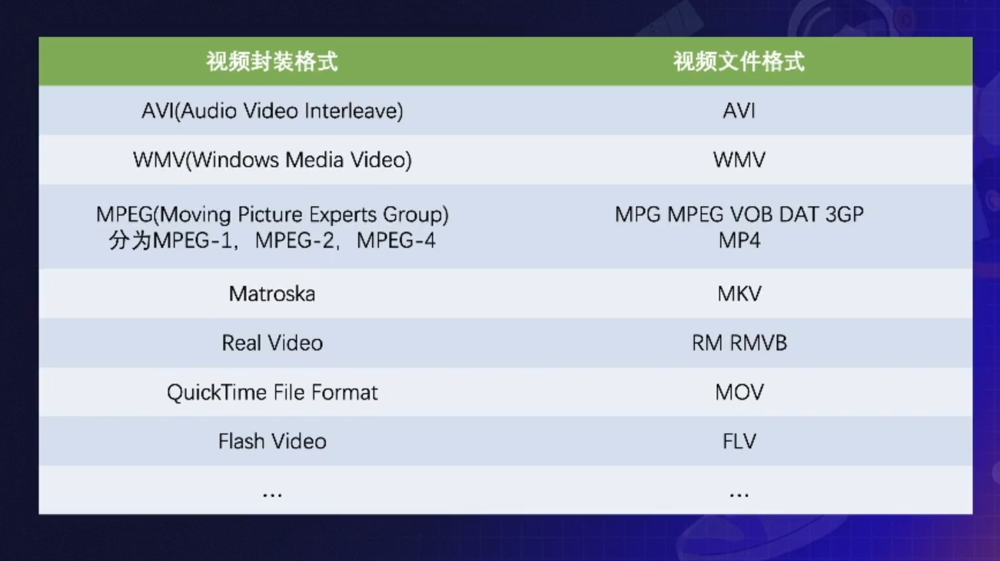
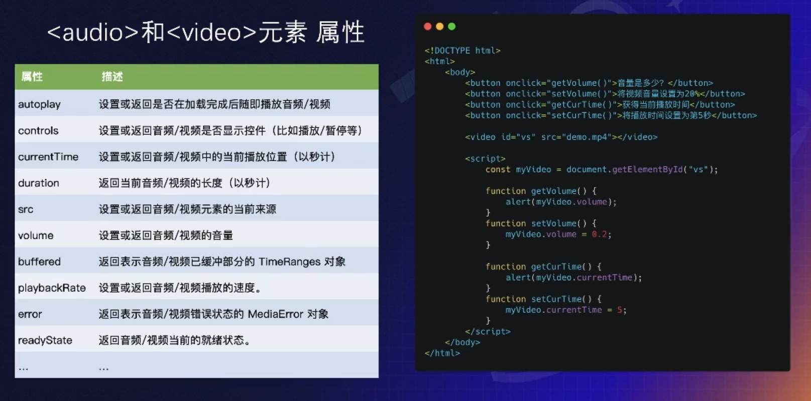
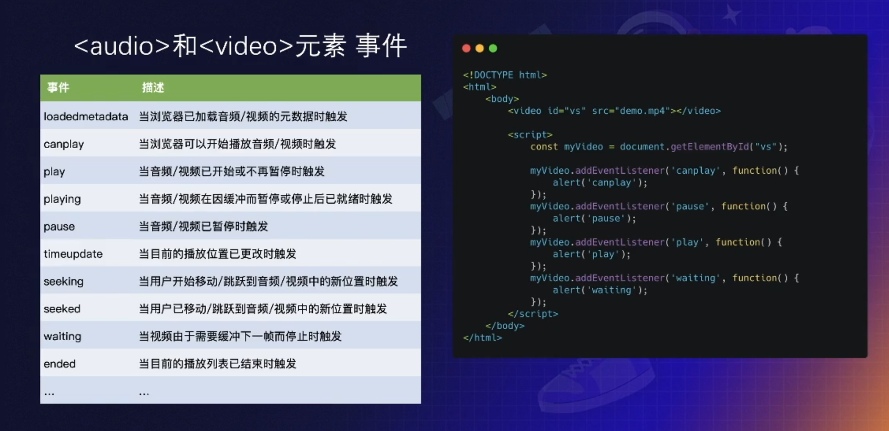
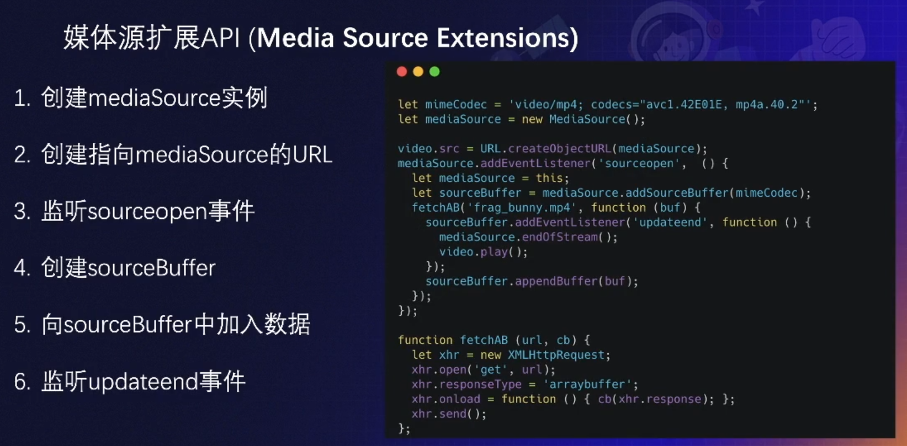
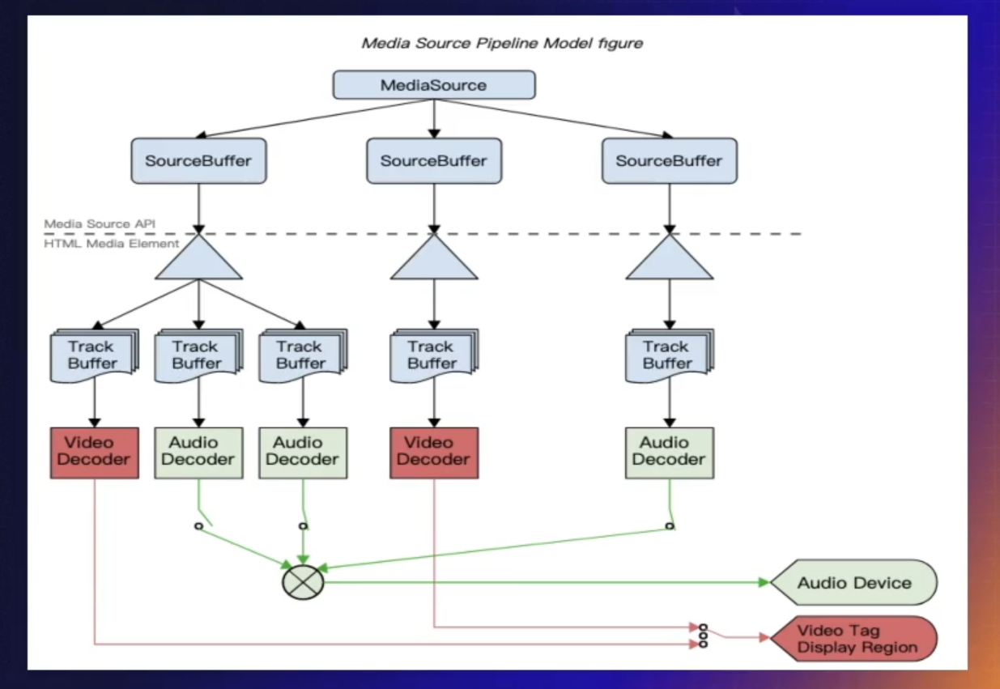

# Web 多媒体

## 目录

- [Web 多媒体](#web-多媒体)
  - [目录](#目录)
  - [Web 多媒体历史](#web-多媒体历史)
  - [基础知识](#基础知识)
    - [编码格式](#编码格式)
      - [图像基本概念](#图像基本概念)
      - [视频基本概念](#视频基本概念)
      - [帧的解码方式](#帧的解码方式)
      - [GOP (group of picture)](#gop-group-of-picture)
      - [为什么要编码](#为什么要编码)
      - [编码数据处理流程](#编码数据处理流程)
    - [封装格式](#封装格式)
    - [多媒体元素和扩展 API](#多媒体元素和扩展-api)
      - [audio & video 元素属性](#audio--video-元素属性)
      - [audio & video 元素事件](#audio--video-元素事件)
      - [audio & video 元素缺陷](#audio--video-元素缺陷)
      - [媒体源扩展 API](#媒体源扩展-api)
      - [MSE 使用](#mse-使用)
      - [MSE 播放流程](#mse-播放流程)
      - [播放器播放流程](#播放器播放流程)
    - [流媒体协议](#流媒体协议)
      - [HLS](#hls)
  - [应用场景](#应用场景)
  - [总结与展望](#总结与展望)

## Web 多媒体历史

1. flash
2. HTML5
3. Media Source Extensions

## 基础知识

### 编码格式

#### 图像基本概念

#### 视频基本概念

#### 帧的解码方式

- I 帧 - 帧内编码帧
  - 该视频帧的压缩和解码不依赖于其他任何帧
- P 帧 - 前向预测编码帧
  - 该视频帧的解码依赖于前帧
- B 帧 - 双向预测编码帧
  - 该视频帧的解码依赖于前后双帧

#### GOP (group of picture)

两个 I 帧 之间的间隔。

一般情况下，GOP 在 2s~4s。

#### 为什么要编码

未压缩情况下：

图片：

分辨率：1920 X 1080

大小：1920 X 1080 X 24 / 8 = 5.9M

视频：

- 帧率：30FPS
- 时长：90分钟
- 大小：933G

对文件进行编码（以视频为例）

针对文件不相关部分或冗余部分进行去除或压缩。

冗余种类：

- 空间冗余
- 时间冗余
- 编码冗余
- 视觉冗余

#### 编码数据处理流程

### 封装格式

### 多媒体元素和扩展 API

#### audio & video 元素属性

#### audio & video 元素事件

#### audio & video 元素缺陷

- 不支持直接播放 hls、flv 等视频格式
- 视频资源的请求和加载无法通过代码控制
  - 分段加载（节约流量）
  - 清晰度无法切换
  - 精确预加载

#### 媒体源扩展 API

#### MSE 使用

#### MSE 播放流程

#### 播放器播放流程

### 流媒体协议

注：重点为前三种，RTMP 为 flash 使用。

#### HLS

HTTP Live Streaming，由 Apple 公司提出的基于 HTTP 的媒体流传输协议，用于实时音视频流的传输。目前 HLS 协议被广泛应用于视频点播和直播领域。

## 应用场景

## 总结与展望

