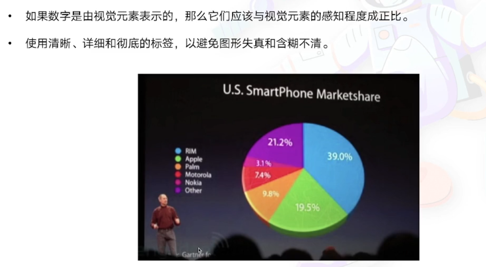
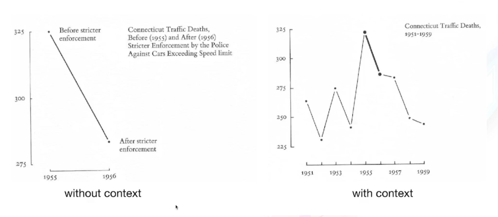
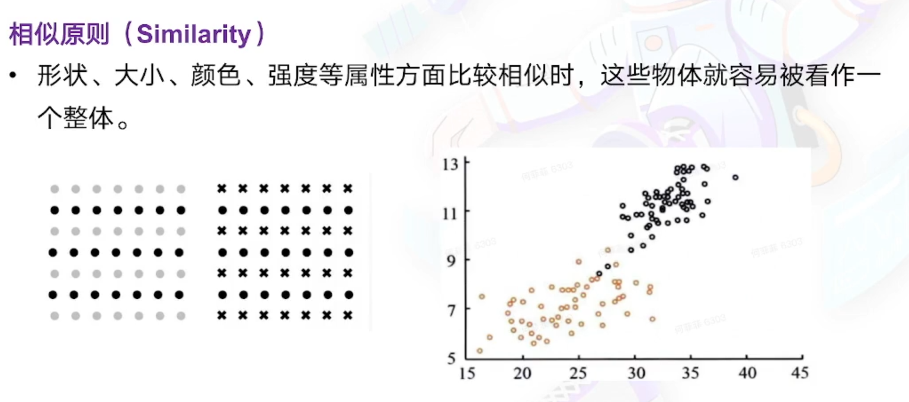
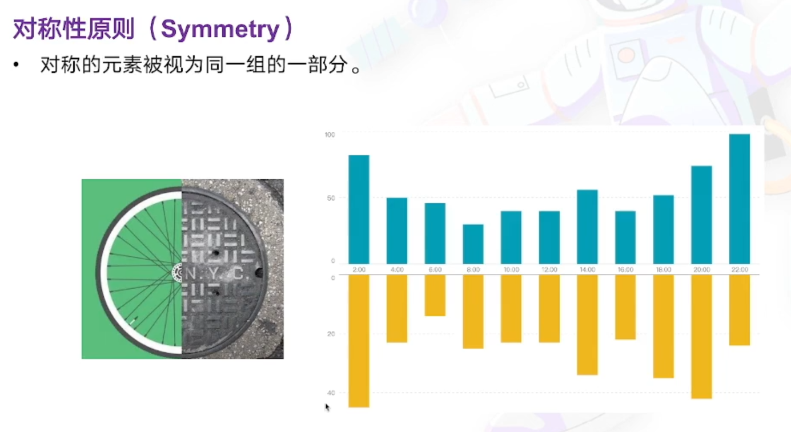
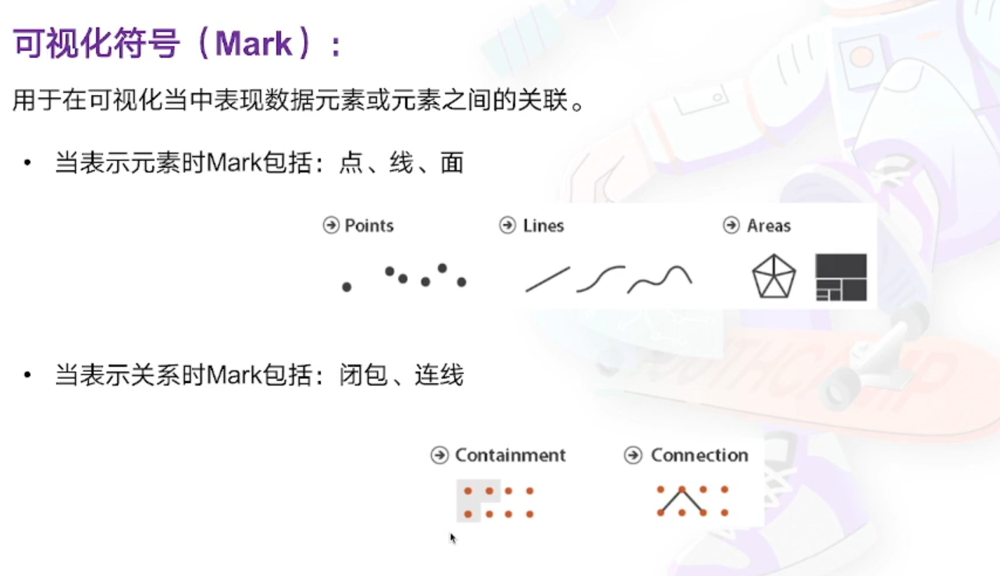
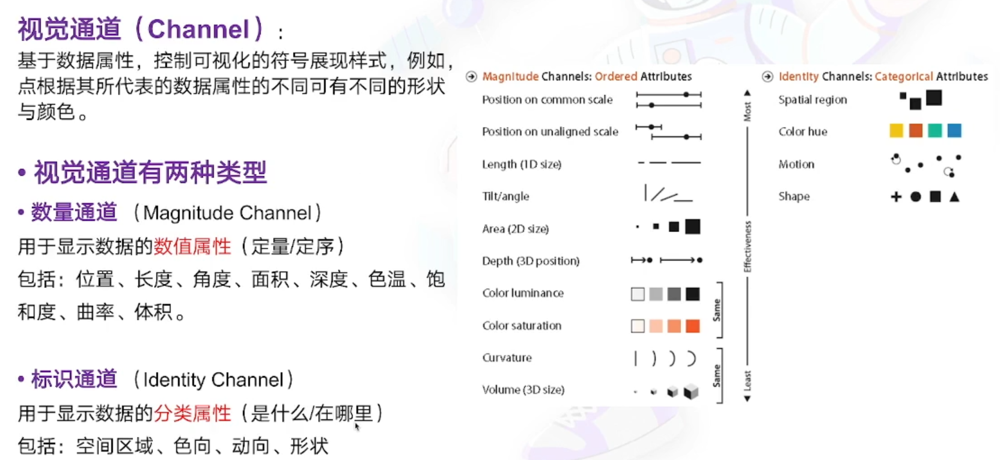
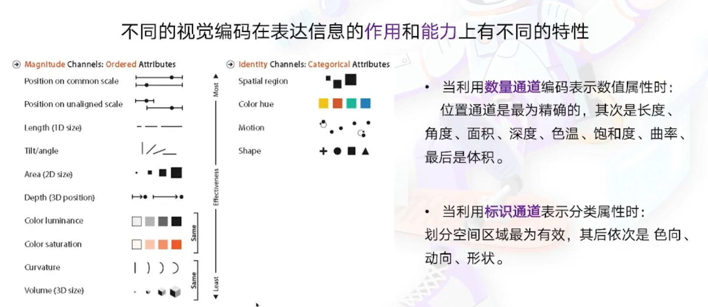

# 数据可视化基础

## 目录

- [数据可视化基础](#数据可视化基础)
  - [目录](#目录)
  - [什么是数据可视化](#什么是数据可视化)
    - [数据可视化分类](#数据可视化分类)
    - [为什么要数据可视化](#为什么要数据可视化)
  - [可视化设计原则和方法](#可视化设计原则和方法)
    - [常见的错误可视化](#常见的错误可视化)
    - [透视失真](#透视失真)
    - [图形设计 & 数据尺度](#图形设计--数据尺度)
    - [数据上下文](#数据上下文)
  - [可视化设计原则](#可视化设计原则)
    - [Data-ink Ratio](#data-ink-ratio)
  - [视觉感知](#视觉感知)
    - [格式塔理论](#格式塔理论)
    - [格式塔理论原则](#格式塔理论原则)
      - [就近原则](#就近原则)
      - [相似原则](#相似原则)
      - [连续性原则](#连续性原则)
      - [闭合原则（Closure）](#闭合原则closure)
      - [共势原则（Common movement）](#共势原则common-movement)
      - [对称性原则（Symmetry）](#对称性原则symmetry)
      - [图形与背景关系原则（Figure-ground）](#图形与背景关系原则figure-ground)
  - [视觉编码（Visual Encoding）](#视觉编码visual-encoding)
    - [可视化符号（Mark）](#可视化符号mark)
    - [视觉通道](#视觉通道)
    - [视觉编码的优先级](#视觉编码的优先级)
  - [面向前端的可视化工具](#面向前端的可视化工具)

## 什么是数据可视化

Anything that converts data into a visual representation (like charts, graphs, maps, sometimes even just tables).

### 数据可视化分类

- 科学可视化
  - 科学实验数据的直观展示
- 信息可视化
  - 对抽象数据的直观展示
- 可视分析
  - 对分析结果的直观展现，及交互式反馈，是一个跨领域的方向

### 为什么要数据可视化

- 记录信息
- 分析推理
- 证实假设
- 交流思想
  
## 可视化设计原则和方法

能够**正确**地表达数据中的信息而**不产生偏差和歧义**。

### 常见的错误可视化

- 透视失真
- 图形设计 & 数据尺度
- 数据上下文

### 透视失真

如下图，由于 3D 视图的**近大远小**，使得在该立体饼图中，19.5% 所占部分看起来要比 21.2% 所占部分要大。

### 图形设计 & 数据尺度

如下图，环形仪表盘中，自60开始以20刻度递增。

### 数据上下文

数据上下文是否完整会导致截然不同的结论。

## 可视化设计原则

- 准确地展示数据
  - Show the data, and tell the truth
- 节省笔墨
  - Use the least amount of ink
- 节省空间
  - Don't waste space
- 消除不必要的“无价值”图形
  - Eliminate non-essentials and redundancies
- 在最短时间内传达最多的信息
  - Give the viewer the greatest number of ideas in the shortest time

### Data-ink Ratio

## 视觉感知

可视化致力于**外部认知**，也就是说，怎样利用大脑以外的资源来增强大脑本身的认知能力。

### 格式塔理论

### 格式塔理论原则

#### 就近原则

#### 相似原则

#### 连续性原则

#### 闭合原则（Closure）

#### 共势原则（Common movement）

#### 对称性原则（Symmetry）

#### 图形与背景关系原则（Figure-ground）

## 视觉编码（Visual Encoding）

### 可视化符号（Mark）

### 视觉通道

### 视觉编码的优先级

## 面向前端的可视化工具

- D3
  - 用于数据可视化的开源的 JS 函数库
  - 被认为是最好的 JS 可视化框架之一
- Vega - A Visualization Grammer
  - 是一种可视化语法。
  - 通过其声明式语言，可以用 JSON 格式描述可视化的视觉外观和交互行为，并使用 Canvas 和 SVG 生成视图。
- G2 - 可视化引擎
  - 一套面向常规统计图表，**以数据驱动的高交互可视化图形语法，**，具有高度的易用性和扩展性
  - 无需关注图标各种繁琐的实现细节，一条语句即可使用 Canvas 或 SVG 构建出各种各样的可交互的统计图表。
- Echarts
  - 使用 JS 实现的开源可视化库
  - 可以流畅的运行在 PC 和移动设备上，兼容当前绝大部分浏览器
  - 底层依赖矢量图形库 ZRender
