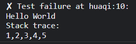

# Text

在 JavaScript 中使用字符串类型表示文本，字符串是由 16 位值组成的**不可变**有序序列，每个值通常代表一个 Unicode 字符。字符串的长度是它包含的 16 位值的个数。

JavaScript 字符串（是一个数组），使用从零开始的索引，第一个 16 位值位于索引 0，依次类推。

空字符串是长度为 0 的字符串。JavaScript 没有特殊的类型表示字符串的单个元素。要表示单个 16 位值，只需使用长度为 1 的字符串。

## 目录

- [Text](#text)
  - [目录](#目录)
  - [characters codepoints and javascript strings](#characters-codepoints-and-javascript-strings)
  - [String Literals](#string-literals)
    - [长字符串表示](#长字符串表示)
  - [Escape Sequences in String Literal](#escape-sequences-in-string-literal)
    - [Table 3-3-1 JavaScript escape sequences](#table-3-3-1-javascript-escape-sequences)
  - [Working with Strings](#working-with-strings)
  - [Template Literals](#template-literals)
  - [Pattern Matching](#pattern-matching)

## characters codepoints and javascript strings

JavaScript 使用 Unicode 字符集的 UTF-16 编码，JavaScript 字符串是无符号的 16 位值序列。

最常用的 Unicode 字符具有适合 16 位的代码点，可以由字符串的一个元素表示。

代码点不适合 16 位的 Unicode 字符，将使用 UTF-16 规则，对两个 16 位值组成的序列（可称之为 代理对）进行编码。这意味着一个长度为 2 的 JavaScript 字符串（两个 16 位值）可能只代表一个 Unicode 字符

```javascript
let euro = "€";
let love = "❤";
euro.length   // => 1: this character has one 16-bit element
love.length   // => 2: UTF-16 encoding of ❤ is "\ud83d\udc99"
```

JavaSciprt 定义的大多数字符串操作方法是对 16 位值进行操作，而不是字符。亦没有特别对待“代理对”，并且没有对字符串执行规范化，甚至不确保字符串是格式良好的 UTF-16。

**注**：在 ES6 中，字符串是可迭代的，如果使用  for/of 循环 或者 ... 扩展操作符，将迭代字符串的实际字符，而不是 16 位值。

```javascript
let str = "huaqi";
for (let item of str) {
  console.log(item);   // h u a q i
}
console.log(...str);   // h u a q i
```

## String Literals

如果要在 JavaScript 程序中包含字符串，只需将字符串包含在**匹配的** 单引号、双引号 或 反引号中（'' "" ``）。

双引号字符和反引号可以包含在由单引号字符分割的字符串中，由双引号和反引号分割的字符串也是如此。

```javascript
""  // The empty string: it has zero characters
'testing'
"3.14"
'name="myform"'
"Wouldn't you prefer O'Reilly's book?"
"τ is the ratio of a circle's circumference to its radius"
`"She said 'hi'", he said.`
```

使用反引号分隔字符串是 ES6 的一个特性，它允许 JavaScript 表达式嵌入（或插入）字符串字面量。

### 长字符串表示

最初的 JavaScript 版本要求将字符串文子写在单行上，通常会看看到 JavaScript 代码通过使用 + 操作符连接单行字符串来创建字符串。

在 ES5 中，可以通过在每行末尾使用反斜杠 \ 将字符串分隔成多行。**反斜杠及其后面的行结束符都不是字符串字面值的一部分。**

如果需要在由单引号或双引号的分隔的字符串中包含换行字符，可以使用字符序列 \n。

ES6 反引号语法允许字符串跨多行分割，在这种情况下，**行结束符是字符串字面值的一部分。**

```javascript
// A string representing 2 lines written on one line:
'two\nlines'

// A one-line string written on 3 lines:
"one\
 long\
 line"

// A two-line string written on two lines:
`the newline character at the end of this line
is included literally in this string`
```

**注**：当使用单引号分隔字符串时，必须小心使用英语缩写和所有格，如 can\'t Reilly\'s。由于撇号与单引号字符相同，必须使用反斜杠 \ 对出现在单引号的任何撇号进行转义。

在客户端 JavaScript 编程中，JavaScript 可能和 HTML 代码互相包含，与 JavaScript 一样，HTML 也使用单引号或双引号分隔字符串。因此在组合 JavaScript 和 HTML 时，最好在两种语言中使用不同风格的引号。

```html
<button onclick="alert('Thank you')">Click Me</button>
```

## Escape Sequences in String Literal

反斜杠字符 \ 在 JavaScript 字符串中有特殊用途。与其后面的字符相结合，表示字符串中不能以其他方式表示的字符。例如：\n 是表示**换行符**的转义序列。

### Table 3-3-1 JavaScript escape sequences

| Sequence | Character represented                                                                                                   |
| :------- | ----------------------------------------------------------------------------------------------------------------------- |
| \0       | The NUL character (\u0000)                                                                                              |
| \b       | Backspace (\u0008)                                                                                                      |
| \t       | Horizontal tab (\u0009)                                                                                                 |
| \n       | Newline (\u000A)                                                                                                        |
| \v       | Vertical tab (\u000B)                                                                                                   |
| \f       | Form feed (\u000C)                                                                                                      |
| \r       | Carriage return (\u000D)                                                                                                |
| "        | Double quote (\u0022)                                                                                                   |
| \\'      | Apostrophe or single quote (\u0027)                                                                                     |
| \\\      | Backslash (\u005C)                                                                                                      |
| \xnn     | The Unicode character specified by the two hexadecimal digits nn                                                        |
| \unnnn   | The Unicode character specified by the four hexadecimal digits nnnn                                                     |
| \u{n}    | The Unicode character specified by the codepoint n, where n is one to six hexadecimal digits between 0 and 10FFFF (ES6) |

上表中有三个转义序列是通用的，可以通过 Unicode 字符代码指定为十六进制数来表示任何字符。

- 序列 \xA9 表示版权符号，具有由十六进制数字 A9 给出的 Unicode 编码
- \u 转义表示由四个十六进制数字或用花括号括起来的 1~ 5 个数字指定的任意 Unicode 字符。\u03c0 表示字符 Π， \u{1f600} 表示呲牙笑。

如果 \ 字符在表 3-1 中以外的任何字符之前，反斜杠将被忽略，例如，\\# 和 # 一样。

最后，如上所述，ES5 允许在换行之前使用反斜杠跨多行分隔字符串字面量。

## Working with Strings

JavaScript 连接字符串的能力是其内置特性之一。

如果对数字使用 + 运算符，它们将相加。

如果对字符串使用 + 运算符，+ 后面的字符串连接至前面的字符串。

```javascript
let msg = "Hello," + "world";  // Produces the string "Hello, world"
let name = 3;
let greeting = "Welcome to my blog," + " " + name;  // Produces the string "Welcome to my blog, 3"
// implicit type conversion
```

字符串之间可以使用 === 与 !== 进行比较，当且仅当两个字符串由完全相同的 16 位值序列组成时，它们才相等。字符串还可以使用 <、<=、>、>= 操作符进行比较。

字符串之间的比较是通过比较 16 位值来完成的。

要确定一个字符串的长度（即它包含的 16 位值的数量），可以使用字符串的 length 属性。

JavaScript 亦提供了丰富的 API 用于处理字符串

```javascript
let s = "Hello, world"; // Start with some text.

// string.length
s.length; 

// Obtaining portions of a string
s.substring(1,4)        // => "ell": the 2nd, 3rd, and 4th characters.
s.slice(1,4)            // => "ell": same thing
s.slice(-3)             // => "rld": last 3 characters
s.split(", ")           // => ["Hello", "world"]: split at delimiter string

// Searching a string
s.indexOf("l")          // => 2: position of first letter l
s.indexOf("l", 3)       // => 3: position of first "l" at or after 3
s.indexOf("zz")         // => -1: s does not include the substring "zz"
s.lastIndexOf("l")      // => 10: position of last letter l

// Boolean searching functions in ES6 and later
s.startsWith("Hell")    // => true: the string starts with these
s.endsWith("!")         // => false: s does not end with that
s.includes("or")        // => true: s includes substring "or"

// Creating modified versions of a string
s.replace("llo", "ya")  // => "Heya, world"
s.toLowerCase()         // => "hello, world"
s.toUpperCase()         // => "HELLO, WORLD"
s.normalize()           // Unicode NFC normalization: ES6
s.normalize("NFD")      // NFD normalization. Also "NFKC", "NFKD"

// Inspecting individual (16-bit) characters of a string
s.charAt(0)             // => "H": the first character
s.charAt(s.length-1)    // => "d": the last character
s.charCodeAt(0)         // => 72: 16-bit number at the specified position
s.codePointAt(0)        // => 72: ES6, works for codepoints > 16 bits

// String padding functions in ES2017
"x".padStart(3)         // => "  x": add spaces on the left to a length of 3
"x".padEnd(3)           // => "x  ": add spaces on the right to a length of 3
"x".padStart(3, "*")    // => "**x": add stars on the left to a length of 3
"x".padEnd(3, "-")      // => "x--": add dashes on the right to a length of 3

// Space trimming functions. trim() is ES5; others ES2019
" test ".trim()         // => "test": remove spaces at start and end
" test ".trimStart()    // => "test ": remove spaces on left. Also trimLeft
" test ".trimEnd()      // => " test": remove spaces at right. Also trimRight

// Miscellaneous string methods
s.concat("!")           // => "Hello, world!": just use + operator instead
"<>".repeat(5)          // => "<><><><><>": concatenate n copies. ES6
```

**注**：字符串在 JavaScript 中是不可变的，类似 replace() 以及 toUpperCase() 这样的方法，会返回新的字符串，它们不会修改调用它们的字符串。

亦可以将字符串类比只读数组进行处理，可以使用 [],而不是 charAt() 方法从字符串中访问单个字符（16 位值）

```javascript
let str = "Hello, world";
str[0];               // "h"
str[str.length - 1];  // "d"
```

## Template Literals

在 ES6 及以后的版本中，字符串文字可以使用 反引号分隔

```javascript
let str = `hello world`;
```

这不仅仅是一种字符串字面量语法，因为在 `` 可以包含任意的 JavaScript 表达式，我们称之为模板字面量。

`` 中的字符串字面值的最终值是通过计算其包含的任何表达式，进而将表达式结果转换为字符串，并将计算得出的字符串与反撇号中的字面值字符组合起来：

```javascript
let name = "Bill";
let greeting = `Hello ${ name }.`;  // greeting == "Hello Bill".
```

在 `` 里的 ${} 中的所有内容都将被解释为 JavaScript 表达式。大括号之外都是普通的字符串文本。括号内的表达式将被求值，然后转换为字符串，将替换 ${} 以及它们中的所有内容。

`` 模板字面量可以包含任意数量的表达式。其可以使用普通字符串可以使用的任何转义字符，并且不需要特殊转义就可以跨任意数量的行

```javascript
let filename = "huaqi";
let linenumber = 10;
let exception = {
  message: "Hello World",
  stack: [1, 2, 3, 4, 5],
};

// 存在 \ 转义字符，以及多个换行符
let errorMessage = `\
\u2718 Test failure at ${filename}:${linenumber}:
${exception.message}
Stack trace:
${exception.stack}
`;
```

以上代码结果



那么亦可以通过模板字面量使数组转字符串。

```javascript
let arr = [1,2,3,4,5];
console.log(arr.join(""));
console.log(`${arr}`);
```

ES6 有一个内置的标记函数: String.raw() 它在不处理任何反斜杠转义的情况下返回带有反引号的文本：

```javascript
`\n`.length            // => 1: the string has a single newline character
String.raw`\n`.length  // => 2: a backslash character and the letter n`
```

## Pattern Matching

JavaScript 定义了一种称为正则表达式（或 RegExp）的数据类型，用于描述和匹配文本字符串。RegExp 并不是 JavaScript 中的基本数据类型之一，但它们像 number 和 string 一样有字面语法。

正则表达式字面量的语法很复杂，其定义的 API 也很重要。

RegExp 功能强大，通常用于文本处理。

一对斜杠之间的文本构成了正则表达式字面量，其中的第二个斜杠后还可以跟一个或多个字母，用于修改模式的含义

```javascript
/^HTML/;             // Match the letters H T M L at the start of a string
/[1-9][0-9]*/;       // Match a nonzero digit, followed by any # of digits
/\bjavascript\b/i;   // Match "javascript" as a word, case-insensitive
```

RegExp 对象定义了许多有用的方法，字符串也有接受 RegExp 参数的方法

```javascript
let text = "testing: 1, 2, 3";   // Sample text
let pattern = /\d+/g;            // Matches all instances of one or more digits
pattern.test(text)               // => true: a match exists
text.search(pattern)             // => 9: position of first match
text.match(pattern)              // => ["1", "2", "3"]: array of all matches
text.replace(pattern, "#")       // => "testing: #, #, #"
text.split(/\D+/)                // => ["","1","2","3"]: split on nondigits
```
