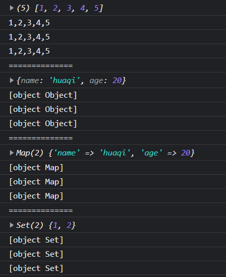

# Type Conversions

JavaScript 对于它所需要的值的类型非常灵活。

JavaScript is very flexible about the types of values it requires.

## 目录

- [Type Conversions](#type-conversions)
  - [目录](#目录)
  - [常见类型的类型转换](#常见类型的类型转换)
  - [3.9.1 Conversions and Equality](#391-conversions-and-equality)
  - [3.9.2 Explicit Conversions](#392-explicit-conversions)
    - [格式化和解析数字](#格式化和解析数字)
      - [数字类型转字符串类型](#数字类型转字符串类型)
      - [字符串类型转数字类型](#字符串类型转数字类型)
  - [3.9.3 Object to Primitive Conversions](#393-object-to-primitive-conversions)
    - [Object-To-Boolean conversions](#object-to-boolean-conversions)
    - [Object-To-String conversions](#object-to-string-conversions)
    - [Object-To-Number conversions](#object-to-number-conversions)
    - [Special Case Operator Conversions](#special-case-operator-conversions)
      - [+ 操作符](#-操作符)
      - [== 和 != 操作符](#-和--操作符)
      - [<、<=、> 和 >= 操作符](#-和--操作符-1)
    - [The toString() and valueOf() Methods](#the-tostring-and-valueof-methods)
      - [toString()](#tostring)
      - [valueOf()](#valueof)
    - [Object-To-Primitive Conversion Algorithms](#object-to-primitive-conversion-algorithms)

## 常见类型的类型转换

- 布尔值
  - 当 JavaScript 需要一个布尔值时，可以提供任何类型的值，JavaScript 会根据需要进行转换。一些值（
“真”值）转换位真，其他值（“假”值）转换为假。
- 字符串
  - 如果 JavaScript 想要一个字符串，它会将你给它的任何值转换为字符串。
- 数字
  - 它将尝试将给它的值转换为一个数字（如果不能执行有意义的转换，则转换为 NaN）。

```javascript
10 + " objects"     // => "10 objects":  Number 10 converts to a string
"7" * "4"           // => 28: both strings convert to numbers
let n = 1 - "x";    // n == NaN; string "x" can't convert to a number
n + " objects"      // => "NaN objects": NaN converts to string "NaN"
```

表 3-9-1 总结了 JavaScript 中值如何从一种类型转换为另一种类型。空的单元格表示不需要转换，也不执行任何转化。

表 3-9-1 JavaScript 类型转换

| Value                                        | to String         | to Number  | to Boolean |
| :------------------------------------------- | :---------------- | :--------- | :--------- |
| undefined                                    | "undefined"       | NaN        | false      |
| null                                         | "null"            | 0          | false      |
| true                                         | "true"            | 1          |
| false                                        | "false"           | 0          |
| "" (empty string)                            |                   | 0          | false      |
| "1.2" (nonempty, numeric)                    |                   | 1.2        | true       |
| "one" (nonempty, non-numeric)                |                   | NaN        | true       |
| 0                                            | "0"               |            | false      |
| -0                                           | "0"               |            | false      |
| 1 (finite, non-zero)                         | "1"               |            | true       |
| Infinity                                     | "Infinity"        |            | true       |
| -Infinity                                    | "-Infinity"       |            | true       |
| NaN                                          | "NaN"             |            | false      |
| {} (any object)                              | see §3.9.3        | see §3.9.3 | true       |
|                                              | ""                | 0          | true       |
| 9                                            | "9"               | 9          | true       |
| 'a'                                          | use join() method | NaN        | true       |
| function(){}                  (any function) | see §3.9.3        | NaN        | true       |

表中显示的原语到原语的转换相对简单。

所有原语都定义了到字符串的转换。

转换称数字需要一点技巧，可以被解析位数字的字符串可以转换为这些数字。允许前导和尾随空格，但是任何不属于数字文字的前导和尾随非空格字符都会导致字符串到数字的转换产生NaN。

## 3.9.1 Conversions and Equality

JavaScript 有两个操作符用于测试两个值是否相等。

严格相等操作符 === ，如果如果被测试的两者不是同一类型，则认为它们是不相等的，推荐在编码时，使用严格相等操作符。

由于 JavaScript 在类型转换方面非常灵活，所以它还定义了灵活相等操作符 == 。

```javascript
null == undefined // => true: These two values are treated as equal.
"0" == 0          // => true: String converts to a number before comparing.
0 == false        // => true: Boolean converts to number before comparing.
"0" == false      // => true: Both operands convert to 0 before comparing!
```

由上述代码可知，在比较双方可以转换为数字的情况下，JavaScript 在使用灵活相等操作符 == 时，会将它们为**数字**然后进行比较。

## 3.9.2 Explicit Conversions

尽管 JavaScript 会自动执行许多类型转换，但有时可能需要执行**显式**转化。

最简单的执行显式类型转换方法是使用 Boolean()、Number()、String() 等函数。

```javascript
Number("3")    // => 3
String(false)  // => "false":  Or use false.toString()
Boolean([])    // => true
```

**注**：除 null 和 undefined 之外的任何值都有 toString() 方法，该方法的结果通常与 String() 函数的返回结果相同。

**注**：笔者亦使用了模板字符串进行类型转换

```javascript
let arr = [1, 2, 3, 4, 5];
let arrStr = arr.toString();
let arrChar = String(arr);
console.log(arr);
console.log(arrStr);
console.log(arrChar);
console.log(`${arr}`);

console.log("==============");

let obj = {
  name: "huaqi",
  age: 20,
};
let objStr = obj.toString();
let objChar = String(obj);
console.log(obj);
console.log(objStr);
console.log(objChar);
console.log(`${obj}`);

console.log("==============");

let myMap = new Map();

myMap.set("name", "huaqi");
myMap.set("age", 20);

let mapStr = myMap.toString();
let mapChar = String(myMap);
console.log(myMap);
console.log(mapStr);
console.log(mapChar);
console.log(`${myMap}`);

console.log("==============");

let mySet = new Set();
mySet.add(1);
mySet.add(2);

let setStr = mySet.toString();
let setChar = String(mySet);
console.log(mySet);
console.log(setStr);
console.log(setChar);
console.log(`${mySet}`);

```



亦可以将 Boolean()、Number()、String() 作为构造函数，使用 new 关键字进行实例化，这样会得到一个行为类似于原始类型值的“包装器”对象。这些包装器对象是 JavaScript 早期遗留下来的，如今并不会经常使用。

某些 JavaScript 操作符会执行隐式类型转换，有时也可用于显式类型转换:

```javascript
x + ""   // => String(x)
+x       // => Number(x)
x-0      // => Number(x)
!!x      // => Boolean(x): Note double !
```

### 格式化和解析数字

格式化和解析数字是计算机程序中的常见任务，JavaScript 有专门的函数和方法，可以对**数字到字符串**和**字符串到数字**提供更精确的控制。

#### 数字类型转字符串类型

由 Number 类定义的 toString() 方法接受一个可选参数，该参数指定转换的基数。如果不指定参数，则以 10 为基数进行转换，当然也可以选择使用代表其他基数的数字（2 ~ 36）。

**注**：由 Number 类定义的 toString() 覆盖了 Object 类中定义的 toString()

```javascript
let n = 17;
let binary = "0b" + n.toString(2);  // binary == "0b10001"
let octal = "0o" + n.toString(8);   // octal == "0o21"
let hex = "0x" + n.toString(16);    // hex == "0x11"
```

在处理金融或科学数据时，您可能希望将数字转换为字符串，以便控制输出中的小数位或有效数字的数量，或您可能希望控制是否使用指数表示法。Number 类为这类数字到字符串的转换定义了三个方法。

- toFixed()
  - 将一个数字转换为指定小数点后几位的字符串，不使用指数符号
- toExponential()
  - 使用指数表示法将数字转化为字符串，小数点前有一个数字，小数点后有指定的数字数（这意味着有效数字比指定的值大 1）
- toPrescision()
  - 将一个数字转换为具有指定有效数字数量的字符串。如果有效数字的数目不足以显示数字的整形部分，则使用指数表示法。

```javascript
let n = 123456.789;
n.toFixed(0)         // => "123457"
n.toFixed(2)         // => "123456.79"
n.toFixed(5)         // => "123456.78900"
n.toExponential(1)   // => "1.2e+5"
n.toExponential(3)   // => "1.235e+5"
n.toPrecision(4)     // => "1.235e+5"
n.toPrecision(7)     // => "123456.8"
n.toPrecision(10)    // => "123456.7890"
```

除了这里提到的数字格式方法外，Intl.NumberFormat 类定义了一个更通用的、国际化的数字格式化方法。

#### 字符串类型转数字类型

- Number()
  - 如果将一个字符串传递给 Number(), 它将尝试将该字符串解析为整数或浮点字面值。
  - 该函数仅适用于基数为 10 的整数，不允许非文字部分的某位字符。
- parseInt()
  - 只解析整数
  - 如果字符串以“0x”或“0X”开头，则将其解释为十六进制数
  - 接受第二个可选参数，指定要解析的数字的基数（2 ~ 36）
- parseFloat()
  - 同时解析整数和浮点数
- parseInt() 与 parseFloat() 共同点
  - 它们是全局函数，不是任何类的方法，更加灵活
  - 都跳过前导空格，解析尽可能多的数字字符，并忽略后面的任何内容
  - 如果第一个非空格字符不是有效数字文字的一部分，则返回 NaN

```javascript
parseInt("3 blind mice")     // => 3
parseFloat(" 3.14 meters")   // => 3.14
parseInt("-12.34")           // => -12
parseInt("0xFF")             // => 255
parseInt("0xff")             // => 255
parseInt("-0XFF")            // => -255
parseFloat(".1")             // => 0.1
parseInt("0.1")              // => 0
parseInt(".1")               // => NaN: integers can't start with "."
parseFloat("$72.47")         // => NaN: numbers can't start with "$"

// 指定 parseInt 要解析数字的基数
parseInt("11", 2)     // => 3: (1*2 + 1)
parseInt("ff", 16)    // => 255: (15*16 + 15)
parseInt("zz", 36)    // => 1295: (35*36 + 35)
parseInt("077", 8)    // => 63: (7*8 + 7)
parseInt("077", 10)   // => 77: (7*10 + 7)
```

## 3.9.3 Object to Primitive Conversions

JavaScript 的对象转换为原始类型十分复杂，其中一个原因是某些类型的对象有不止一个原语表示。例如，日期对象可以表示为字符串或数字时间戳。

JavaScript 规范定义了将对象转换为基本值的三个基本算法：

- prefer-string
  - This algorithm returns a primitive value, preferring a string value, if a conversion to string is possible.
- prefer-number
  - This algorithm returns a primitive value, preferring a number, if such a conversion is possible.
- no-preference
  - This algorithm expresses no preference about what type of primitive value is desired, and classes can define their own conversions. Of the built-in JavaScript types, all except Date implement this algorithm as prefer-number. The Date class implements this algorithm as prefer-string.

### Object-To-Boolean conversions

对象到布尔值的转换很简单：所有对象都转换为 true。

注意：这种转换不需要上述的对象转换原语类型算法，其适用于所有对象，包括空数组，甚至包装器对象 new Boolean(false)。

```javascript
let obj = {
  name: "huaqi",
  age: 20,
};
let myFlase = new Boolean(false);

let bool00 = Boolean(obj);
let bool01 = Boolean([]);
let bool02 = Boolean(myFlase);

console.log(bool00);    // true
console.log(bool01);    // true
console.log(bool02);    // true

```

### Object-To-String conversions

当一个对象需要转换为字符串时，JavaScript 首先使用 prefer-string 算法将其转换为原始类型，然后根据表3-9-1 的规则将得到的原始类型转换为字符串。

例如：如果你将一个对象传递给一个需要 string 参数的内置函数，比如：String()，或者将对象传入到模板字面量中时，这种转换就会发生。

```javascript
let str01 = String(obj);
let str02 = `${obj}`;

console.log(str01);     // [object Object]
console.log(str02);     // [object Object]
```

### Object-To-Number conversions

当一个对象需要转换为数字时，JavaScript 首先能使用 prefer-number 算法将其转换为一个原始值，然后根据表3-9-1 的规则将结果原始值转换为数字。

- 期望数字参数的内置 JavaScript 函数和方法会将对象参数转换为数字类型
- 大多数期望数字操作数的 JavaScript 操作符也会将对象转换为数字

### Special Case Operator Conversions

操作符将在第四章详细介绍，这里将解释不使用之前已经描述的 对象转字符串和对象转数字的特殊情况操作符。

#### + 操作符

JavaScript 中的 + 操作符可以执行数字相加以及字符串连接。

- 如果它的任意一个操作数是对象，JavaScript 会使用 no-preference 算法将它们转换为原始类型。
- 若两个操作数都是原始类型
  - 检查它们的类型，
    - 如果其中一个操作数是字符串，就将另一个操作数转换为字符串并连接两个字符串
    - 否则，将两个操作数转换为数字并相加

#### == 和 != 操作符

== 和 != 操作符以一种允许类型转换的松散方式执行相等和不等的测试。

如果一个操作数是对象，另一个是原始类型，它们会使用 no-preference 算法将对象转换为原始类型，然后比较两个原始类型值

#### <、<=、> 和 >= 操作符

此类操作符比较操作数的顺序，可用于比较数字和字符串。

如果其中一个操作数是对象，则使用 prefer-number 算法将其转换为原始类型

**注**：与 Object-To-Number 的转换不同，prefer-number 转换返回的原始类型随后不会转换为数字。

Date 对象的表示数字可以使用 < 和 > 进行有意义的比较，但字符串不能。

Note that the numeric representation of Date objects is meaningfully comparable with < and >, but the string representation is not.

对于 Date 对象，no-preference 算法会将其转换为字符串，因此 JavaScript 对 Date 对象使用 prefer-number 操作符（<、>），意味着可以使用它们来比较两个 Date 对象的顺序。

For Date objects, the no-preference algorithm converts to a string, so the fact that JavaScript uses the prefer-number algorithm for these operators means that we can use them to compare the order fo two Date objects.

### The toString() and valueOf() Methods

所有对象都继承了两种用于对象转换到原始类型的方法

- toString()
- valueOf()

#### toString()

toString()，它的任务是返回对象的字符串表示。默认的 toString() 方法的返回值不是很有趣。

```javascript
({x: 1, y: 2}).toString()       // => "[object Object]"
```

许多类定义了 toString() 方法的更特定版本

- Array class
  - toString() 方法将每个数组元素转换为字符串，并使用**逗号**将结果字符串连接在一起
- Function class
  - toString() 方法将用户定义的函数转换为 JavaScript 源代码的字符串
- Date class
  - toString() 方法返回一个人类可读的（JavaScript 可解析）的日期和事件字符串
- RegExp class
  - toString() 方法将 RegExp 对象转换为看起来像 RegExp 字面量的字符串

```javascript
[1,2,3].toString();                  // => "1,2,3"
(function(x) { f(x); }).toString();  // => "function(x) { f(x); }"
/\d+/g.toString();                   // => "/\\d+/g"
let d = new Date(2020,0,1);
d.toString();  // => "Wed Jan 01 2020 00:00:00 GMT-0800 (Pacific Standard Time)"
```

#### valueOf()

这个方法的职能并没有很好的定义：它被假定将一个对象转换为表示该对象的原始值，如果存在这样的原始值的话。

对象是复合值，大多数对象不能用单个原始类型表示，因此默认的 valueOf() 只会返回对象本身，而不是返回一个原始值。

包装类，如 String、Number、Boolean 定义的 valueOf() 方法，只是返回被包装的原始类型值。

数组、函数以及正则表达式只是继承了默认的 valueOf() 方法，它们调用 valueOf() 方法只会返回对象。

Date 类定义了一个 valueOf() 方法，以其内部表现形式返回日期（the number fo milliseconds since January 1, 1970）

```javascript
let str = String("string");
let num = Number(10);
let boo = Boolean("fasle");
let d = new Date(2010, 0, 1);
let func = function () {
  console.log("func");
};
let arr = Array(1, 2, 3, 4);

console.log(str.valueOf());   // string
console.log(num.valueOf());   // 10
console.log(boo.valueOf());   // true
console.log(d.valueOf());     // 1262275200000
console.log(func.valueOf());  // func 函数体
console.log(arr.valueOf());   // [1,2,3,4]
```


### Object-To-Primitive Conversion Algorithms

- perfer-string 算法
  - 首先尝试 toString()。如果该方法被定义并返回一个原语值，那么 JavaScript 将使用原语值(即使它不是字符串)
  - 如果 toString() 不存在或者它返回一个对象，那么 JavaScript 会尝试 valueOf() 方法。如果该对象存在并返回一个原始值，那么 JavaScript 将使用该值
  - 否则，转换失败，报错 TypeError
- perfer-number 算法
  - 首先尝试 valueOf()
  - 然后尝试 toString()
- no-perference 算法
  - 取决于被转换对象的类。
  - 如果对象是 Date 对象，那么 JavaScript 使用 prefer-string 算法
  - 对于其他任何对象，JavaScript 都使用 prefer-number 算法

这里描述的规则适用于所有内置 JavaScript 类型，并且是自定义的任何类的默认规则。

prefer-number 算法的细节解释了为什么空数可以转化为数字 0，而单元素数组也可以转换为数字

```javascript
Number([])          // => 0: this is unexpected!
Number([99])        // => 99
Number([99, 100])   // => NaN
```

对象到数字的转换首先使用 prefer-number 算法将对象转换为原语，然后将结果原语值转化为数字。

prefer-number 算法首先尝试 valueOf(), 然后使用 toString()。Array 类继承了默认的 valueOf() 方法，该方法不会返回原语值。因此当我们尝试将数组转换为数字时，最终会调用数组的 toString() 方法。

- 空数组
  1. 空数组 --> 空字符串
  2. 空字符串 --> 数字 0
- 具有单个元素的数组
  1. 具有单个元素的数组 --> 与该元素相同的字符串
  2. 字符串 --> 数字
- 具有多个元素的数组
  1. 具有多个元素的数组 --> 由 ，分隔的元素组成的字符串
  2. 字符串 --> NaN
