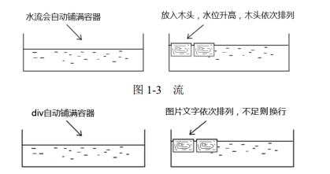

# 概述

## 一些重点

思考：为什么 CSS 会是这样的？

世纪之处，互联网是门户网站的世界，门户网站需要图文展示。

为什么会选择 CSS，而非其他语言？比如 SVG

**CSS 的诞生是为图文信息展示服务的。**

## CSS 完胜 SVG 的武器 -- 流

SVG 的强项在于矢量和图形，弱项在于**文字处理**。

问：CSS 如何服务于图文信息展示？答：流，准确说文档流。

## 何为“流”

“流”实际上是 CSS 世界中的一种基本的定位和布局机制，与现实世界的“水流”有异曲同工之妙。

### 流 和 水流的对比

构建 CSS 世界的基石是 HTML，而 HTML 中最具代表的两个元素 \
 和 \ 正好是 CSS 世界中**块级元素**和**内联级元素**的代表。

所谓“流”，就是 CSS 世界中引导元素排列和定位的一条看不见的“水流”。

### 流是如何影响整个 CSS 世界的

本书中的 CSS 世界，特指 CSS2.1 世界，并不包括 CSS3。

1. 擒贼先擒王
   - HTML 默认的表现就符合“流”，故而“流”也可以控制 CSS 世界的基石 -- HTML。
2. 特殊布局与流的破坏
   - 对于拥有复杂布局的网页，可以通过破坏“流”以实现特殊布局
3. 流向的改变
   - 文档流默认从左往右、自上而下，但是可以改变。

**注**：“流”的特性对于\<table> 并不适用，一些 CSS 属性的表现，如单元格的 vertical-align 与普通的元素不一样。

当然，CSS2.1 加强了和 \<table> 的联系。

## CSS 新世界 -- CSS3

移动互联网以及硬件发展带动 CSS 进入了新的世界

1. 布局更为丰富
   - 移动端的崛起，催生了 CSS3 媒介查询以及许多响应式布局特性的出现，如图片元素的 srcset 属性、CSS 的 object-fit 属性
   - 弹性盒子布局（flexible box layout）
   - 格栅布局（grid layout）
2. 视觉表现长足进步
   - 圆角、阴影和渐变让元素更有质感
   - transform 变换让元素有更多可能
   - filter 滤镜混合混合模式让 Web 轻松变成在线的 Photoshops
   - animation 让动画变得非常简单
