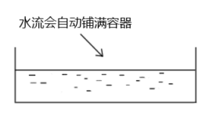
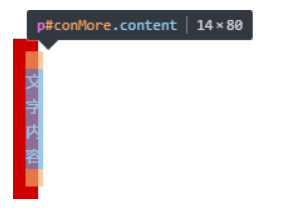
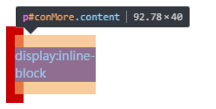
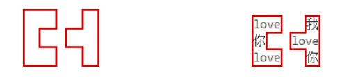
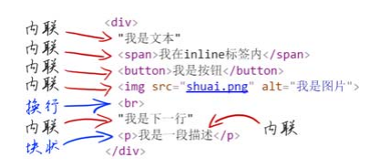
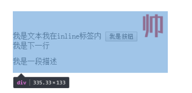
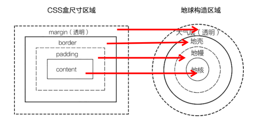

# width/height 作用的具体细节

因为块级元素的流体特性主要体现在水平方向上，所以这里先着重讨论 width。

## 目录

- [width/height 作用的具体细节](#widthheight-作用的具体细节)
  - [目录](#目录)
  - [深藏不露的 width: auto](#深藏不露的-width-auto)
    - [外部尺寸与流体特性](#外部尺寸与流体特性)
      - [正常流宽度](#正常流宽度)
      - [格式化宽度](#格式化宽度)
    - [内部尺寸与流体特性](#内部尺寸与流体特性)
      - [包裹性](#包裹性)
      - [首选最小宽度](#首选最小宽度)
      - [最大宽度](#最大宽度)
  - [width 值作用的细节](#width-值作用的细节)
    - [盒尺寸（box dimension）](#盒尺寸box-dimension)
    - [流动性丢失](#流动性丢失)
    - [与现实世界表现不一致的困扰](#与现实世界表现不一致的困扰)
  - [CSS 流体布局下的宽度分离原则](#css-流体布局下的宽度分离原则)
    - [为何要宽度分离](#为何要宽度分离)
    - [可能的挑战](#可能的挑战)
  - [改变 width/height 作用细节的 box-sizing](#改变-widthheight-作用细节的-box-sizing)
    - [box-sizing 的作用](#box-sizing-的作用)
    - [为何 box-sizing 不支持 margin-box](#为何-box-sizing-不支持-margin-box)
    - [如何评价 *{ box-sizing: border-box }](#如何评价--box-sizing-border-box-)
    - [box-sizing 发明的初衷](#box-sizing-发明的初衷)
  - [相对简单而单纯的 height: auto](#相对简单而单纯的-height-auto)
  - [关于 height: 100%](#关于-height-100)
    - [为何 height: 100% 无效](#为何-height-100-无效)
    - [如何让元素支持 height: 100% 效果](#如何让元素支持-height-100-效果)

## 深藏不露的 width: auto

auto 作为 width 的默认值，至少包含了以下4中不同的宽度表现。

1. 充分利用可用空间
   - 块级元素的宽度，默认 100% 于父级容器
   - 这种充分利用可用空间的行为，叫作 fill-available
2. 收缩与包裹
   - 典型代表：浮动、绝对定位、inline-block、table元素
   - shrink-to-fit（收缩到合适），笔者称之为“包裹性”
   - CSS3 中称为 fit-content
3. 收缩到最小
   - 最容易出现在 table-layout: auto 的表格中
   - 当每一列空间都不够的时候，文字能断就断，中文随便断，英文单词不能断
   - CSS3 中称为 min-content
4. 超出容器限制
   - 上述三种情况中，除非有明确的 width 相关设置，否则都不会主动超过父级容器宽度
   - 存在特殊情况
     - 内容很长的连续英文或数字
     - 内联元素设置为 white-space: nowrap
   - CSS3 中称为 max-content

在 CSS 世界中

- 盒子
  - 内在盒子
  - 外在盒子
- 显示
  - 内部显示
  - 外部显示
- 尺寸分为
  - 内部尺寸（Intrinsic Sizing）
    - 尺寸由内部元素决定
  - 外部尺寸（Extrinsic Sizing）
    - 尺寸由外部元素决定

对于上述 width: auto 的四种表现，只有第一个“充分利用可用空间”，是“外部尺寸”，其余全部是“内部尺寸”。

### 外部尺寸与流体特性

#### 正常流宽度

当在一个容器里导入足量的水时，水一定会均匀铺满整个容器。



当在页面中使用 \<div> 元素时，其尺寸表现就会和水流一样铺满容器。这就是 block 容器的特性，在所有浏览器中表现一致。

为设置垂直导航，对于如下 CSS 代码：

```css
a {
    display: block;
    width: 100%;
}
```

\<a> 元素默认 display: inline，所以设置 display: block 使其块状化绝对没有任何问题，但是设置 width: 100% 没有任何必要。

作者总结过的一套“鑫三无准则”，即“无宽度，无图片，无浮动”。为何要“无宽度”？

原因：表现为“外部尺寸”的块级元素一旦设置了宽度，流动性就丢失了。

所谓流动性，并不只是宽度100%显示，而是一种 margin/border/padding 和 content 内容区域自动分配水平空间的机制。

[block 元素的流动性对比示例](https://demo.cssworld.cn/3/2-3.php)

[block 元素的流动性对比示例 - 备份](demo/00-block元素的流动性.html)


上下两个导航均有 margin 和 padding，前者无 width 设置，完全借助流特性；后者 width: 100%

当然对于导航栏的宽度可以计算出来：

```css
.nav {
    width: 240px;
}

.nav-a {
    display: block;
    /* 200px = 240px - 10px * 2 - 10px * 2 */
    width: 200px;
    margin: 10px;
    padding: 9px 10px;
}
```

对于上述手动计算方式，弊端可想而知。

因此对于“无宽度”这条准则，少了代码，少了计算，少了维护，何乐而不为呢？

#### 格式化宽度

格式化宽度仅出现在**绝对定位模型**中，即设置 position: absolute/fixed 的元素中。

在默认情况下，绝对定位元素的宽度表现为“包裹性”：**宽度由内部尺寸决定**。

但是，有一种情况其宽度是由外部尺寸决定的。

对于**非替换元素**，当 left/right 或 top/bottom 对立方位的属性值同时存在时，元素的宽度表现为**格式化宽度**，其宽度大小相对于最近的具有定位特性（position 属性值不为 static）的祖先元素计算。

代码示例：

```css
.parent {
    position: relative;
    width: 1000px;
}

.child {
    position: absolute;
    left: 20px;
    right: 20px;
}
```

根据上述关于格式化宽度的描述，.child 元素的宽度为 960px（1000-20-20）。

**格式化宽度**具有完全的流体性，即margin、border、padding 和 content 内容区域同样会自动分配水平（和垂直）空间。

### 内部尺寸与流体特性

所谓“内部尺寸”，简单来说就是元素的尺寸由内部的元素决定，而非由外部的容器决定。

如何判断一个元素是否使用“内部尺寸”？

如果该元素内在没有内容的情况下，宽度为 0，那就是应用了“内部尺寸”。

#### 包裹性

“包裹性”是作者对“shrink-to-fit”理解后的一种称谓。

具有包裹性的元素：

- inline-block 元素
- 浮动元素
- 绝对定位元素

包裹性，除了包裹，还有自适应性。

**自适应性**，指的是元素尺寸由内部元素决定，但永远小于“包含块”容器的尺寸（除非容器尺寸小于元素的“首选最小宽度”）。

因此，如果一个元素设置 display: inline-block，那么即使它里面的内容再多，只要是正常文本，宽度永远不会超过容器。

包裹性示例：CSS 极具代表性的 inline-block 元素--按钮。

具体表现为：按钮文字越多，宽度越宽（内部尺寸特性），但如果文字足够多，则会在容器的宽度处自动换行（自适应特性）。

注意：\<button>标签按钮才会自动换行，\<input> 标签按钮默认设置 white-space: pre，不会自动换行，需将 pre 重置为 normal。

**“包裹性”对实际开发有什么作用？**

需求：页面某个模块的文字内容是动态的，字数不定，希望在文字少的时候居中显示，文字超过一行时左对齐。

[按钮元素“包裹性”实例](https://demo.cssworld.cn/3/2-5.php)

[按钮元素“包裹性”实例 - 备份](demo/01-包裹性实例.html)

#### 首选最小宽度

首选最小宽度，指的是元素最适合的最小宽度。

在 CSS 世界中，图片和文字的权重远大于布局，因此CSS的设计者显然不会让图文在 width: auto 时宽度变为0，此时所表现的宽度就是“首选最小宽度”。

具体规则如下：

东亚文字（如中文）最小宽度为每个汉字的宽度



西方文字（如英文）最小宽度由特定的连续英文字符单元决定，并不是所有的英文字符都会组成连续单位，一般会终止于**空格（普通空格）、短横线、问号以及其他非英文字符**等。



**注**：如果想让英文字符和中文一样，最小宽度单元为字符宽度，可以设置 word-break: break-all

类似图片这样的**替换元素**的最小宽度就是该元素内容本身的宽度。

**“首选最小宽度”对我们实际开发有什么作用？**

开发中遇到类似现象的时候知道原因是什么，方便对症下药。

可以利用“首选最小宽度”构建图形，当然可以使用 CSS3 盒阴影以及背景渐变或其他方式。



具体代码见链接：

[“首选最小宽度”与凹凸效果实例](https://demo.cssworld.cn/3/2-6.php)

[“首选最小宽度”与凹凸效果实例 - 备份](demo/02-首选最小宽度实例.html)

#### 最大宽度

最大宽度就是元素可以有的最大宽度，根据作者理解，“最大宽度”实际等同于“包裹性”元素设置 white-space: nowrap 声明后的宽度。

如果内部没有块级元素或者块级元素没有设定宽度值，则“最大宽度”实际上是最大的连续内联盒子的宽度。

什么是连续内联盒子？

可以将**内联盒子**简单地理解为 display: inline/inline-block/inline-table 等元素。

**连续内联盒子**，指全部都是内联级别的一个或一堆元素，中间没有任何的换行标签\<br> 或其他块级元素。

如图所示：



标注图中最大宽度就是最开始的4个连续内联元素的总宽度



**“最大宽度”对实际开发有什么作用呢？**

大部分需要使用“最大宽度”的场景都可以通过设置一个“很大宽度”来实现。

注意最大宽度和很大宽度的区别：有5张宽度为 200px 的图片，假设图片元素紧密排列，则“最大宽度”就是 1000px。但是在实际开发时，可能直接设置容器 width: 2000px，此时 2000px 就是“很大宽度”，宽度足够大，保证图片不会因为容器宽度不足而不在一行内显示。

---

## width 值作用的细节

下面将视角转向 width 属性值为具体数值的情况。

示例，对于一个\<div> 元素，设定其宽度为 100px：

```css
div {
  width: 100px;
}
```

上述代码中，100px 的宽度是如何作用在 \<div> 元素上的？

回答这个问题，需要先了解 CSS 世界中与尺寸相关的一个重要概念 -- “盒尺寸”

### 盒尺寸（box dimension）

前文多次强调，width 是作用在“内在盒子”上的，而这个“内在盒子”是由很多部分构成的，其结构的构成可以与地球结构进行联想



“内在盒子”的构成示意：

| 内在盒子构成部分 | 对应的 CSS 关键字名称 |
| :--------------- | :-------------------- |
| content box      | content-box           |
| padding box      | padding-box           |
| border box       | border-box            |
| margin box       | 无                    |

为何唯独 margin box 没有对应的 CSS 关键字名称？

因为目前没有任何场景需要用到 margin box。

**margin 的背景永远都是透明的**，因此不可能作为 background-clip 或 background-origin 属性值出现。

margin 一旦设定具体宽度和高度值，盒子本身的尺寸并不会因为 margin 值的变化而变化，因此作为 box-sizing 的属性值存在也就没有了意义。

回到刚才的问题：width: 100px 是如何作用到 \<box> 元素上的？

在 CSS2.1 的规范中的相关描述为：content box 环绕着 width 和 height 给定的矩形。即，width：100px 作用在content box 上。

由于 \<div> 元素默认的 padding、border 和 margin 都是 0，因此该元素所呈现的宽度就是 100px。

如果为该元素设定内在盒子中其余盒子的宽度：

```css
div {
  width: 100px;
  padding: 20px;
  border 20px solid;
}
```

最终该元素的宽度为 100 + 20*2 + 20*2 = 180px。

有时候，这种宽度设定和表现并不合理，总结为以下两点：

### 流动性丢失

对于块状元素，如果设定 width：auto，则元素会如水流般充满整个容器，而一旦设定 width 的属性值为具体数值，则元素的流动性就会阻断，尤其宽度作用在 content box 上，更是内外流动性全无。


### 与现实世界表现不一致的困扰

包含 padding 或 border 会让元素宽度变大的这种 CSS 表现会让 CSS 使用者困惑。

---

## CSS 流体布局下的宽度分离原则

所谓“宽度分离原则”，就是 CSS 中的 width 属性不与影响宽度的 padding/border（有时候包括 margin）属性共存，即不能出现以下的组合

```css
.box {
  width: 100px;
  border: 1px solid;
}

.box {
  width: 100px;
  padding 20px;
}
```

更推荐将 width 分离出来，使其独立占用一层标签，而 padding、border、margin 利用流动性在内部自适应呈现。

```css
.father {
  width: 180px;
}

.son {
  margin: 0 20px;
  padding: 20px;
  border: 1px solid;
}
```

### 为何要宽度分离

在前端领域，一提到分离，作用一定是便于维护。比方说，样式和行为分离、前后端分离或者这里的“宽度分离”。

嵌套一层标签，父元素定宽，子元素因为默认 width: auto，所以会如流水般自动填满父级容器，诸如 padding 属性值更改后，不必手动计算 width 值，浏览器会自动计算，完全不用担心尺寸的变化。

### 可能的挑战

若使用“宽度分离”会多使用一层标签，增加 HTML 成本。过深的嵌套会增加页面渲染和维护成本。

作者观点：如果不考虑**替换元素**，世界上绝大多数的网页，只需要一个 width 设定就可以了，只需要设定最外层限制网页主体内容宽度的 width，而里面的所有元素都没有理由再出现 width 设置。

所以，“宽度分离”虽然多了一层标签，但最终也就多了一层标签而已。

有没有既无须计算，又无须额外嵌套标签的实现呢？

有，即可以改变 width 作用细节的 box-sizing 属性。

---

## 改变 width/height 作用细节的 box-sizing

box-sizing 是 CSS3 属性之一。

### box-sizing 的作用

box-sizing 顾名思义就是“盒尺寸”，前文提到在规范中有“盒尺寸”（box dimension）一词，可能 dimension 过于官方，所以 CSS 属性就使用了更口语化的 box-sizing。

虽然 box-sizing 直译为“盒尺寸”，实际上，其更准确的叫法应该是“盒尺寸的作用细节”。

box-sizing 不同的属性值会改变 width/height 作用的盒子，因此理论上，box-sizing 可以有下述写法:

```css
.box1 { box-sizing: content-box; }
.box2 { box-sizing: padding-box; }
.box3 { box-sizing: border-box; }
.box4 { box-sizing: margin-box; }
```

但是实际浏览器支持情况如下：

```css
.box1 { box-sizing: content-box; }  /* 默认值 */
.box2 { box-sizing: padding-box; }  /* Firefox 曾经支持 */
.box3 { box-sizing: border-box; }   /* 全线支持 */
.box4 { box-sizing: margin-box; }   /* 从未支持过 */
```

box-sizing 两个属性值比较：


当然，设置 box-sizing 并不是万能的，当遇到下图所示的布局时，它也会捉襟见肘，因为边框外的间距只能是 margin，但 其并不支持 box-sizing: margin-box，若想要用一层标签实现，仍需要计算。

### 为何 box-sizing 不支持 margin-box

不支持 margin-box 最大的原因在于它本身没有价值。

原因一：

元素为 content-box、padding-box、border-box 设定值，最终会使 offset 尺寸发生变化，但设置 margin box 并不会改变 offset 尺寸。

margin 只有在 width: auto 时，才可以改变元素尺寸，但此时元素处于流动性状态，不需要设置 box-sizing。

原因二：

在原有规范中："margin 的背景永远是透明的"，如果 box-sizing 支持 margin-box，那么 margin box 的语义就变为：“显式的盒子”，存在语义冲突的问题。

原因三：

本身 box-sizing 支持 margin-box 的使用场景有限，有CSS3 的 flex、grid 布局和“宽度分离”等解决方案可以替代。

### 如何评价 *{ box-sizing: border-box }

作者推崇：“充分利用元素本身的特性来实现想要的效果”，足够简单纯粹。全局重置的做法有悖其理念。且存在以下问题：

（1）**易产生没必要的消耗**

通配符 *，应该是一个慎用的选择器，因为它会选择所有的标签元素。

1. 对于普通内联元素（非替换元素），box-sizing 设置对其渲染表现没有影响，因此，通配符 * 对于这些元素而言是没有必要的消耗。
2. 诸如 search 类型的搜索框，其默认 box-sizing: border-box;（如果浏览器支持），因此，通配符 * 对于 search 类型的 \<input> 元素而言也是没有必要的消耗。

（2）**这种做法并不能解决所有问题**

由于 box-sizing 不支持 margin-box，因此，只有当元素没有水平 margin 时，使用 box-sizing 才能真正做到无计算。而“宽度分离”等策略则可以彻底解决所有的宽度设计问题。

### box-sizing 发明的初衷

根据作者多年的开发经验，在 CSS 世界中，唯一离不开 box-sizing: border-box 的就是原生普通文本框\<input>和文本域\<textarea> 的100%自适应父容器宽度。

\<textarea>为替换元素，替换元素的特性之一就是无论其 display 的属性值为 block 或是 inline,**元素尺寸由内部元素决定**。

对于非替换元素，如果设置 display: block，则会具有流动性，宽度由外部尺寸决定。

对于替换元素，其宽度不受 display 水平影响，因此，通过修改其 display 属性值是无法让尺寸 100% 自适应父容器的。

```css
textarea {
  display: block; /* 还是原来的尺寸 */
}
```

由上述，只能通过对 \<textarea> 设置 width: 100% 使其自适应父容器。但此时，默认 box-sizing: content-box，输入的时候光标会顶着边框，用户体验很不好。

由上述原因，设置 box-sizing: border-box; 是根本解决之道。

**总结**：box-sizng 被发明出来的最大初衷应该是解决替换元素宽度自适应问题。

若果真如总结所言，* { box-sizing: border-box; } 应该改为如下 CSS 代码：

```css
input,
textarea,
img,
video,
object {
  box-sizing: border-box;
}
```

---

## 相对简单而单纯的 height: auto

height: auto 要比 width: auto 简单而单纯。

原因在于，CSS 的默认流为水平方向，宽度是稀缺的，高度是无限的。因此，宽度的分配规则比较复杂，高度就显得比较随意。

默认设置 height: auto，即是将子元素高度相加。

当然，涉及具体场景，会有特殊情况，如果元素设置 float 容器高度会消失，或者 margin 直接穿过去，高度比预期矮，但这些并不是 height 的问题。

此外，height: auto 也有外部尺寸特性，但仅存于绝对定位模型中，即“格式化高度”，与“格式化宽度”类似，不再展开。

---

## 关于 height: 100%

height 和 width 还有一个比较明显的区别，**对百分比单位的支持**。

对于某元素，如果其父元素 width: auto，其 width 支持百分比值。但是若该元素在文档流中，其百分比值会被完全忽略。

需求示例，想要在页面中插入一个 \<div>，以使满屏显示背景图。

```css
div {
  width: 100%;  /* 多余代码 */
  height: 100%; /* 无效代码 */
  background: url(bg.jpg);
}

/*
 此时 div 高度永远是 0，哪怕其父级 body 元素塞满了内容也是如此。
 为解决该问题，需要做如下修改：
 */
 html, 
 body {
  height: 100%;
 }

 /* 
  仅仅设置 body 亦是无效的，因为此时 body 也没有具体的高度值
  body {
    子元素设置 height: 100% 依旧无效
  }
  */
```

**总结**：对于普通文档流中的元素，百分比高度值若想要起作用，其父级必须有一个可以生效的高度值。

### 为何 height: 100% 无效

规范中已给出答案：如果包含块的高度没有显式指定，并且该元素不是绝对定位，则包含块的计算值为 auto。而 auto 不能与百分比进行计算：'auto' * 100/100 = NaN。

那为何 width: 100% 会生效呢？

规范中对于宽度的解释为：如果该元素的宽度取决于包含块的宽度，那么产生的布局在 CSS 2.1 中是**未定义**的。

而对于该未定义行为，各个浏览器对此的实现为：**如果该元素的宽度取决于包含块，就按照包含块真实的计算值作为百分比计算的基数。**

### 如何让元素支持 height: 100% 效果

（1）设定显式的高度值

设置 height: 600px，或者可以生效的百分比高度

```css
html,
body {
  height: 100%;
}
```

（2）使用绝对定位

```css
div {
  height: 100%;
  position: absolute;
}
```

此时的 height: 100% 就会有计算值，即使祖先元素的 height: auto。

**注**：绝对定位元素的百分比计算和非绝对定位元素的百分比计算是有区别的。

- 绝对定位的宽高百分比计算相对于 padding box
- 非绝对定位的宽高百分比计算相对于 content box

[（非）绝对定位元素的百分比计算](https://demo.cssworld.cn/3/2-11.php)

[（非）绝对定位元素的百分比计算 - 备份](demo/04-（非）绝对定位元素的百分比计算.html)
