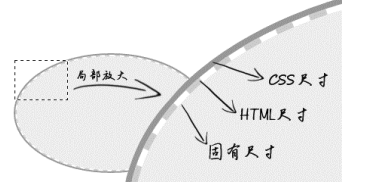

# 深入理解 content

## 目录

- [深入理解 content](#深入理解-content)
  - [目录](#目录)
  - [content 与 替换元素](#content-与-替换元素)
    - [什么是替换元素](#什么是替换元素)
      - [内容的外观不受页面的 CSS 的影响](#内容的外观不受页面的-css-的影响)
      - [拥有自己的尺寸](#拥有自己的尺寸)
      - [对于很多 CSS 属性有自己的一套表现规则](#对于很多-css-属性有自己的一套表现规则)
    - [替换元素的默认 display 值](#替换元素的默认-display-值)
      - [\<input> 和 \<button> 按钮的区别在什么地方](#input-和-button-按钮的区别在什么地方)
    - [替换元素的尺寸计算规则](#替换元素的尺寸计算规则)
      - [无法改变的替换元素内容的固有尺寸](#无法改变的替换元素内容的固有尺寸)
      - [自定义的宽高如何影响图片的最终呈现](#自定义的宽高如何影响图片的最终呈现)
    - [替换元素和非替换元素的距离有多远](#替换元素和非替换元素的距离有多远)
      - [替换元素和非替换元素之间只隔了一个 src 属性](#替换元素和非替换元素之间只隔了一个-src-属性)
      - [替换元素和非替换元素之间只隔了一个 CSS content 属性](#替换元素和非替换元素之间只隔了一个-css-content-属性)
    - [content 与替换元素关系剖析](#content-与替换元素关系剖析)
      - [content 生成的文本 无法选中、无法复制](#content-生成的文本-无法选中无法复制)
      - [不能左右 :empty 伪类](#不能左右-empty-伪类)
      - [content 动态生成值无法获取](#content-动态生成值无法获取)
  - [content 内容生成技术](#content-内容生成技术)
    - [content 辅助元素生成](#content-辅助元素生成)
    - [content 字符内容生成](#content-字符内容生成)
    - [content 图片生成](#content-图片生成)
    - [content attr 属性值内容生成](#content-attr-属性值内容生成)
    - [深入理解 content 计数器](#深入理解-content-计数器)
      - [counter-reset 计数器-重置](#counter-reset-计数器-重置)
      - [counter-increment 计数器递增](#counter-increment-计数器递增)
      - [counter()/counters() 方法](#countercounters-方法)
    - [content 内容生成的混合特性](#content-内容生成的混合特性)

## content 与 替换元素

### 什么是替换元素

根据**外在盒子**是 inline/block 可以将元素分为内联元素和块级元素。

根据**元素是否具有可替换内容**可以将元素分为替换元素和非替换元素。

替换元素（replaced element），顾名思义，内容可以被替换。

```html

```

将上述代码中的 1.jpg 替换为 2.jpg，图片内容会被替换。

**通过修改元素的某个属性值可以替换其所呈现的内容**那么该元素就属于“替换元素”。

下述元素均属于替换元素

- \
- \<object>
- \<video>
- \<audio>
- \<iframe>
- 表单元素
  - \<textarea>
  - \<input>
  - \<select>

替换元素除了内容可替换这一特性以外，还有以下特性。

#### 内容的外观不受页面的 CSS 的影响

**替换元素内容的样式表现在 CSS 作用域之外**。

如何更改替换元素本身的外观？

- 需要类似 appearance 属性
- 浏览器自身暴露的一些样式接口
  - -ms-check {}
    - 可以更改高版本 IE 浏览器下单复选框的内间距、背景色等样式

#### 拥有自己的尺寸

在 Web 中，很多替换元素在没有明确尺寸设定的情况下，其默认的尺寸（不包括边框）是 300px * 150px，如 \<video>、\<iframe>、\<canvas>等。

少数部分替换元素的尺寸为 0，如 \。

表单元素的替换元素的尺寸规则和浏览器有关，没有明显的规律。

#### 对于很多 CSS 属性有自己的一套表现规则

比较具有代表性的是 vertical-align 属性，默认设置为 vertical-align: baseline，基线之意。

对于非替换元素，基线被定义为**字符 x 等下边缘**。

对于替换元素，由于替换元素的内容往往不会含有字符 x，于是基线被定义为**元素的下边缘**。

### 替换元素的默认 display 值

**所有替换元素都是内联水平元素**，但是替换元素默认的 display 值却是不一样的。

| 元素                | Chrome       | Firefox      |
| :------------------ | :----------- | :----------- |
| \              | inline       | inline       |
| \<iframe>           | inline       | inline       |
| \<video>            | inline       | inline       |
| \<select>           | inline-block | inline-block |
| \<input>            | inline-block | inline       |
| range/file \<input> | inline-block | inline-block |
| hidden \<input>     | none         | none         |
| \<button>           | inline-block | inline-block |
| \<textarea>         | inline-block | inline       |

在 Firefox 浏览器中，对于 \<textarea> 元素和绝大多数 \<input> 元素，默认设置为 display: inline。这其实是一个很有意思的现象。

对于下述代码：

```html
<input type="button" value="按钮">
<button type="button">按钮</button>
```

在 Firefox 中，前者默认为 display: inline；后者默认 display: inline-block。为什么表现相同的元素会有这样的区别？

#### \<input> 和 \<button> 按钮的区别在什么地方

两种按钮默认的 white-space 值不一样。前者是 pre，后者是 normal。所造成的表现差异为：当按钮内容文字足够多的时候，\<input> 元素中的文字不会自动换行，\<button> 元素中的文字会自动换行。

### 替换元素的尺寸计算规则

对于替换元素来说，display: inline/block/inline-block，它们的尺寸计算规则是一样的。

作者将替换元素的尺寸从内而外分为 3 类：

- 固有尺寸
  - 指替换元素内容原本的尺寸
  - 图片、视频作为一个独立文件存在时，拥有自己的宽度和高度
  - 对于表单元素，固有尺寸可以理解为不加修饰的默认尺寸
- HTML 尺寸
  - 通过 HTML 原生属性改变元素尺寸
  - \ 元素的 width 和 height 属性
  - \<input> 元素的 size 属性
  - \<textarea> 元素的 cols 和 rows 属性
- CSS 尺寸
  - 特指通过 CSS 的 width/height、max/min-width、max/min-height 设置的尺寸，对应盒尺寸的 content box

具体分层如图所示：



3 层结构的具体计算规则如下：

1. 如果没有 CSS 尺寸和 HTML 尺寸，则使用固有尺寸作为最终宽高
2. 如果没有 CSS 尺寸，则使用 HTML 尺寸作为最终宽高
3. 如果有 CSS 尺寸，则最终尺寸由 CSS 属性决定
4. 如果“固有尺寸”含有固有的宽高比例，同时 CSS 尺寸或 HTML 尺寸仅设置了宽度或高度，则元素根据设置的宽/高度以固有的宽高比显示
5. 如果上述条件都不符合，则最终表现为 width: 300px; height: 150px。宽高比 2:1
6. 内联替换元素和块级替换元素使用上述同一套尺寸计算规则

根据上述规则的代码示例：

```html
<!-- 规则1 -->


<!-- 
    假设 1.jpg 原尺寸为 256 x 192。
    则此时该图片在页面中所呈现的宽高为：256px x 192px
 -->

<!-- ========================= -->

<!-- 规则2 -->


<!-- 
    通过 HTML 属性 width 和 height 限定了图片的 HTML 尺寸
    则此时该图片在页面中所呈现的宽高为：128px x 96px
 -->

<!-- ========================= -->

<!-- 规则3 -->
img { width: 200px; height: 150px; }


<!-- 
    固有尺寸、HTML尺寸、CSS尺寸同时存在，起作用的是 CSS 属性限定的尺寸
    则此时该图片在页面中所呈现的宽高为：200px x 150px
 -->

<!-- ========================= -->

<!-- 规则4 -->
img { width: 200px; }


<!-- 
    CSS 中仅设置了 width，但 1.jpg 本身具有特定的宽高比例，height 也会等比例计算
    则此时该图片在页面中所呈现的宽高为：200px x 150px（150 = 200 x 192 / 256 ）
 -->

<!-- ========================= -->

<!-- 规则5 -->
<video></video>

<!-- 该元素在所有现代浏览器下的尺寸表现都是 300px x 150px -->

<!-- ========================= -->

<!-- 规则6 -->
img { display: block; }


<!-- 
    虽然图片此时变为块级元素，但是尺寸规则和内联状态下一致，因此，图片呈现的宽高仍是 256px x 192px。
    这也是为何图片以及其他表单类替换元素设置 display: block，宽度却没有 100% 容器宽度的原因。
 -->

```

上述规则仍有漏洞，如果替换元素没有任何尺寸，则元素应该为 300px x 150px，这条规则适用于 \<video>、\<canvas>、\<iframe>，但是 \ 除外。

- Chrome 0 x 0
- Firefox 0 x 22

上述浏览器对与相同情况做出不同的表现型的情形比较麻烦。以下述提到前端技巧为例：

Web 开发时，为了提高加载性能以及节约带宽费用，**首屏以下的图片会设置为通过滚屏加载的方式以达到异步加载**，然后这个即将被异步加载的图片为了布局稳健、体验良好，往往会使用一张透明的图片进行占位。例如：

```html

```

实际上，上述代码中的透明图片也是多余的资源，可以直接进行如下优化：

```html

```

配合下述 CSS 代码：

```css
img { visibility: hidden; }
img[src] { visibility: visible; }
```

**注**：这里的 \ 不设置 src 属性，当图片的 src 属性缺省时，浏览器不会有任何请求，而如果设置 src=""，在很多浏览器下依然会有请求，而且请求的是当前页面数据。

#### 无法改变的替换元素内容的固有尺寸

对于上述替换元素的尺寸规则，自定义的宽高设置会覆盖替换元素内容的固有尺寸，但是宽高设置并没有修改替换元素的固有尺寸。

借助非替换元素 ::before 或 ::after 伪元素以及图片文件做证明：

```css
div::before {
    content: url(1.jpg);
    display: block;
    width: 200px;
    height: 200px;
}
```

上述伪元素呈现的图片尺寸为 256px x 192px（1.jpg 的固有尺寸），width 和 height 设置被无视了。

对于 CSS 设定的宽高仅仅是针对 content box 尺寸，对于伪元素的 content 生成的图片并没有任何影响。

#### 自定义的宽高如何影响图片的最终呈现

既然图片的固定尺寸不受 CSS 宽高控制，那为何设定 width 和 height 会影响最终图片呈现的尺寸呢？

这是因为 **\ 的替换内容默认的适配方案是填充**（fill），即替换内容会填满外部设定的尺寸大小。

所以，图片呈现的尺寸变化的本质并不是改变固有尺寸，而是采用了填充作为适配 HTML 尺寸和 CSS 尺寸的方式，且在 CSS3 之前，此适配方式是不能改变的。

在 CSS3 中，\ 和一些替换元素的替换内容的适配方式可以通过属性 object-fit 进行修改。

\ 元素的默认声明为 object-fit: fill。

若设置 object-fill: none，则图片的尺寸表现会与上述伪元素呈现图片的方式类似。

若设置 object-fill: contain，则图片会在保持原比例的前提下，尽可能的利用 HTML 尺寸但又不会超出的方式进行渲染，有些类似 background-size: contain 的呈现原理，如果设定 \ 元素的 width、height 都是 200px，则会呈现图示的自动垂直居中效果。


### 替换元素和非替换元素的距离有多远

#### 替换元素和非替换元素之间只隔了一个 src 属性

替换元素 \ 如果去除 src 属性，就是一个和 \<span> 类似的普通的内联标签，即一个非替换元素。

#### 替换元素和非替换元素之间只隔了一个 CSS content 属性

替换元素的特性：内容可替换，内容即 content box，对应 CSS 属性 content，所以，从理论层面讲，content 属性决定了元素是否是替换元素。

在 Chorme 浏览器中，所有元素均支持 CSS content 属性

```html
img { content: url(1.jpg) }


<!-- 两者效果相同 -->


```

由上述特性可以轻松实现图片跟随交互而变换。

```html


img:hover {
  content: url(laugh-tear.png)
}
```

注：CSS content 属性改变的仅仅是视觉呈现，当以右键或其他形式保存 \ 的图片时，所保存的是 “laugh.png”。

**使用 CSS content 属性，可以让非替换元素变为替换元素**。

[非替换元素转变为替换元素](https://demo.cssworld.cn/4/1-5.php)

[非替换元素转变为替换元素](demo/00-CSS%20content%20属性使用.html)

上述代码中，虽然视觉上文字被替换了，但是屏幕阅读器阅读到的还是文字，搜索引擎 SEO 抓取的还是原始的文本信息。

仍有局限，替换元素内容的固有尺寸无法改变，而在手机屏幕中，为了使图片显示细腻，往往真实图片尺寸是显示图片尺寸的两倍，这时候会有兼容问题，此时推荐使用 SVG 矢量图片。

### content 与替换元素关系剖析

在 CSS 规范中，**CSS content 属性生成的对象称为“匿名替换元素”**（anonymous replaced element）。所以 content 属性生成的内容都是替换元素。

#### content 生成的文本 无法选中、无法复制

上述特性与声明了 user-select: none 的效果一样。

普通元素的文本可以被轻松选中。

content 生成的文本无法被屏幕阅读器读取，无法被搜索引擎抓取。因此对可访问性和 SEO 很不友好，故而，content 属性可用于生成一些无关紧要的内容，如装饰性图形或序列号。

#### 不能左右 :empty 伪类

:empty 是一个 CSS 选择器，当元素里面无内容时进行匹配。

#### content 动态生成值无法获取

---

## content 内容生成技术

在实际项目中，content 属性几乎都是用在 ::before/::after 两个伪元素中，因此，“content 内容生成技术” 有时也被称为 “::before/::after 伪元素技术”。

### content 辅助元素生成

此应用的重点不在于 content 生成的内容，而是伪元素本身。

```css
/* 通常，会将 content 属性值设置为空字符串 */
.element::before {
  content: "";
}

/* 最常见的应用之一：清除浮动带来的影响 */
.clear::after {
  content: "";
  display: table; /* block 亦可 */
  clear: both;
}
```

另外一个很具有代表性的应用就是辅助实现“**两端对齐**”以及“**垂直居中/上边缘/下边缘对齐**”。

[content辅助元素与布局实例页面](https://demo.cssworld.cn/4/1-7.php)

实现原理: **::after伪元素用于辅助实现两端对齐，::before 伪元素用于辅助实现底对齐。**

### content 字符内容生成

content 字符内容生成，即直接写入字符内容，中英文都可以，比较常见的应用是配合 @font-face 规则实现图标字体效果。

另外值得介绍的点就是，除常规字符之外，还可以插入 Unicode 字符，比较经典的操作就是插入换行符以实现某些布局或效果。

核心 CSS 代码如下：

```css
::after {
  content: "\A";
  white-space: pre;
}
```

'\A'指的是换行符中的 LF 字符，其 Unicode 编码是 000A，在 CSS 的 content 属性中则直接写作'\A'；

换行符除了 LF 字符还有 CR 字符，其 Unicode 编码是 000D，在 CSS 的content 属性中则直接写作'\D'。

CR 字符和 LF 字符分别指回车（CR）和换行（LF），content 字符生成强大之处就在于不普通字符随便插，Unicode字符也不在话下。

[content 换行符实现 loading](https://demo.cssworld.cn/4/1-9.php)

[content 换行符实现 loading - 备份](demo/02-content换行符%20loading.html)

### content 图片生成

content 图片生成指直接使用 url 功能符显示图片。但是实用性不高。

```css
div::before {
  content: url(1.jpg);
}
```

url 功能符支持的图片地址

- png
- jpg
- ico
- svg
- base64URL

### content attr 属性值内容生成

对于 \ 元素需要设置 alt 属性值以描述图片信息，此时可以使用 content 进行生成。

```css
img::after {
  /* 生成 alt 信息 */
  content: attr(alt);
}

/* 除却原生 HTML 属性，自定义 HTML 属性亦可生产 */
.icon::before {
  content: attr(data-title);
}
```

**注**：attr() 功能符中的属性值名称不可被引号 “” 包裹，否则浏览器会认为是无效声明。

### 深入理解 content 计数器

所谓 CSS 计数器，指的是使用 CSS 代码实现，**随着元素数目增多，数值也跟着变大的效果**。

CSS 计数器的属性和方法介绍，两个属性 counter-reset、counter-increment，一个方法 counter()/counters();

#### counter-reset 计数器-重置

主要作用：**计数器命名**，也可以声明**计数起始数**。

计数起始数默认为 0，支持**负数**。

counter-reset 亦**支持多个计数器同时命名**，使用空格进行分隔。

counter-reset 支持 none/inherit，以取消重置或继承重置。

```css
/* 计数器名为 "counter1", 默认起始值为 2 */
.xxx { counter-reset: counter1 2; }

/* 同时命名多个计数器 */
.xxx { counter-reset: counter1 2 counter2 1; }
```

[counter-reset 使用](https://demo.cssworld.cn/4/1-12.php)

[counter-reset 使用 - 备份](/demo/03-counter-reset%20使用.html)

#### counter-increment 计数器递增

属性值为 counter-reset 的一个或多个关键字，可以跟随数字，表示每次计数的变化值（若省略，则使用默认变化值 1）。

CSS 的计数规则被作者称之为“普照规则”：普照源（counter-reset）唯一，每普照（counter-increment）一次，普照源增加一次计数值。

**计数器的数值变化遵循 HTML 渲染顺序，每解析一次 counter-increment 计数器进行一次变化，何时需要 counter 输出就输出此时的计数值。**

[counter-increment 递增机制](https://demo.cssworld.cn/4/1-15.php)

[counter-increment 递增机制 - 备份](demo/04-counter-increment%20递增机制.html)

counter-increment 的其他设定：

- 可以一次命名多个计数器名称
  - 与 counter-reset 规则类似，使用空格区分
- 可以在计数器名称后数值变化值
  - 变化值可以是负数
- 可以设定 none/inherit

```css
.counter {
  counter-reset: counter1 2 counter2 3;
  counter-increment: counter1 counter2;
}

.counter::before {
  content: counter(counter1);
}

.counter::after {
  content: counter(counter2);
}
```

#### counter()/counters() 方法

类似 CSS3 中的 calc() 计算。**该方法只用于显示计数**，不过名称、用法有多个。

语法：counter(name, style)

style 支持的关键字值就是 list-style-type 支持的值，既可以设置计数器的值不仅可以为**数字**，还可以是**英文字母或罗马数字**。

list-style-type 属性值：

- disc
- circle
- square
- decimal
- lower-roman
- upper-roman
- lower-alpha
- upper-alpha
- none
- armenian
- cjk-ideographic
- georgian
- lower-greek
- hebrew
- hiragna
- hiragna-iroha
- katakana
- katakana-iroha
- lower-latin
- upper-latin

counters(name, string, style) 可以设置计数器的小数点，可以理解为子序列，即 1.1、1.2、1.3 等。

string 为字符串（需要使用引号“”包裹，是必需参数），表示子序号的连接字符串。例如 1.1，string 为 "."；1-1，string 为 "-"。

style 用法同上。

若要实现子序列计数，需要**让每一个列表容器拥有一个“普照源”**，通过子级对父级的 counter-reset 进行重置，配合 counters() 以实现该效果。

[CSS计数器counters的string参数与嵌套实例页面](https://demo.cssworld.cn/4/1-18.php)

[CSS计数器counters的string参数与嵌套实例页面 - 备份](demo/05-嵌套子序列递增实现.html)

### content 内容生成的混合特性

**各种 content 内容生成语法可以混合在一起使用。**

```css
a::after {
  content: `(${attr(href)})`;
}
```
