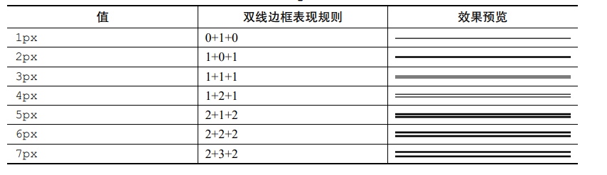
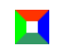

# 功勋卓越的 border 属性

border 衍生出的特性可以解决很多棘手的问题。

## 目录

- [功勋卓越的 border 属性](#功勋卓越的-border-属性)
  - [目录](#目录)
  - [为什么 border-width 不支持百分比值](#为什么-border-width-不支持百分比值)
    - [语义](#语义)
    - [使用场景](#使用场景)
    - [border-width 支持的关键字](#border-width-支持的关键字)
  - [了解各种 border-style 类型](#了解各种-border-style-类型)
    - [border-style: none](#border-style-none)
    - [border-style: solid](#border-style-solid)
    - [border-style: dashed](#border-style-dashed)
    - [border-style: dotted](#border-style-dotted)
    - [border-style: double](#border-style-double)
      - [双线边框的表现规则](#双线边框的表现规则)
      - [实现“菜单”图标](#实现菜单图标)
    - [其他 border-style 类型](#其他-border-style-类型)
  - [border-color 和 color](#border-color-和-color)
  - [border 与透明边框技巧](#border-与透明边框技巧)
    - [右下方 background 定位的技巧](#右下方-background-定位的技巧)
    - [增加点击区域大小](#增加点击区域大小)
    - [三角等图形的绘制](#三角等图形的绘制)
  - [border 与图形构建](#border-与图形构建)
  - [border 等高布局技术](#border-等高布局技术)

## 为什么 border-width 不支持百分比值

```css
div {
    border-width: 50%
}
```

上述代码，是无效声明。不支持百分比值，是由 border 的语义和使用场景决定的。

### 语义

border-width 是“边框宽度”，而边框尺寸不受元素尺寸影响，这也是不支持百分比值的原因之一。

### 使用场景

CSS 世界的背景主要是为图文展示服务的，而边框是为限定背景区域而设计的，显然没有需要使用百分比值的场景。

类似 border-width 不支持百分比值的属性，原因也类似

- outline
- box-shadow
- text-shaow

### border-width 支持的关键字

- thin
  - 等同于 1px
- medium
  - 默认值
  - 等同于 3px
    - 因为 border-style: double 至少 3px 才有效果
- thick
  - 等同于 4px

---

## 了解各种 border-style 类型

border-style 是一个简写属性，用于设定元素所有边框的样式。

### border-style: none

**注**，默认 border-style: none。

故而，单纯设置 border-width 或 border-color 没有边框显示

```css
div {
    border: 10px; /* 无边框出现 */
}

div {
    border: red; /* 无边框出现 */
}
```

如果设置 border-style 类型值，则会渲染边框，默认宽度 3px。

使用 border-style: none 多出现在**重置边框样式**时。

若要实现一个没有下边框的边框效果：

```css
div {
    border: 1px solid;
    border-bottom: none;
}

/* 也可以直接通过边框宽度 0 进行重置 */
div {
    border: 1px solid;
    border-bottom: 0;
}

/* 下述写法的渲染性能最高 */
div {
    border: 1px solid;
    border-bottom: 0 none;
}
```

### border-style: solid

渲染实线边框

### border-style: dashed

渲染虚线边框

虚线颜色区的**宽高比**以及**颜色区和透明区的宽度比例**在不同浏览器下是有差异的。

Chrome、Firefox 浏览器：颜色区的宽高比是 3:1，颜色区和透明区的宽度比例是 1:1。


IE 浏览器：颜色区的宽高比是 2:1，颜色区和透明区的宽度比例是 2:1。


### border-style: dotted

渲染虚点边框

虚点边框的渲染在不同的浏览器上亦有差异，规范上明确是**圆点**。

Chrome、Firefox 浏览器：虚点为**方块点**。


IE 浏览器：虚点为**圆点**。


### border-style: double

渲染双线边框

#### 双线边框的表现规则



#### 实现“菜单”图标

```css
.icon-menu {
  width: 120px;
  height: 20px;
  border-top: 60px double;
  border-bottom: 20px solid;
}
```

### 其他 border-style 类型

insert（内凹）、outset（外凸）、groove（沟槽）、ridge（山脊），实用价值不高。

---

## border-color 和 color

border-color 的默认颜色是元素当前的色值。

```css
.box {
  border: 10px solid;
  color: red;
}
```

此时 .box 元素的 10px 边框颜色为红色。

具有类似特性的 CSS 属性还有

- outline
- box-shadow
- text-shadow

利用该特性可以轻松实现下述需求：

鼠标悬浮元素上时，改变元素边框的颜色，核心代码如下

```css
.add {
  color: #ccc;
  border: 2px dashed;
}

.add:before {
  border-top: 10px solid;
}

.add:after {
  border-left: 10px solid;
}

/* 
  hover 变色 
  只需重置一处
*/
.add:hover {
  color: #06c;
}
```

[border绘制与color变色](https://demo.cssworld.cn/4/4-1.php)

[border绘制与color变色 - 备份](demo/15-border绘制与color变色.html)

---

## border 与透明边框技巧

### 右下方 background 定位的技巧

在 CSS3 之前，background 只能**相对左上角数值定位**。

需求：在宽度不定的元素中，距离右边缘 50px 位置设置一个背景图片。

使用透明边框可以实现上述需求

```css
.box {
  border-right: 50px solid transparent;
  background-position: 100% 50%;
}
```

使用透明边框实现 50px 间距效果，在此基础上，就可以使用百分比 background-position 定位到预期位置。

默认 background 背景图片相对于 padding box 定位，即 background-position: 100% 的位置计算默认不会将 border-width 计算在内。

### 增加点击区域大小

通过给原图标元素设置 padding、border 以增加点击面积。

[优雅增加点击区域之搜索框清除按钮](https://demo.cssworld.cn/4/4-2.php)

[优雅增加点击区域之搜索框清除按钮 - 备份](demo/16-border增加点击区域.html)

### 三角等图形的绘制

即使在移动端，**使用 CSS 的 border 属性绘制三角形等图形仍是性价比最高的方式**。

```css
div {
  width: 0;
  border: 10px solid;
  border-color: #f30 transparent transparent;
}
```

---

## border 与图形构建

border 属性可以轻松实现兼容性非常好的三角图形效果，其底层是受 inset/outset 等 border-style 属性影响。

border 的四色边框：

```css
div {
  width: 10px;
  height: 10px;
  border: 10px solid;
  border-color: #f30 #00f #396 #0f0;
}
```



**只要是与三角形或者梯形相关的图形，都可以使用 border 属性来模拟**。

---

## border 等高布局技术

border 属性也可以实现等高布局

[border实现等高布局](https://demo.cssworld.cn/4/4-4.php)

[border实现等高布局 - 备份](demo/17-border%20实现等高布局.html)

核心代码如下：

```css
.box {
  border-left: 150px solid #333;
  background-color: #f0f3f9;
}

.box > nav {
  width: 150px;
  margin-left: -150px;
  float: left;
}

.box > section {
  overflow: hidden;
}
```

左侧导航栏区域由 border-left 属性生成。**元素边框高度总是与元素自身高度保持一直**，因此可以巧妙地实现等高布局效果。

**注**，由于**溢出隐藏基于 padding box**，若父容器使用 overflow: hidden 清除浮动影响，会使左浮动的导航列表元素隐藏掉。
