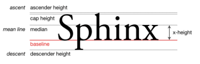

# 字母 x CSS 世界中隐匿的举足轻重的角色

块级元素负责结构，内联元素接管内容，而 CSS 世界是面向图文混排，即内联元素设计的。

## 目录

- [字母 x CSS 世界中隐匿的举足轻重的角色](#字母-x-css-世界中隐匿的举足轻重的角色)
  - [目录](#目录)
  - [字符 x 与 CSS 世界的基线](#字符-x-与-css-世界的基线)
  - [字母 x 与 CSS 的 x-height](#字母-x-与-css-的-x-height)
  - [字母 x 与 CSS 中的 ex](#字母-x-与-css-中的-ex)

## 字符 x 与 CSS 世界的基线

在各种内联相关模型中，凡是涉及垂直方向的排版或对齐，多离不开最基本的**基线**（baseline）。

line-height（行高），**定义为两基线的间距**；

vertical-align 默认值为**基线**，

其他诸如中线顶线一类的定义也离不开基线。

**字母 x 的下边缘（线）就是基线**。

---

## 字母 x 与 CSS 的 x-height

x-height 指小写字母 x 的高度，术语描述为基线和等分线（mean line）（也称中线，midline）之间的距离。

- ascender height: 上下线高度
- cap height: 大写字母高度
- median: 中线
- descender height: 下行线高度

**注**：vertical-align: middle。middle 指基线向上 1/2 x-height 的高度，可以理解为字母 x 交叉点的位置。

这里的 middle 是中间的意思，与上面的 median（中线）不是一个意思。

由上述概念，vertical-align: middle 并不是**绝对的垂直居中对齐**，因为不同的字体在行内盒子的位置是不一样的。

**对于内联元素垂直居中应该对文字，而非居外部的块级容器所言。**

---

## 字母 x 与 CSS 中的 ex

ex 是 CSS 中的一个相对单位，指的是小写字母 x 的高度，即 x-height。

ex 的用途：**不受字体和字号影响的内联元素的垂直居中对齐**。

内联元素默认是基线**对齐**，基线即 x 的底部，1ex 就是一个 x 的高度。字体图标高度设置 1ex，此时字体图标和文字垂直居中，且不受字体和字号影响。
