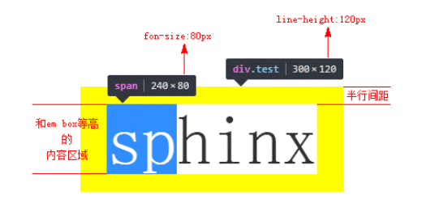
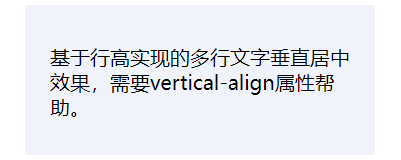

# 内联元素的基石 line-height

## 目录

- [内联元素的基石 line-height](#内联元素的基石-line-height)
  - [目录](#目录)
  - [内联元素的高度之本 -- line-height](#内联元素的高度之本----line-height)
    - [行距与半行距](#行距与半行距)
    - [文字图形区域 ≠ em-box](#文字图形区域--em-box)
    - [line-height 与替换元素尺寸](#line-height-与替换元素尺寸)
  - [为什么 line-height 可以让内联元素“垂直居中”](#为什么-line-height-可以让内联元素垂直居中)
    - [行高实现多行文本或者图片等替换元素的垂直居中效果实现](#行高实现多行文本或者图片等替换元素的垂直居中效果实现)
  - [深入 line-height 的各类属性值](#深入-line-height-的各类属性值)
    - [normal 是一个变量](#normal-是一个变量)
    - [line-height 的其他属性值](#line-height-的其他属性值)
  - [内联元素 line-height 的“大值特性”](#内联元素-line-height-的大值特性)

## 内联元素的高度之本 -- line-height

默认空 \<div> 元素高度是 0，此时若向其中填充文字，该元素就会具有高度。**其本质由 line-height 属性决定**，某些场景与 font-size 大小有关。

**对于非替换元素的纯内联元素，其可视高度的完全由 line-height 决定**，padding、border 属性对其可视高度没有任何影响。

因此，对于文本，line-height 指定了用于计算行框盒子高度的基础高度。所有浏览器均是如此解析。

### 行距与半行距

内联元素的高度由固定高度和不固定高度组成，这里的不固定高度部分就是**行距**。line-height 之所以起作用，就是通过改变“行距”来实现的。

业界共识：行距 = 行高 - em-box，em 是一个相对 font-size 大小的 CSS 单位，1em 等于当前元素 font-size 大小。 转换为 CSS，行距 = line-height - font-size。行距一分为二，就是**半行距**。

两个半行距分别加在 em-box 的上下方就构成了文字的完整高度。

### 文字图形区域 ≠ em-box

内容区域（context area）高度受 font-family 和 font-size 双重影响。

em-box 仅受 font-size 影响。

通常内容区域要高于 em-box，而当字体为宋体时，内容区域和 em-box 是等同的。

[基于宋体的半行间距位置演示实例](https://demo.cssworld.cn/5/2-2.php)

[基于宋体的半行间距位置演示实例 - 备份](demo/01-半行间距分析.html)



**注**：line-height 不能影响替换元素，如图片的高度。

### line-height 与替换元素尺寸

```html
<style>
    .box {
        line-height: 256px;
    }
</style>
<div class="box">
    
</div>
```

此时 .box 元素的高度为 256px，但并不是 line-height 改变了图片的高度，而是改变了**幽灵空白节点**的高度。

图片为内联元素，会构成一个“行框盒子”，而在 HTML5 文档模式下，每一个**行框盒子前都有一个宽度为 0，内联特性表现与普通字符一样的幽灵空白节点**。

**对于文本元素，line-height 可以直接决定元素的最终高度**。

**对于替换元素，line-height 只可以决定元素的最小高度**，一是替换元素的高度不受 line-height 影响，二是 vertical-align 会发挥作用。

对于块级元素，line-height 对其本身没有任何作用，**其实际通过改变块级元素中内联元素占据的高度**进而影响块级元素最终元素高度。

---

## 为什么 line-height 可以让内联元素“垂直居中”

误区一：要让单行文字垂直居中，只需要 line-height 一个属性就可以。

误区二：line-height 可以让单行或多行元素**近似垂直居中**，并不是真正意义上的垂直居中。

“近似垂直居中”是因为**文字字形的垂直中线位置**普遍要比**真正的行框盒子的垂直中线**位置低。

由上节，行距 = line-height - font-size，基于 CSS 中“行距的上下等分机制”，行高可以实现“垂直居中”。

### 行高实现多行文本或者图片等替换元素的垂直居中效果实现

多行文本或者替换元素的垂直居中的实现需要借助属性 vertical-align。

```html
<style>
  .box {
    line-height: 120px;
    background-color: #f0f3f9;
  }

  .content {
    display: inline-block;
    line-height: 20px;
    margin: 0 20px;
    /* 相对 .box 父元素，作用于整个 .content */
    vertical-align: middle;
  }
</style>

<div class="box">
  <div class="content">基于行高实现的...</div>
</div>
```



实现原理：

多行文字使用一个标签包裹，然后设置 display: inline-block。此时，可以重置外部的 line-height 为正常大小i，还可以保持内联元素特性，从而可以设置 vertical-align 属性，以及一个关键的**行框盒子**。

通过父元素 .box 声明 line-height: 120px，作用于行框盒子中的 strut 节点，相当于在 .content 元素前创建了一个高度为 120px、宽度为 0 的内联元素。

由于内联元素默认基线对齐，通过对 .content 声明 vertical-align: middle 调整多行文本的垂直位置，从而实现“垂直居中”（近似垂直居中）效果。

使用类似的方法也可以实现图片的垂直居中效果，也是类似的原理。

---

## 深入 line-height 的各类属性值

line-height 默认值 normal，支持数值、百分比值以及长度值

### normal 是一个变量

normal 实际上是一个和 font-family 有着密切关联的变量值。

不同字体下的 line-height: normal 解析值

| 字体     | Chrome | Firefox |
| :------- | :----- | :------ |
| 微软雅黑 | 1.32   | 1.321   |
| 宋体     | 1.141  | 1.142   |

可以看到，只要**字体确定**，各个浏览器下的默认 line-height 解析值基本上都是一样的。但是关键在于，不同系统、不同浏览器的默认字体是不一样的，进而导致其默认 line-height 都是有差异的。

为提高兼容性，line-height 应该重置为什么？

### line-height 的其他属性值

- 数值
  - 如 line-height: 1.5
  - 最终计算值是和当前 font-size 相乘后的值。
- 百分比值
  - 如 line-height: 150%
  - 最终计算值是和当前 font-size 相乘后的值。
- 长度值，即带单位值
  - 最终计算值因单位而异
  - 如 line-height: 21px
    - 最终计算值即为 21px
  - 如 line-height: 1.5em
    - 最终计算值是和当前 font-size 相乘后的值。

**使用数值作为 line-height 作为属性值，在继承细节上有所差别**。

如果使用数值作为 line-height 的属性值，那么所有的子元素继承的都是**该数值**。

如果使用百分比值或者长度值作为属性值，那么所有的子元素继承的是**最终计算值**。

对于重图文内容展示的网页或网站，如博客、论坛、公众号之类，一定要使用**数值作为单位**。

对于偏重布局结构精致的网站，则可以使用长度值或者数值。

---

## 内联元素 line-height 的“大值特性”

无论内联元素 line-height 如何设置，最终父级元素的高度都是由数值大的 line-height 决定的。

由于内联盒子属于行框盒子，而在行框盒子前有一个幽灵空白节点 strut 盒子。父元素的 line-height 会影响 strut 的高度，子元素的 line-height 会影响内联盒子的高度。而行框盒子的高度由高度最高的那个盒子决定。

若要避免 strut 的影响，可以通过给内联元素声明 display: inline-block 创建一个独立的行框盒子。这也是多行文字垂直居中的原理。
