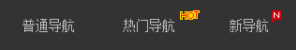
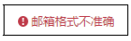
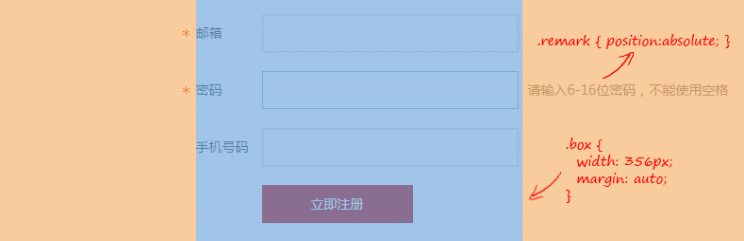
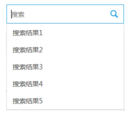

# position: absolute

## 目录

- [position: absolute](#position-absolute)
  - [目录](#目录)
  - [position: absolute 和 float: left/right 的相似点](#position-absolute-和-float-leftright-的相似点)
    - [position: absolute 的块状化](#position-absolute-的块状化)
    - [position: absolute 破坏性](#position-absolute-破坏性)
    - [position: absolute 包裹性](#position-absolute-包裹性)
  - [absolute 的包含块](#absolute-的包含块)
    - [常见的包含块规则](#常见的包含块规则)
    - [absolute 元素的包含块的差异](#absolute-元素的包含块的差异)
    - [绝对定位元素声明 height: 100% 和 height: inherit 的区别](#绝对定位元素声明-height-100-和-height-inherit-的区别)
    - [绝对定位元素的宽度自适应性是相对于包含块表现的](#绝对定位元素的宽度自适应性是相对于包含块表现的)
    - [absolute 元素定位](#absolute-元素定位)
  - [具有相对特性的无依赖 absolute 绝对定位](#具有相对特性的无依赖-absolute-绝对定位)
    - [各类图标定位](#各类图标定位)
    - [超越常规布局的排版](#超越常规布局的排版)
    - [下拉列表的定位](#下拉列表的定位)
    - [占位符效果模拟](#占位符效果模拟)
    - [进一步深入无依赖绝对定位](#进一步深入无依赖绝对定位)
    - [总结](#总结)
  - [absolute 与 text-align](#absolute-与-text-align)

## position: absolute 和 float: left/right 的相似点

position: absolute 和 float: left/right 都兼具**块状化、包裹性、破坏性**。

position: absolute 和 float: left/right 同时存在时，float 属性没有任何效果。

### position: absolute 的块状化

元素声明 position: absolute/fixed 则其 display 计算值为 block/table

### position: absolute 破坏性

破坏性指**破坏正常的流特性**。

absolute 破坏正常的流以实现自己的特性表现，但本身仍受流体元素布局、位置甚至一些内联相关的 CSS 属性影响。

absolute 亦能实现 BFC（块级格式化上下文）。

### position: absolute 包裹性

包裹性由**包裹**和**自适应性**组成。

与 float 的包裹性不同，由于 absolute 包含块的与众不同，其**自适应性的最大宽度非父元素的宽度决定**。

---

## absolute 的包含块

包含块（containing block）是**元素用于计算和定位的一个框**。

比如，width: 50%，即元素宽度的一半，这里的元素即指包含块。

对于普通元素，其包含块就是父元素的 content box。

而对于绝对定位元素，其包含块是第一个 position 属性值不为 static 的祖先元素的 content box。

### 常见的包含块规则

- 根元素（很多场景下可以看作是 \<html>）
  - 被称为**初始包含块**
  - 尺寸等同于浏览器可视窗口的大小
- 元素 position: relative/static
  - 包含块是其**最近块容器祖先盒**的 content box
- 元素 position: fixed
  - 包含块是**初始包含块**
- 元素 position: absolute
  - 包含块是最近 position 属性值不为 static 的祖先元素建立
  - 若该祖先元素是纯 inline 元素
    - 在该内联元素前后各生成一个宽度为 0 的 inline box，这两个 inline box 的 padding box 的外包围盒就是内联元素的包含块。
    - 若该内联元素被跨行分割，则包含块未定义，浏览器自行发挥
    - 以上均不满足，包含块由该元素的 padding box 的边界形成
  - 若没有符合条件的祖先元素，则包含块是**初始包含块**

### absolute 元素的包含块的差异

由上述规则可见，和常规元素相比，absolute 绝对定位元素的包含块由以下 3 个明显差异

1. 内联元素也可以作为包含块所在的元素
2. 包含块所在元素不是父级块级元素，而是最近的 position 属性值不为 static 的祖先元素或根元素
3. 包含块是 padding box 的边界而不是 content box

当然使用内联元素作为 absolute 元素的包含块的场景很少。

### 绝对定位元素声明 height: 100% 和 height: inherit 的区别

对于普通元素两者没有区别。

而对于绝对定位元素，height: 100% 的计算高度是第一个具有定位属性值的祖先元素的高度，height: inherit 则是单纯的父元素高度继承。

### 绝对定位元素的宽度自适应性是相对于包含块表现的

```html
<style>
    .box {
        position: absolute;
    }
</style>

<div class="box">文字内容</div>
```

对于上述代码，有以下问题

- .box 元素的宽度是多少？
- 文字会换行
- 如果 .box 元素中有 1000 个汉字，文字会换行吗？
  - 如果换行，在那里换行？

在**通常场景**下，.box 元素的宽度就是文字的宽度，不会换行；随着文字数量的增多，.box 元素的宽度会越来越大，直至包含块宽度，此时文字自动换行。

而对于下述代码

```html
<style>
    .container {
        width: 200px;
        border: 1px solid;
        position: relative;
    }

    .box {
        position: absolute;
    }
</style>

<div class="container">
    <div class="box">文字内容</div>
</div>
```

此时 .box 元素的包含块就是 .container 元素的 content box。因此 .box 元素的最大宽度就是 .container 元素的宽度。

而 .container 元素高度塌陷的原因是因为 absolute 破坏了正常的 CSS 流，这是绝对定位元素的破坏性表现。

### absolute 元素定位

既然是定位，absolute 元素的祖先元素通常是块级元素。

由上述 absolute 元素的包含块是最近 position 属性值不为 static 的祖先元素建立，包含块由 padding box 的边界组成。

**absolute 元素定位相对于包含块，即 padding box 边界**。这和 overflow 剪裁边界也是 padding box 边界类似。

---

## 具有相对特性的无依赖 absolute 绝对定位

前置问题：若一个绝对定位元素，没有任何 left/top/right/bottom 属性设置，并且其祖先元素全部都是非定位元素，其位置在哪里？

仍是在当前位置。

**注**：absolute 是非常独立的 CSS 属性值，其样式和行为表现不依赖其他任何 CSS 属性就可以完成。

作者将这种无 top/right/bottom/left 属性值的绝对定位称为**无依赖绝对定位**。

[absolute 无依赖定位](https://demo.cssworld.cn/6/5-4.php)

[absolute 无依赖定位 - 备份](demo/06-absolute%20无依赖定位.html)

很多场景下，无依赖绝对定位相对来说要很实用和强大，除却代码简洁外，其还有**相对定位特性**。

无依赖绝对定位本质上确实是相对定位，但不占据 CSS 流的尺寸空间。

### 各类图标定位



对于上述“HOT”图标，实现其在导航文字右上角的定位很简单，直接对图标元素进行样式设定就可以，代码示例：

```css
.icon-hot {
    position: absolute;
    margin: -6px 0 0 2px;
    width: 28px;
    height: 11px;
    background: url(hot.gif)
}
```

方便维护：图标更换仅修改图标对应的 HTML 和 CSS 部分代码即可；导航文字长度随意，因为图标自动跟随文字之后显示。



对于上述图标与文字对齐的实现，参见以下代码

```html
<style>
    .icon-x {
        line-height: 20px;
        padding-left: 20px;
    }

    .icon-warn {
        position: absolute;
        margin-left: -20px;
        width: 20px;
        height: 20px;
        background: url(warn.png) no-repeat center;
    }
</style>

<span class="icon-x">
    <i class="icon-warn"></i>邮件格式不准确
</span>
```

inline-block 对齐相比方法，inline-block 对齐最终行框高度并不是 20px，因为中文中心下沉，若要达到视觉上的图标垂直居中，图标的 vertical-align 对齐要比实际低一些，进而导致最终行框盒子的高度要高于 20px。

无依赖绝对定位的兼容性更好，因为绝对定位元素不会改变正常流的尺寸空间，图标大小不会影响最终行框高度，行框高度仍然是纯文本所在的 20px 高度。

### 超越常规布局的排版

对于常见的表单，通常水平居中对齐，在定宽情况下，声明 margin: auto 可轻松实现。但是提心信息如何处置呢？

可以置于输入框之下，通过 visibility 属性值控制提示信息的显示与否，但是弊端为需要提前预留显示空间。

另一种方法置于输入框右侧，但是为了默认状态下表单水平居中，如果考虑提示信息的宽度，容器宽度可能不够。此时可以使用无依赖绝对定位。



如图所示，提示信息以及星号（*）均是典型的无依赖绝对定位，对原有布局没有任何影响。

[无依赖绝对定位与布局排版](https://demo.cssworld.cn/6/5-6.php)

[无依赖绝对定位与布局排版 - 备份](demo/07-无依赖绝对定位与超越常规布局的排版.html)

### 下拉列表的定位



上述实现核心代码：

```html
<style>
    .datalist {
        position: absolute;
    }

    /* 列表的显隐控制 */
    .search-result {
        display: none;
    }

    input:focus ~ .search-result {
        display: block;
    }
</style>

<input />
<div class="result">
    <div class="datalist">
        <a href>搜索结果1</a>
        ...
    </div>
</div>
```

### 占位符效果模拟

```html
<style>
    /* label 和 input 样式一致 */
    .placeholder, input {
        ....
    }

    /* 占位符元素覆盖 input 元素 */
    .placeholder {
        position: absolute;
        border-color: transparent;
        ...
    }
</style>

<label class="placeholder" for="text">占位符</label>
<input id="test" />
```

由于无依赖绝对定位元素本质上是一个不占据任何空间的相对定位元素，使其与输入框完美重叠定位，在对一些样式进行重置，比如将 placeholder 边框设置为透明以显示输入框边框样式。

### 进一步深入无依赖绝对定位

尽管元素声明 position: absolute 后其 display 计算值为 block，但是其定位的位置和其尚未声明 position: absolute 时的位置相关。

```html
<style>
    .follow {
        position: absolute;
    }
</style>

<h3>
    标题
    <span class="follow">span</span>
</h3>

<h3>
    标题
    <div class="follow">div</div>
</h3>
```

上述代码的渲染效果图示


虽然此时 \<span>、\<div> 元素的 display 的计算值都是 block，但是其它们的位置和未应用 position: absolute 时一样。

### 总结

无依赖绝对定位建议仅使用在静态交互效果上，如果是动态呈现的列表，仍建议使用 JS 计算和定位。

仍须注意 position: absolute 和 float: left/right 存在冲突不建议同时使用。

---

## absolute 与 text-align

```html
<style>
    p {
        text-align: center;
    }

    img {
        position: absolute;
    }
</style>

<p></p>
```

上述代码的渲染结果未，图片在 \<p> 容器元素的中间区域显示，但并不是水平居中显示。

尽管 absolute 可以使元素块状化，但是**其仍受内联元素 text-align 属性的影响**。

而 text-align 影响绝对定位元素的本质是**幽灵空白节点**和**无依赖绝对定位共同作用**的结果。

具体渲染原理如下：

由于 \ 是内联元素，会在 \<p> 元素前创建一个幽灵空白节点 strut 元素，其亦是内联元素，然后受 text-align: absolute 影响而水平居中显示。

而 \ 仅声明了 position: absolute，表现为无依赖绝对定位，因其特性，在幽灵空白节点后渲染；再因为 \ 元素不占据空间，所以幽灵空白节点在 \<p> 元素中水平居中显示。

综上，为使图片水平居中显示，可以为其声明 margin-left 为一半图片宽度负值大小。此方法与父元素声明 position: relative 然后定位元素设置 left: 50% 的方法相比，其优势在于不需要改变元素的定位属性，避免层级问题的出现。

**注**：只有内联元素的无依赖绝对定位才会受 text-align 影响，因为块级元素并不生成幽灵空白节点。
