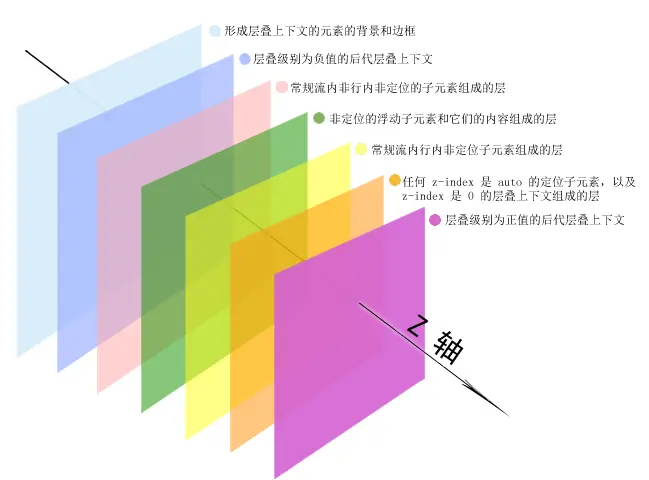

# 层叠规则

## 目录

- [层叠规则](#层叠规则)
  - [目录](#目录)
  - [z-index](#z-index)
  - [什么是层叠上下文](#什么是层叠上下文)
  - [什么是层叠水平](#什么是层叠水平)
  - [层叠顺序](#层叠顺序)
  - [层叠准则](#层叠准则)
  - [层叠上下文的特性](#层叠上下文的特性)
    - [笔者个人理解](#笔者个人理解)
  - [层叠上下文的创建](#层叠上下文的创建)
    - [定位元素与传统层叠上下文](#定位元素与传统层叠上下文)
  - [层叠上下文与层叠顺序](#层叠上下文与层叠顺序)
  - [z-index 负值深入理解](#z-index-负值深入理解)
  - [z-index “不犯二”准则](#z-index-不犯二准则)

## z-index

在 CSS 世界中，z-index 属性只有和**定位元素（position 不为 static 的元素）或 flex 盒子的子元素**才会发挥作用。

属性值正负均可。

---

## 什么是层叠上下文

层叠上下文（stacking context），是 HTML 中的一个三维的概念。

z 轴，表示用户与显示器之间不可见的垂直线，如图所示：


层叠上下文是一个概念，与**块状格式化上下文（BFC）**类似。

可以将层叠上下文理解为一种**层叠结界**，自称一个小世界。这个小世界中可能有其他的层叠结界，其自身也可能处于其他的层叠结界中。

---

## 什么是层叠水平

层叠水平（stacking level），决定在同一层叠上下文元素在 z 轴上的显示顺序。

**页面中所有的元素都有层叠水平**，包括层叠上下文元素和普通元素。对于普通元素的层叠水平探讨只局限于当前层叠上下文中，普通元素的层叠水平无法突破上述提到的层叠结界。

---

## 层叠顺序

层叠顺序（stacking order），表示元素发生层叠时特定的垂直显示顺序。

层叠顺序是规则，层叠上下文和层叠水平是概念。

CSS 2.1 的层叠顺序规则图示


层叠顺序规则 3D 图示



层叠顺序规则的补充说明

位于最下方的 background/border 特指层叠上下文元素的边框和背景色。每一个层叠顺序规则仅适用于当前层叠上下文元素的小世界。

inline 水平盒子，包括 inline/inline-block/inline-table 元素的层叠顺序，它们是同级别的。

单纯从层叠水平上看，z-index: 0 和 z-index: auto 可以看作是一样的。实际上，两者在层叠上下文领域有着根本性的差别。

对于**仅声明 position: relative/absolute 的元素**，其层叠顺序位于 z-index: auto 层。

为什么内联元素的层叠顺序要比浮动元素和块状元素高？

由图示的标注可以知晓。background/border 为装饰属性，浮动和块状元素一般用作布局，而内联元素大部分都是内容。而网页尤其重视内容。

---

## 层叠准则

- 谁大谁上
  - 当具有明显的层叠水平标识时，如生效的 z-index 属性值，在同一层叠上下文领域内，层叠水平值大的元素覆盖较小的元素
- 后来居上
  - 当元素的层叠水平一致、层叠顺序相同时，在 DOM 流中处于后面的元素会覆盖前面的元素。

---

## 层叠上下文的特性

- 层叠上下文的层叠水平要比普通元素高
- 层叠上下文可以阻断元素的混合模式
- 层叠上下文可以嵌套，内部层叠上下文及其所有子元素均受制于外部的层叠上下文
- 每个层叠上下文和兄弟元素独立，即当进行层叠变化或渲染时，只需要考虑后代元素即可
- 每个层叠上下文是自称体系的，当元素发生层叠时，整个元素被认为是在父层叠上下文的层叠顺序中

### 笔者个人理解

子级层叠上下文元素在参与父级层叠上下文的层叠顺序计算时，仅层叠上下文元素本身参与计算。

上述也解释了一个现象，子级层叠上下文元素 son-1 中某个子元素 “son-A” 的 z-index 超级大，但由于 son-1（index: 1）层叠顺序小于 son-2（index: 2） ，尽管 son-A 元素的 z-index 超级大，在渲染时，son-2 元素仍显示 son-A 元素上方。

---

## 层叠上下文的创建

与块状格式化上下文一样，层叠上下文也基本由一些特定的 CSS 属性创建，可以分为

- 文档根元素（\<html>）
- position 值为 absolute/relative，且 z-index 值不为 auto 的元素
- position 值为 fixed（固定定位）/sticky（粘滞定位）
- flex 容器的子元素，且 z-index 值不为 auto
- grid 容器的子元素，且 z-index 值不为 auto
- opacity 属性值小于 1 的元素
- mix-blend-mode 属性值不为 normal 的元素
- 以下任意属性值不为 none 的元素
  - transform
  - filter
  - backdrop-filter
  - perspective
  - clip-path
  - mask / mask-image / mask-border
- isolation 属性值为 isolate 的元素
- will-change 值设定了任意属性（该属性在 non-initial 值时会创建层叠上下文的元素）

### 定位元素与传统层叠上下文

代码对比：

```html
<!--
    z-index: auto 
    美女图片位于美景图片之上 
    -->
<div style="position: relative; z-index: auto;">
    <!-- 美女 -->
    
</div>
<div style="position: relative; z-index: auto;">
    <!-- 美景 -->
    
</div>

<!-- =========================== -->

<!--
    z-index: 0 
    美景图片位于美女图片之上 
    -->
<div style="position: relative; z-index: auto;">
    <!-- 美女 -->
    
</div>
<div style="position: relative; z-index: auto;">
    <!-- 美景 -->
    
</div>
```


上述代码的差别在于：

z-index: auto 所在的 \<div> 元素是一普通定位元素，于是，里面的两个 \ 元素的层叠比较不受父级元素的影响，两者直接套用层叠准则。遵循**谁大谁上**准则，z-index: 2 的美女图片显示在 z-index: 1 的美景图片上。

z-index: 0 当 z-index 属性值一旦变为数值（包括 0），**就会创建一个层叠上下文**。此时，层叠规则就会发生变化。两个 \ 元素的层叠顺序比较规则变为**优先比较其父级层叠上下文元素的层叠顺序**。遵循**后来居上**准则，根据 DOM 文档流中的位置决定谁在上面，于是位于文档流后面美景图片的父盒子显示在美女图片的父盒子之上。\ 元素上的 z-index 属性在此时没有发挥作用。

---

## 层叠上下文与层叠顺序

一旦普通元素具有层叠上下文，其层叠顺序就会变高。

- 如果层叠上下文元素不依赖 z-index 数值，则其层叠顺序是 z-index: auto，可以看作 z-index: 0 级别
- 如果层叠上下文依赖 z-index 数值，则其层叠顺序由 z-index 值决定

元素一旦成为定位元素，其 z-index 就会自动生效，此时其 默认 z-index: auto。而不支持 z-index 的层叠上下文元素天然是 z-index: auto。意味着，**层叠上下文元素和定位元素是一个层叠顺序的**，于是它们发生层叠时，遵循**后来居上**准则，

```html
<!-- 此时 2.jpg 显示在 1.jpg 之上 -->


<!-- 此时 1.jpg 显示在 2.jpg 之上 -->


```

---

## z-index 负值深入理解

由上文中的层叠顺序规则图可以看到，负 z-index 是显示在当前层叠上下文之上的，被限制在当前层叠上下文结界中。意味着 z-index: -1 或 z-index: -999 最终都会显示在当前层叠上下文之上。

由于层叠上下文元素会创建新的层叠上下文，**z-index 负值渲染是一个寻找第一个层叠上下文元素的过程，层叠顺序止步于这个层叠上下文元素**。

---

## z-index “不犯二”准则

“不犯二”准则：对于非浮层元素，避免设置 z-index 值，z-index 值没有任何道理需要超过 2。

1. 定位元素一旦设置 z-index 值，会从普通定位元素变为层叠上下文元素，创建了新的层叠上下文，元素之间的层叠顺序发生了根本性的变化，很容易出现元素设置巨大的 z-index 值也无法覆盖其他元素的问题。
2. 避免 z-index “一山更比一山高”的样式混乱问题。
