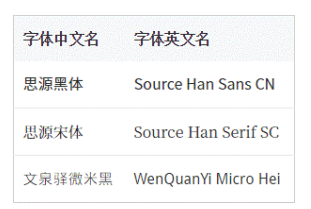

# font-family

**font-family 默认值由操作系统和浏览器共同决定**。

font-family 支持两类属性值，**字体名**和**字体族**。

## 目录

- [font-family](#font-family)
  - [目录](#目录)
  - [字体名和字体族](#字体名和字体族)
    - [字体名](#字体名)
    - [字体族](#字体族)
  - [了解衬线字体和无衬线字体](#了解衬线字体和无衬线字体)
  - [等宽字体的实践价值](#等宽字体的实践价值)
    - [等宽字体与代码呈现](#等宽字体与代码呈现)
    - [等宽字体与图形呈现案例](#等宽字体与图形呈现案例)
    - [ch 单位与等宽字体布局](#ch-单位与等宽字体布局)
  - [中文字体和英文名称](#中文字体和英文名称)
    - [Windows 常见内置中文字体和对应英文名称](#windows-常见内置中文字体和对应英文名称)
    - [OS X 常见内置中文字体和对应英文名称](#os-x-常见内置中文字体和对应英文名称)
    - [Office 软件安装新增中文字体和对应英文名称](#office-软件安装新增中文字体和对应英文名称)
    - [其他一些中文字体和对应英文名称](#其他一些中文字体和对应英文名称)
  - [补充说明](#补充说明)

## 字体名和字体族

### 字体名

```css
body {
    font-family: simsun;
}
```

上述代码表示 body 元素中使用宋体。

如果字体名包含空格，需要使用引号进行包裹。

字体名不区分大小写，如果有多个字体设定，从左往右依次寻找本地是否有对应的字体即可。

### 字体族

- font-family: serif;
  - 衬线字体
- font-family: sans-serif;
  - 无衬线字体
- font-family: monospace;
  - 等宽字体
- font-family: cursive;
  - 手写字体
- font-family: fantasy;
  - 奇幻字体
- font-family: system-ui;
  - 系统 UI 字体

---

## 了解衬线字体和无衬线字体

衬线字体：笔画的开始、结束处有额外装饰而且笔画的粗细有所不同。

常用中文衬线字体：宋体。

常用英文衬线字体：Times New Roman、Georgia。

无衬线字体：没有额外的装饰，笔画的粗细差不多。

常用中文无衬线字体：雅黑。

常用英文无衬线字体：Arial、Verdana、Tahoma、Helivetica、Calibri。

移动端 Web 开发时，设备的默认中文字体都是无衬线字体，当然默认字体不一样。

**注**：serif 和 sans-serif 一定要写在 font-family 列表之后，因为在大多数浏览器下，写在 serif 和 sans-serif 之后的所有字体都会被忽略。

---

## 等宽字体的实践价值

等宽字体，一般针对英文字体而言。

东亚字体应该都是等宽的。

等宽：每个字符在同等 font-size 下占据的宽度是一样的。

常用英文等宽字体：Consolas、Monaco、monospace

### 等宽字体与代码呈现

等宽字体利于代码呈现。一般编辑器或 Web 上呈现源代码的字体都是等宽字体。

### 等宽字体与图形呈现案例

需求：通过下拉选择，可以改变元素的边框样式，即 border-style solide/dashed/dotted

而原生 \<select> 的 \<option> 元素的 innerHTML 只能是 text 字符，不支持 html 与伪元素。此时为呈现长短一致的图形可以使用等宽字体。


### ch 单位与等宽字体布局

ch 是一个 CSS3 字符相对单位，与 em、rem、ex 类似，**1ch 表示一个 0 字符的宽度**。

应用场景：

手机号码输入框宽度设定 11ch，同时字体等宽，可以提高用于的阅读性。

实现代码依次出现的动效，使用等宽字体和 ch 单位控制宽度，配合 overflow 和 animation 就可以完成。

---

## 中文字体和英文名称

为规避乱码的风险，font-family 属性值推荐使用英文名称而不是中文名称，尽管一些常见的中文字体名称作为属性值仍可以生效。

### Windows 常见内置中文字体和对应英文名称


### OS X 常见内置中文字体和对应英文名称


### Office 软件安装新增中文字体和对应英文名称


### 其他一些中文字体和对应英文名称



---

## 补充说明

在 OS X 苹果操作系统的字体名称经常出现 SC（simplified chinese）简体、TC（traditional chinese）繁体。

尽管 font-family 属性值对字体名称的大小写不敏感，但实际使用时至少名称的首字母要大写，否则在使用 CSS unicode-range 的时候可能会遇到一些麻烦。
