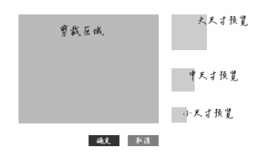
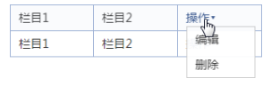

# 元素的显示与隐藏

## 目录

- [元素的显示与隐藏](#元素的显示与隐藏)
  - [目录](#目录)
  - [元素隐藏实践](#元素隐藏实践)
    - [使用元素 \<script>](#使用元素-script)
    - [display: none 隐藏](#display-none-隐藏)
    - [absolute 与 visibility 配合使用](#absolute-与-visibility-配合使用)
    - [visibility 元素隐藏](#visibility-元素隐藏)
    - [relative 隐藏](#relative-隐藏)
    - [透明度 与 absolute 隐藏](#透明度-与-absolute-隐藏)
    - [透明度隐藏](#透明度隐藏)
    - [隐藏方法总结](#隐藏方法总结)
  - [display 与元素的显隐](#display-与元素的显隐)
    - [HTML 中默认 display: none 的元素](#html-中默认-display-none-的元素)
    - [计数器列表与 display: none 元素](#计数器列表与-display-none-元素)
  - [visibility 与元素的显隐](#visibility-与元素的显隐)
    - [visibility 的继承性](#visibility-的继承性)
    - [visibility 与 CSS 计数器](#visibility-与-css-计数器)
    - [visibility 与 transition](#visibility-与-transition)
    - [visibility 隐藏对 JavaScript 侧更友好](#visibility-隐藏对-javascript-侧更友好)
    - [visibility 隐藏对无障碍访问更友好](#visibility-隐藏对无障碍访问更友好)

## 元素隐藏实践

使用 CSS 使元素不可见的方法有很多，剪裁、定位到屏幕外、明度变化等都可以

### 使用元素 \<script>

此时元素不可见，同时不占据空间，辅助设备无法访问，元素不渲染，可以使用 \<script> 元素进行隐藏。

```html
<!-- 1.jpg 不会发送请求 -->
<script type="text/html">
    
</script>

<!-- 
    <script> 不支持嵌套
    如果希望在 <script> 中再放置其他不渲染的模板内容，可以尝试 <textarea> 元素
 -->

<!-- 
    2.jpg 同样不会发送请求
 -->
<script type="text/html">
    
    <textarea src="display: none;">
        
    </textarea>
</script>
```

获取 \<script> 元素的隐藏内容使用 script.innerHTML

获取 \<textarea> 元素的隐藏内容使用 textarea.value

### display: none 隐藏

此时元素不可见，不占据空间，辅助设备无法访问，但资源有加载，DOM 可访问。

```css
.dn {
    display: none;
}
```

### absolute 与 visibility 配合使用

元素不可见，不占据空间，辅助设备无法访问，元素显隐时可以添加淡入淡出效果

```css
.hidden {
    position: absolute;
    visibility: hidden;
}
```

### visibility 元素隐藏

元素不可见，不能点击，辅助设备无法访问，占据空间保留

```css
.vh {
    visibility: hidden;
}
```

### relative 隐藏

元素不可见，不能点击，占据空间，键盘可访问

```css
.lower {
    position: relative;
    z-index: -1;
}
```

### 透明度 与 absolute 隐藏

元素不可见，可以点击，不占据空间

```css
.opacity {
    position: absolute;
    opacity: 0;
    filter: Alpha(opacity=0);
}
```

### 透明度隐藏

元素不可见，位置保留，元素可点击

```css
.opacity {
    opacity: 0;
    filter: Alpha(opacity=0);
}
```

### 隐藏方法总结

| 隐藏方法                                         | 是否占据空间 | 元素是否可点击 | 资源是否加载 | 其他                               |
| :----------------------------------------------- | :----------- | :------------- | :----------- | :--------------------------------- |
| 使用 \<script> 元素包裹                          | 否           | 否             | 否           | 辅助设备无法访问                   |
| 元素声明 display: none                           | 否           | 否             | 是           | 辅助设备无法访问                   |
| 元素声明 position: absolute; visibility: hidden; | 否           | 否             | 是           | 辅助设备无法访问，可以添加动画效果 |
| 元素声明 visibility: hidden;                     | 是           | 否             | 是           | 辅助设备无法访问                   |
| 元素声明 position: relative; z-index: -1;        | 是           | 否             | 是           | 键盘可访问                         |
| 元素声明 opacity: 0; position: absolute;         | 否           | 是             | 是           |                                    |
| 元素声明 opacity: 0;                             | 是           | 是             | 是           |                                    |
| 元素声明 display: none                           | 否           | 否             | 否           |                                    |

---

## display 与元素的显隐

对于一个元素而言，如果其 display 计算值为 none，则该元素及其所有后代元素均隐藏。

元素声明 display: none，无法点击，辅助设备无法访问，占据空间消失。

对于 Firefox 浏览器，元素或其父元素声明 display: none 则其 background-image 图片不加载。

对于 Chrome 和 Safari 浏览器，若元素的父元素声明 display: none，则其 background-image 图片不加载；若元素本身声明 display: none，则其 background-image 图片加载。

### HTML 中默认 display: none 的元素

\<style>、\<script>、\<dialog>、\<input type="hidden" > 默认 display: none;

如果上述元素是 \<body> 的子元素，则为其声明 display: block 可以让内联 CSS 和 JavaScript 代码直接在页面中显示。

```html
<style style="display: block;">
.l {
    float: left;
}
</style>    
```

上述代码的基础上，声明 contenteditable="true" ，可以一些浏览器（比如 Chrome），可以直接实时编辑预览页面的样式。

```html
<style 
    style="display: block;"
    contenteditable="true"
>
.l {
    float: left;
}
</style>    
```

对于 hidden 类型的 \<input> 输入框

```html
<input type="hidden" name="id" value="1">
```

专门用于放置类似 token 或者 id 这样的隐藏信息，亦说明表单元素的显示与否不影响数据的提交，真正影响数据提交的属性是 disabled。

HTML5 新增的 hidden 属性，可以让元素天生 display: none 隐藏

```html
<div hidden>看不见我</div>
```

现代浏览器均支持上述属性，若要兼容桌面端，需要如下 CSS 设置：

```css
[hidden] {
    display: none;
}
```

display: none 显隐控制并不会影响 CSS3 animation 动画的实现，但是会影响 CSS3 transition 过渡效果的执行。

对于上述问题，可以尝试 transition 和 visibility 一起使用。

### 计数器列表与 display: none 元素

若计数器列表中的列表项声明 display: none 则该列表项并不参数计数。

---

## visibility 与元素的显隐

### visibility 的继承性

父元素设置 visibility: hidden，由于继承性，子元素也会隐藏。若子元素声明 visibility: visible，子元素会正常显示。这与元素声明 display: hidden，有本质区别。

上述 visibility 特性，可以提高优化加载体验。

头像上传功能实例：头像图片上传完毕要进入剪裁界面。



模块外部容器设置 visibility: hidden，剪裁区域中设置加载效果，设置 visibility: visible。图片尺寸获取成功后，再正常初始化，然后外部容器重置 visibility: visible。此时，站在用于角度：“加载中 -> 剪裁界面”。

HTML 示意

```html
<div style="visibility: hidden;">
    <div class="main-box">
        <div class="operate-box">
            <i 
                class="icon-loading"              
                style="visibility: visible;"
            >
            加载中...
            </i>
        </div>
        <div class="button-box">
            <button>确定</button>
            <button>取消</button>
        </div>
    </div>
    <div class="preview-box">
        大，中，小预览图...
    </div>
</div>
```

### visibility 与 CSS 计数器

元素声明 visibility: hidden 并不影响其计数器的计数

### visibility 与 transition

```css
/* 下述代码 .box 元素 hover 时，没有过渡效果 */
.box > .target {
    display: none;
    position: absolute;
    opacity: 0;
    transition: opacity .25s
}

.box:hover > .target {
    display: block;
    opacity: 1;
}

/* 下述代码 .box 元素 hover 时，有过渡效果 */
.box > .target {
    position: absolute;
    opacity: 0;
    transition: opacity .25s;
    visibility: hidden;
}

.box:hover > .target {
    visibility: visible;
    opacity: 1;
}
```

上述代码的差异在于：CSS3 transition 支持 CSS 属性 visibility，但不支持 display。

由于 transition 可以延时执行，配合 visibility 使用可以纯 CSS 实现 hover 延时显示效果，由此提升交互体验。



对于上图所示的 hover 悬浮显示列表效果，且多个触发点相邻，可以在显示悬浮列表时增加一定的延时，可以比避免误触而导致副高目标元素的问题。

核心代码如下：

```html
<style>
    .list {
        position: absolute;
        visibility: hidden;
    }

    td:hover .list {
        visibility: visible;
        transition: visibility 0s .2s
    }
</style>

<td>
    <a href>操作</a>
    <div class="list">
        <a href>编辑</a>
        <a href>删除</a>
    </div>
</td>
```

元素在 hover 状态声明 transition 可以让鼠标光标移出元素时无延时的迅速隐藏。

[visibility 与 hover 状态的延时显示](https://demo.cssworld.cn/10/2-3.php)

[visibility 与 hover 状态的延时显示 - 备份](demo/01-visibility%20与%20hover%20状态的延时显示.html)

### visibility 隐藏对 JavaScript 侧更友好

场景：获取隐藏元素的尺寸和位置，以便对交互布局进行精准定位给。

对于上述场景，建议使用 visibility 隐藏：

```css
.hidden {
    position: absolute;
    visibility: hidden;
}
```

原因如下：

若使用 display: none 属性，则元素的尺寸还是位置的计算值都为 0，计算不准确。

### visibility 隐藏对无障碍访问更友好

视觉障碍用户对于页面状态变化都是通过声音感知，而非视觉。因此有必要告知用户准确的状态信息。

下面是遮罩浮层的一些描述，显示时和隐藏时分别如下：

```html
<style>
    .hidden {
        visibility: hidden;
    }
</style>

<div class="overlay" role="button" title="点击关闭浮层">点击关闭浮层</div>
<div class="overlay hidden" role="button" title="浮层已关闭">点击关闭浮层</div>
```

以上述代码为例，当关闭浮层时 iPhone 的 VoiceOver 会读“浮层已关闭”。显然用户体验更佳。

普通元素的 title 属性是不会被屏幕阅读软件朗读的，除非辅以按钮等控件元素，上述代码因为声明了 role="button" 所以才会被朗读。

visibility: hidden 元素是不会朗读的，上述代码之所以会被朗读，元素从显示到隐藏，遮罩层 focus 仍存在（display: none 则丢失，因为尺寸位置全部变为 0）。
