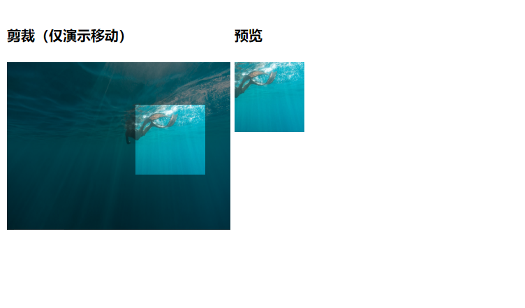
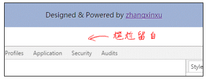
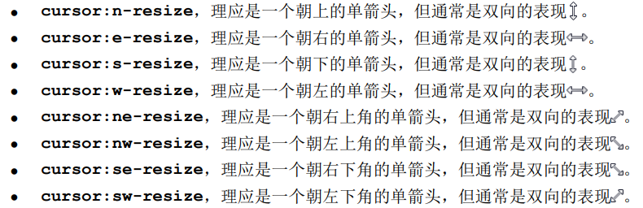
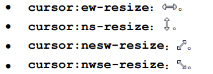
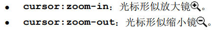
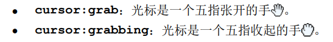

# 用户界面样式

用户界面样式指的是 CSS 世界中用于帮助用户进行界面交互的一些 CSS 样式，主要有 outline 和 cursor 等属性。

## 目录

- [用户界面样式](#用户界面样式)
  - [目录](#目录)
  - [和 border 形似的 outline 属性](#和-border-形似的-outline-属性)
    - [不推荐在全局设置 outline: 0 none](#不推荐在全局设置-outline-0-none)
  - [真正不占据空间的 outline 及其应用](#真正不占据空间的-outline-及其应用)
    - [outline 应用于头像剪裁的矩形镂空效果](#outline-应用于头像剪裁的矩形镂空效果)
    - [自动填满屏幕剩余空间](#自动填满屏幕剩余空间)
  - [光标属性](#光标属性)
    - [cursor 属性值](#cursor-属性值)
      - [常规](#常规)
      - [链接和状态](#链接和状态)
      - [选择](#选择)
      - [拖曳](#拖曳)
      - [滚动](#滚动)
      - [拉伸](#拉伸)
      - [缩放](#缩放)
      - [抓取](#抓取)
    - [自定义光标](#自定义光标)

## 和 border 形似的 outline 属性

outline 表示元素的轮廓，语法和 border 属性非常相似，属性值分为宽度、类型和颜色，支持的关键字和属性值与 border 属性一致。

```css
.outline {
    outline: 1px solid #000;
}
```

属性 outline 和 border 表现类似，但是作用却大相径庭。

### 不推荐在全局设置 outline: 0 none

outline 是一个和用户体验密切相关的属性，与 focus 状态以及键盘访问有着密切关系。

浏览器原生具有键盘访问网页的能力，对于按钮或者链接，通常的键盘操作是：Tab 键按次序不断 focus 控件元素，包括链接、按钮、输入框等表单元素，和属性 focus 设置了 tabindex 的普通元素，使用 Shift + Tab 组合键反方向访问。

默认状态下，对处于 focus 状态的 HTML 元素，浏览器会通过虚框或者外放光的形式进行区分和提示。

处于 focus 的元素，再使用回车键，就相当于鼠标点击了该元素。

现代浏览器对于普通链接或者按钮，当使用鼠标进行点击的时候，不会出现 outline 效果，只有键盘 Tab 键或者 JavaScript 的 element.focus() 主动触发才会有 outline 效果。

因此完全没有必要全局设置 outline: 0 none。

```css
/* 如此声明反而会降低用户体验 */
* {
   outline: 0 none; 
}
```

对于输入框元素，一些浏览器默认的 focus 效果可能和网页设计格格不入，因此需要重置 outline。

```css
.input {
    outline: 0; /* outline: none; 亦可 */
}

/* 必须添加元素 focus 态样式 */
.input:focus {
    border-color: Highlight;
}
```

---

## 真正不占据空间的 outline 及其应用

outline 是真正意义上**不占据任何空间的属性**。

outline 不会影响任何元素的任何布局，并且 outline 轮廓可穿透。

内联元素的上下 padding 值似乎不占据任何空间，一旦其祖先元素的 overflow 属性的计算值不是 visible，同时 padding 值足够大，滚动条就会出现，暴露出**不占据空间**其实是一个假象。

### outline 应用于头像剪裁的矩形镂空效果



对于上述中间镂空透明、四周蒙层遮罩的效果如何实现？

核心代码：

```css
.crop {
    overflow: hidden;
}

.crop > .crop-area {
    width: 80px;
    height: 80px;
    outline: 256px solid rgba(0, 0, 0, .5);
    cursor: move;
}
```

剪裁区域元素使用 outline 实现周围半透明黑色遮罩。outline 不会对布局产生任何影响。容器元素声明 overflow: hidden 剪裁溢出 outline。

[outline 与镂空效果](https://demo.cssworld.cn/11/1-1.php)

[outline 与镂空效果 - 备份](demo/00-outline%20与镂空效果.html)

### 自动填满屏幕剩余空间

若网站背景为白色，但底部为黑色，此时会出现一个问题：当主内容很少的时候，包括底部在内不足一屏或者用户显示器是竖屏，则很可能出现如图所示的尴尬情况。



此时可以使用 outline 属性进行优化。

```html
<style>
    .footer {
        height: 50px;
    }

    .footer > p {
        position: absolute;
        left: 0;
        right: 0;
        text-align: center;
        padding: 15px;
        background-color: #a0b3d6;
        /* 足够大的 outline */
        outline: 9999px solid #a0b3d6;
    }
</style>

<div class="footer">
    <p>footer</p>
</div>
```

---

## 光标属性

### cursor 属性值

#### 常规

- cursor: auto
  - cursor 默认值。
  - 浏览器根据内容类别自动处理光标形状
- cursor: default
  - **系统**默认光标形状
- cursor: none
  - 光标隐藏
  - 场景：视频
  
#### 链接和状态

- cursor: pointer
  - 常用于链接
- cursor: help
  - 常用于帮助链接或者包含提示信息的问号小图标
- cursor: progress
  - 场景
    - 点击按钮发送请求，等待返回数据（更推荐使用图标）
    - 页面加载
- cursor: wait
  - 表现为沙漏或表图标
  - 不推荐使用
- cursor: context-menu
  - 兼容性
    - Mac OS X 和 Linux 系统下的 Chrome 和 Firefox 支持
    - Windows 系统下的 Chrome 和 Firefox 不支持
  
#### 选择

- cursor: text
  - 场景：表示文字可选
  - 单行输入框的默认光标表现
- cursor: vertical-text
  - 场景：表示纵向文字可选
- cursor: crosshair
  - 十字光标
  - 场景：像素级的框选或者点选场合
    - 自定义的取色工具
- cursor: cell
  - 表示单元格可以框选

#### 拖曳

- cursor: move
  - 场景：当前元素可移动
    - 头像剪裁
    - 可拖曳弹框组件
- cursor: copy
  - 场景：当前元素可被复制
- cursor: alias
  - 场景：当前元素可以创建别名或快捷方式
- cursor: no-drop
  - 场景：不允许元素放置到当前位置
- cursor: not-allowed
  - 场景：禁止当前行为

#### 滚动

- cursor: all-scroll
  - 表示上下左右都可以滚动
  - 兼容性问题
    - Windows 系统下光标表现与 cursor: move 一样

#### 拉伸

- cursor: col-resize
  - 场景：移动垂直线条
    - 垂直参考线
- cursor: row-resize
  - 场景：移动水平线条
    - 水平参考线

单向拉伸



双向拉伸



#### 缩放



#### 抓取



### 自定义光标

所有浏览器都支持自定义网页中的光标样式。

对于 Chrome 浏览器，可以直接使用 PNG 格式图片作为光标。
