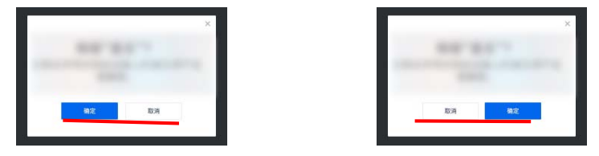

# 流向的改变

## 目录

- [流向的改变](#流向的改变)
  - [目录](#目录)
  - [改变水平流向的 direction](#改变水平流向的-direction)
    - [应用场景：兼容桌面端和移动端](#应用场景兼容桌面端和移动端)
  - [direction 的黄金搭档 unicode-bidi](#direction-的黄金搭档-unicode-bidi)
    - [unicode-bidi 属性值](#unicode-bidi-属性值)
  - [改变 CSS 世界纵横规则的 writing-mode](#改变-css-世界纵横规则的-writing-mode)
    - [writing-mode 原本的作用](#writing-mode-原本的作用)
      - [writing-mode 的语法](#writing-mode-的语法)
    - [writing-mode 改变了哪些规则](#writing-mode-改变了哪些规则)
      - [水平方向的 margin 也可以合并](#水平方向的-margin-也可以合并)
      - [普通块状元素可以使用 margin: auto 实现垂直居中](#普通块状元素可以使用-margin-auto-实现垂直居中)
      - [使用 text-indent 实现文字下沉效果](#使用-text-indent-实现文字下沉效果)
  - [writing-mode 和 direction 的关系](#writing-mode-和-direction-的关系)

## 改变水平流向的 direction

常用属性值：

```css
:root {
    direction: ltr; /* 默认值 left-to-tight */
    direction: rtl; /* right-to-left */
}
```

### 应用场景：兼容桌面端和移动端



在桌面端呈现时，“确认”按钮在左侧，“取消”按钮在右侧。

在移动端呈现时，为方便用户操作，“确认”按钮在右侧，“取消”按钮在左侧。

处理不同设备中元素的不同呈现顺序的高性价比方法：改变流向。

```css
@media screen and (max-width: 480px) {
    .dialog-footer {
        direction: rtl;
    }
}
```

direction 属性还可以改变表格中列的呈现顺序。

direction: rtl 还可以让 text-justify 两端对齐元素，最后一行落单的元素右对齐显示。

**注**：只要是内联元素，只要与书写流相关，都可以试试 direction 属性。

---

## direction 的黄金搭档 unicode-bidi

unicode 指字符集。

bidi（bidirectionality 的简写），译为“双向性”

仅声明 direction 属性，只能改变图片或者按钮的呈现顺序（因为是内联元素），但是对同属于内联元素的字符内容（尤其中文）却无能为力。

对于上述问题，可以声明 direction 和 unicode-bidi 属性，指定每个字符都**反向呈现**。

所有浏览器均支持 unicode-bidi 属性。

网页中的字符很多时候都是混合的，例如中文和英文夹杂，阿拉伯文和英文夹杂，此时就会出现文本阅读方向不一致的情况。

阿拉伯文从右往左，英文从左往右，这种混合方向同时出现的现象就成为**双向性**，因此 unicode-bidi 作用就是明确字符出现双向性时应该有的表现。

### unicode-bidi 属性值

unicode-bidi 兼容性比较好的几个属性值：

- unicode-bidi: normal; 默认值
  - 正常排列
  - 同时声明 direction: rtl;
    - 图片、按钮以及问号、加号之类的字符从右往左显示
    - 中文、英文字符仍从左往右显示
- unicode-bidi: embed;
  - 只能作用于内联元素
  - 通常情况下，与 normal 属性值表现一致
  - embed 属性值的字符排列是独立内嵌的，不受外部影响
    - 实现原理
      - 会开启一个不可见的嵌入层
      - unicode-bidi: normal 并不会开启
      - 在元素的开始位置添加一个特殊字符
        - 文字流向 direction: ltr; 则字符为 U+202A;
        - 文字流向 direction: rtl; 则字符为 U+202B;
      - 在元素结束位置添加一个 U+202C 字符。
- unicode-bidi: bidi-override;
  - 重写双向排列
  - 样式表现为所有字符都按照指定的 direction 顺序排列。
    - 对于子元素已声明 unicode-bidi: emded 无效。
  - 实现原理
    - 在元素开始位置（每个匿名子级块盒的开始位置）插入特殊字符
      - 文字流向 direction: ltr; 则字符为 U+202E;
      - 文字流向 direction: rtl; 则字符为 U+202C;

---

## 改变 CSS 世界纵横规则的 writing-mode

### writing-mode 原本的作用

writing-mode 原本是为控制内联元素的显示而设计的，即实现**文字竖向呈现**。

#### writing-mode 的语法

```css
:root {
    /* 关键字值 */
    writing-mode: horizontal-tb; /* 默认值 */
    writing-mode: vertical-rl;
    writing-mode: vertical-lr;


    /* 全局值 */
    writing-mode: inherit;
    writing-mode: initial;
    writing-mode: unset;
}
```

- horizontal-tb
  - 文本流是水平方向（horizontal）
  - 元素从上往下堆叠（top-bottom）
- vertical-rl
  - 文本流是垂直方向（vertical）
  - 阅读顺序从右往左（right-left）
- vertical-lr
  - 文本流是处置方向（vertical）
  - 阅读顺序是从左往右（left-right）


### writing-mode 改变了哪些规则

writing-mode 将页面默认的水平流改为垂直流，基于默认水平方向才适用的规则，全部都可以在垂直方向适用。

```css
.vertical-mode {
    writing-mode: vertical-rl;
}
```

#### 水平方向的 margin 也可以合并

CSS2 规范文档：

> The bottom margin of an in-flow block-level element always collapses with the top margin of its next in-flow block-level sibling, unless that sibling has clearance.

在 CSS3 中，由于 writing-mode 存在，上述说明并不严谨。

**对垂直流方向的 margin 会发生合并**。如果元素是默认的水平流，则垂直 margin 会合并；如果元素是垂直流，则水平 margin 会合并。

#### 普通块状元素可以使用 margin: auto 实现垂直居中

元素进行如下声明：

```css
/* 容器元素 */
.verticle-mode {
    writing-mode: vertical-rl;
}

/* 子级元素 */
.son {
    margin: auto;
}
```

#### 使用 text-indent 实现文字下沉效果

在垂直文档流下，中文不会旋转，仍是直立效果，此时可以使用 text-indent/letter-spacing 等属性控制文字在垂直方向的布局效果。

核心代码：

```html
<style>
    .btn {}

    .btn:active {
        text-indent: 2px;
    }

    .vertical-mode {
        writing-mode: vertical-rl;
    }
</style>

<a href="javascript:" class="btn vertical-mode">领</a>
```

[text-indent 文字下沉实](https://demo.cssworld.cn/12/2-5.php)

[text-indent 文字下沉实 - 备份](demo/00-text-indent%20文字下沉实例.html)

## writing-mode 和 direction 的关系

writing-mode、direction、unicode-bidi 是 CSS 世界中三大可以改变文本布局流向的属性。

direction 和 unicode-bidi 经常一起配合内联元素使用。

writing-mode 可以对块状元素产生影响。
