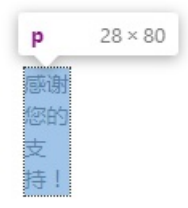
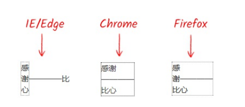

# 贯穿全书的尺寸体系

如果用一个金字塔表示尺寸体系，最上层的概念就是 **Intrinsic Sizing** 和 **Extrinsic Sizing**。

Intrinsic Sizing 被称为**内在尺寸**，元素最终的尺寸表现由**内容决定**。

Extrinsic Sizing 被称为**外在尺寸**，元素最终的尺寸表现由**上下文决定**。

由于新的尺寸关键字在 width 属性中最常用，因此，本节以 width 属性作为示例属性。

CSS 的 width 属性新增了 4 个与尺寸概念相匹配的关键字，包括 fit-content、fill-available、min-content 和 max-content。

## 目录

- [贯穿全书的尺寸体系](#贯穿全书的尺寸体系)
  - [目录](#目录)
  - [width: fit-content 声明](#width-fit-content-声明)
    - [fit-content 关键字使元素具有确定尺寸](#fit-content-关键字使元素具有确定尺寸)
  - [stretch、available 和 fill-avaiable 关键字](#stretchavailable-和-fill-avaiable-关键字)
    - [区分](#区分)
    - [stretch 关键字的应用场景](#stretch-关键字的应用场景)
  - [min-content 关键字](#min-content-关键字)
    - [替换元素](#替换元素)
    - [CJK 文字](#cjk-文字)
      - [特殊标点 - 中文破折号](#特殊标点---中文破折号)
    - [非 CJK 文字](#非-cjk-文字)
  - [max-content 关键字](#max-content-关键字)
  - [总结](#总结)

## width: fit-content 声明

fit-content 关键字是新的尺寸体系关键字中使用频率最高的关键字。

fit-content 适合内容，**内容尺寸即元素尺寸**。

fit-content 关键字的样式表现就是 CSS 2.1 规范中的“shrink-to-fit”。尺寸表现与元素声明 display: inline-block、position: absolute 等类似，尺寸收缩但不会超出包含块级元素的尺寸限制。

如果内联元素要实现内容尺寸即元素尺寸，可以声明 display: inline-block。

如果块级元素要实现内容尺寸即元素尺寸，可以声明 display: table。

而元素声明 width: fit-content 有两大优点

1. 保护了元素原始的 display 计算值
2. 让元素的尺寸有了确定的值
   - 这是 fit-content 关键字最重要的也是最可贵的优点

### fit-content 关键字使元素具有确定尺寸

CSS 中有不少布局都需要有明确的元素的尺寸才可以实现，典型例子就是绝对定位元素使用 margin: auto 实现居中效果时需要设置具体的 width 或 height 的属性值。

```css
.cw-dialog {
    width: 300px;
    height: 200px;
    position: absolute;
    left: 0;
    top: 0;
    right: 0;
    bottom: 0;
    margin: auto;
    border: solid;
}
```

很多时候，绝对定位元素的尺寸不固定，最终的尺寸会根据内容自动变化。此时上述使用 margin: auto 实现的居中效果可以使用 transform 实现。

```css
.cw-dialog {
    position: absolute;
    left: 50%;
    right: 50%;
    border: solid;
    transform: translate(-50%, -50%);
}
```

但是上述方法占用了 transform 属性，会导致绝对定位元素无法使用包含 transform 属性的动画效果。

若想要元素在实现居中效果的前提下，添加动画效果，可以使用 fit-content 关键字配合 margin: auto 使用。

```css
.cw-dialog {
    width: fit-content;
    height: fit-content;
    position: absolute;
    left: 0;
    top: 0;
    right: 0;
    bottom: 0;
    margin: auto;
    border: solid;
    animation: tinyUp .2s;
}

@keyframes tinyUp {
    from { tranform: translateY(5px); }
    to { tranform: translateY(0); }
}
```

[绝对定位元素 fit-content 居中布局最佳实践](https://demo.cssworld.cn/new/3/1-2.php)

[绝对定位元素 fit-content 居中布局最佳实践 - 备份](demo/01-绝对定位元素%20fit-content%20居中布局最佳实践.html)

## stretch、available 和 fill-avaiable 关键字

若页面中方式一个没有声明样式的 \<div> 元素，该 \<div> 元素的**宽度会自动填满可用空间**。

stretch、available 和 fill-avaiable 关键字的作用一致：**使元素尺寸自动填满可用空间**，如同 \<div> 元素的默认尺寸表现。

### 区分

- stretch - 弹性拉伸
  - 替换之前的 fill-available 和 available
- available - 可用空间
  - Firefox 浏览器使用的关键字，需要配合 -moz- 私有前缀使用
- fill-available - 填充可用空间
  - webkit 浏览器使用的关键字，需要配合 -webkit- 私有前缀使用

因此，立足现在，面向外来，CSS 应为：

```css
.element {
    width: -webkit-fill-available;
    width: -moz-available;
    width: stretch;
}
```

### stretch 关键字的应用场景

实际开发中，需要使用 stretch 关键字的场景并不多。

block 水平的元素、弹性布局和网格布局中的子项默认都自带弹性拉伸特性。

替换元素、表格元素、内联块级元素具有“包裹性”，建议使用**宽度分离原则**（[见《CSS 世界》阅读笔记](../../03-CSS%20%E4%B8%96%E7%95%8C/03-%E6%B5%81%E3%80%81%E5%85%83%E7%B4%A0%E4%B8%8E%E5%9F%BA%E6%9C%AC%E5%B0%BA%E5%AF%B8/02-width_height%20%E4%BD%9C%E7%94%A8%E7%9A%84%E5%85%B7%E4%BD%93%E7%BB%86%E8%8A%82.md)），进行自适应。

```css
.container {
    margin: 15px;
    padding: 10px;
}

.container > img {
    width: 100%;
}
```

在表现为包裹性的元素外包裹一层的块级元素，利用块级元素的弹性拉伸特性，实现替换元素的宽度自适应布局效果。

只有当 HTML 元素使用受限使，才需要考虑使用 stretch 关键字。

场景：一个 \<button> 元素，希望距离容器左右边缘各 15px 的间距，但是外部又不方便嵌套其他标签元素，此时非常适合使用 stretch 关键字。

```css
/* Firefox Chrome */
button {
    height: 40px;
    width: -webkit-fill-available;
    width: -moz-available;
    width: stretch; /* 可以省略 box-sizing 属性 */
    margin: 0 15px;
}

/* 兼容 Edge */
button {
    height: 40px;
    width: calc(100% - 30px);
    box-sizing: border-box;
    margin: 0 15px;
}
```

---

## min-content 关键字

min-content 关键字实际上就是 CSS 2.1 规范中提到的“preferred minimum width” 或者 “minimum content width” 即**首选最小宽度**或者**最小内容宽度**。

元素由 content-box、padding-box、border-box 和 margin box 组成，元素最终占据的尺寸由上述四个盒子占据的尺寸决定。其中 padding-box、border-box 和 margin box 的尺寸表现不会因为元素的不同而有所不同。但是 content-box 会随着内容的不同，首选最小宽度也会不同。

### 替换元素

按钮、视频、图片等元素属于替换元素，替换元素的首选最小宽度是当前**元素内容自身的宽度**。

### CJK 文字

CJK 是 Chinese/Japanese/Korean 的缩写，指中文、日文、韩文这几种文字。

如果是一段没有标点的中文文字，首选最小宽度是**单个汉字的宽度**。

```html
<style>
p {
    width: min-content;
    outline: 1px dotted;        
}
</style>

<p>感谢您的支持</p>
```

上述代码的渲染结果：


如果是一段包含有**避头标点**或**避尾标点**的文字，同时 line-break 属性值不为 anywhere，则首选最小宽度包含标点字符的宽度。

> 避头标点：不能在文字开始显示的标点。例如逗号、句号、问号、顿号、叹号等。
> 避尾标点：不能放在尾部的标点。例如前引号、前括号。



#### 特殊标点 - 中文破折号

| 浏览器  | 是否属于避头标点 | 是否属于避尾标点 |
| :------ | :--------------- | :--------------- |
| Edge    | 是               | 是               |
| Firefox | 是               | 否               |
| Chrome  | 否               | 否               |

无论在哪个浏览器，连续的中文破折号都会被认为是一个字符单元。



### 非 CJK 文字

非 CJK 文字的首选最小宽度由**字符单元的宽度决定**，**所有连续的英文字母、数字和标点都被认为是一个字符单元**，直至遇到中断字符。

中断字符：

- 所有浏览器
  - Space 空格（U+0020）
- webkit 浏览器
  - 短横线（即**连字符**）（U+002D）
  - 英文问号（U+003F）
  - 各种前括号（{[
- Firefox 浏览器
  - 短横线
- Edge 浏览器
  - 短横线

---

## max-content 关键字

max-content 关键字表示**最大内容宽度**，max-content 关键字的作用是让元素尽可能大，保证图文内容在一行显示，哪怕最终的宽度溢出外部容器元素。

Edge 浏览器并不支持 max-content 关键字。

满足以下条件的场景可以体现 max-content 关键字的价值

- 各项宽度不确定，整体宽度自适应
- 当前项的内容较少
- 当前项的宽度需要尽可能的小

---

## 总结

关键字 fit-content、min-content、max-content 属于**内在尺寸**（intrinsic sizing），元素尺寸表现与其内容相关。

关键字 stretch（包括 fill-available、available ）属于**外在尺寸**（extrinsic sizing），元素尺寸表现和上下文有关。
