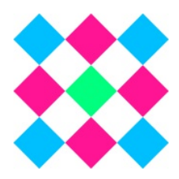
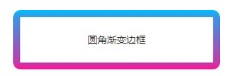

# CSS 边框

## 目录

- [CSS 边框](#css-边框)
  - [目录](#目录)
  - [昙花一现的 CSS 多边框](#昙花一现的-css-多边框)
  - [独一无二的 border-image 属性](#独一无二的-border-image-属性)
    - [约定](#约定)
    - [九宫格](#九宫格)
    - [源图像的划分](#源图像的划分)
    - [border-image-slice 属性](#border-image-slice-属性)
    - [border-image-width 属性](#border-image-width-属性)
    - [border-image-outset 属性](#border-image-outset-属性)
    - [border-image-repeat 属性](#border-image-repeat-属性)
    - [总结](#总结)
    - [border-image 缩写语法](#border-image-缩写语法)
  - [border-image 属性与渐变边框](#border-image-属性与渐变边框)
    - [圆角渐变边框](#圆角渐变边框)
      - [外层嵌套一层 \<div> 元素，然后设置圆角和溢出隐藏](#外层嵌套一层-div-元素然后设置圆角和溢出隐藏)
      - [[推荐] 使用 clip-path 剪裁，无须嵌套额外的元素](#推荐-使用-clip-path-剪裁无须嵌套额外的元素)
    - [border-image 与轮廓的模拟](#border-image-与轮廓的模拟)
    - [border 属性不能声明在 border-image 属性下方](#border-属性不能声明在-border-image-属性下方)

## 昙花一现的 CSS 多边框

浏览器对多边框曾支持过一段时间，语法示意如下：

```css
.example {
    border-right: 8px solid;
    border-right-colors: #555 #666 #777 #888 #999 #aaa #bbb #ccc;
}
```

**现已从规范中剔除**。

---

## 独一无二的 border-image 属性

相较于其他设计软件，border-image 属性是 CSS 独有的。

由于 border-image 属性过于特殊，一般很少出现在项目代码中。

- 对于开发者
  - border-image 属性的渲染机制比较怪异
  - 学习成本较高
- 对于设计师
  - border-image 属性的视觉表现和现实认知不一致
  - 当下设计趋势是扁平化而非拟物化，边框装饰通常在项目中不会出现
- 4 个边角的渲染比较尴尬
  - 实现的边框效果往往不符合预期

### 约定

约定后续所有 .example 元素都包含下面的公共 CSS 代码：

```css
.example {
    width: 80px;
    height: 80px;
    border: 40px solid deepskyblue;
}
```

### 九宫格

对于 .example 元素，border-image 属性的作用过程就是将图片划分为下图所示的 9 个区域的过程。


学习 border-image 属性的两个要点：

1. 源图像的划分
2. 九宫格尺寸的控制

### 源图像的划分

源图像示意，每个格子占据尺寸 54px x 54px：



通过下述代码将源图像的 9 个格子依次填充到 .example 元素九宫格的 9 个区域中：

```css
.example {
    border-image: url(./grid-nine.svg) 54;
}
```

渲染过程如下图所示：


boder-image 是多个属性的缩写，上述代码中 “url(...) 54” 分别对应 border-image-source 和 border-image-slice 属性

```css
.example {
    border-image: url(./grid-nine.svg) 54;
}

/* 下述代码效果相同 */
.example {
    border-image-source: url(./grid-nine.svg);
    border-image-slice: 54;
}
```

boder-image-source 语法：

> boder-image-source: \<image>

故而 border-image-source 和 background-image 属性类似。

### border-image-slice 属性

语法：

> border-image-slice: \<number-precentage>{1,4} && fill?

表示支持 1~4 个数值或 1~4 个百分比值，后面可选带有一个关键字 fill。

border-image-slice 属性的作用是**对原始的图像进行划分**，划分的方向和顺序同 margin、padding 属性一样。

border-image-slice: 20 表示在距离源图像上方 20px、右侧 20px、下方 20px、左侧 20px 进行划分，划分线的位置如下图所示：


默认情况下，源图像划分的中心位置不参与填充，剩余的区域均会被拉伸，因此，最终的渲染效果如下图所示：


添加 fill 关键字，可以得到具有填充效果的结果：

```css
.example {
    border-image-source: url("./grid-nine.svg");
    border-image-slice: 33.33% fill;
}
```


默认 border-image-slice: 100%，渲染效果如下图所示：


**控制 border-image 划分的九宫格尺寸的属性是 border-image-width、border-image-outset**。

### border-image-width 属性

border-image-width 属性和 border-width 属性支持的参数个数一致，不同数量值所对应的方位规则也一致。

两者支持的属性值类型示意：

| 值类型       | border-width            | border-image-width |
| :----------- | :---------------------- | :----------------- |
| 初始值       | medium                  | 1                  |
| 长度值       | √                       | √                  |
| 数值         | ×                       | √                  |
| 百分比值     | ×（暂时）               | √                  |
| 关键字属性值 | thin \| medium \| think | auto               |

boder-image-width 属性支持使用数值作为属性值，这个数值会**作为系数和 border-width 的宽度值相乘**，最终计算值作为边框图片宽度。

下图是声明 border-image-width: 0.75/1/1.5 的九宫格示意图和实际的渲染效果。


border-image-width 属性值设置具体长度值，如 60px、5em 等，则九宫格的宽度与 border-width 属性没有关系。

border-image-width 属性的百分比属性值，**相对于元素自身的尺寸计算**，水平方向相对于宽度计算，垂直方向先对于高度计算。

```css
.example {
    border-image: url(./grid-nine.svg) 54;
    border-image-width: 50% 20%;
}
```


border-image-width: auto 表现，会使用 border-image-slice 属性划分的尺寸作为九宫格宽度值

```css
.example {
    border-image: url(./grid-nine.svg) 54;
    border-image-width: auto; /* 即 54 */
}
```

border-image-width 和 border-width 属性均不支持负值。

border-image-width 的宽度值很可能会超过元素自身的尺寸：

```css
.example {
    border-image: url(./grid-nine.svg) 54;
    border-image-width: 100% 50%;
}

.example {
    border-image: url(./grid-nine.svg) 54;
    border-image-width: 4 3 2 1;
}
```

此时，border-image-width 属性的宽度表现遵循**等比例原则**和**百分百原则**，九宫格宽度**不超过元素对应方向的宽度，同时保持设置的数值比例**。

### border-image-outset 属性

outset 与 offset 区分：

- outset - 向外扩张
  - 只支持正值
- offset - 可以向内或向外扩张
  - 支持正负值

border-image-outset 属性的正式语法：

> border-image-outset: [ \<length> | \<number> ]{1, 4}

支持 1~4 个数值或长度值，支持数值和长度值混合使用：

```css
/* 长度值 */
borde-image-outset: 1rem;
/* 数值 */
border-image-outset: 1.5;
/* 垂直 | 水平 */
border-image-outset: 1 0.5;
/* 上 | 垂直 | 下 */
border-image-outset: 30px 2 40px;
/* 上 | 右 | 下 | 左 */
border-image-outset: 10px 15px 20px 25px;
```

border-image-outset 数值属性值**相对于 border-width 计算**。

```css
.example {
    border-image: url(./grid-nine.svg) 54;
    border-image-outset: 20px;
}
```

border-image-ouset 扩展的 20px 指九宫格中间区域的上、右、下、左 4 个方向的尺寸都扩大了 20px。渲染结果如下图所示：


border-image-outset 属性扩展出去样式，不会影响布局，也不会影响鼠标经过行为或者点击行为。

### border-image-repeat 属性

border-image-repeat 属性**可以控制九宫格上、右、下、左 4 个区域的图像的平铺规则**。


语法：

> border-image-repeat: [ stretch | repeat | round | space ]{1, 2}

该属性强制**水平方向的两条边的平铺规则必须一样**，垂直方向的两条边的平铺规则必须一样。

属性值关键字含义：

- stretch - 默认值
  - 源图像拉伸以充满显示区域
- repeat
  - 源图像紧密相连平铺，保持原比例，平铺单元在边界位置可能会被截断
- round
  - 源图像紧密相连平铺，适当伸缩，以确保平铺单元在边界位置不会被截断
- space
  - 源图像保持原始尺寸，平铺时彼此保持适当的等宽间隙，以确保平铺单元在边界位置处不会被截断
  - 如果区域的尺寸不足以呈现至少一个源图像单元，则会议空白呈现
  - 目前兼容性不足，谨慎使用

不同 border-image-repeat 属性值的渲染结果：


### 总结

- border-image-slice
  - 用于划分源图像
- border-image-width
  - 用于控制九宫格第一区到第八区的尺寸
- border-image-outset
  - 用于控制九宫格最中间第九区的尺寸
- border-image-repeat
  - 用于控制九宫格上右下左四个区域的图像平铺规则

### border-image 缩写语法

正式语法：

> border-image: <'border-image-source'> || <'border-image-slice'> [/ <'border-image-width'> | / <'border-image-width'>?  / <'border-image-outset'> ]? || <'border-image-repeat'>

语法被 || 符号分为 3 部分，分别是**资源引入**、**尺寸控制**和**平铺规则**，三部分可以任意组合显示。

重点在尺寸控制部分语法，结合上述语法说明，得出下列合法的声明：

```css
/* slice: 54 */
border-image: 54;
/* slice: 54, width: 20px */
border-image: 54 / 20px;
/* slice: 54, outset: 20px */
border-image: 54 // 20px;
/* slice: 54, width: 20px, outset: 20px */
border-image: 54 / 20px / 20px;
```

由于尺寸控制相关的 3 个 CSS 属性都支持 4 个方位的分别设置，因此 border-image 最复杂的缩写：

```css
.example {
    border-image: url(./grid-nine.svg) 54 33.33% 33.33% 54 / 10px 20px 30px 1 / 1 30 20px 10px round space;
}
```

---

## border-image 属性与渐变边框

实际项目中，常用 border-image 配合 CSS 渐变实现渐变边框、条纹边框。

```html
<style>
    .border-linear-gradient {
        border-style: solid;
        border-image: linear-gradient(deepskyblue, deeppink) 20 / 10px;
    }

    .border-radial-gradient {
        border-style: solid;
        border-image: radial-gradient(deepskyblue, deeppink) 20 / 10px;
    }
</style>

<p class="border-linear-gradient">上下渐变边框</p>
<p class="border-radial-gradient">径向渐变边框</p>
```

上述代码渲染结果：


border-image 属性重新定义元素的虚线边框，虚线的尺寸和虚实比例可以随意控制：

```html
<style>
    .border-dashed {
        border: 1px dashed deepskyblue;
        border-image: repeating-linear-gradient(135deg, deepskyblue, deepskyblue 5px, transparent 5px, transparent 10) 1;
    }
</style>

<div class="border-dashed">1:1 的虚线</div>
```

自定义的跨浏览器统一样式的虚线边框：


[border-image实现渐变边框、条纹边框实例](https://demo.cssworld.cn/new/3/3-7.php)

[border-image实现渐变边框、条纹边框实例 - 备份](demo/03-border-image%20模拟边框三连.html)

### 圆角渐变边框

使用 border-radius 属性无法改变 border-image 属性生成的图形效果，需要其他方法：

#### 外层嵌套一层 \<div> 元素，然后设置圆角和溢出隐藏

```css
.father {
    border-radius: 10px;
    overflow: hidden;
}
```

#### [推荐] 使用 clip-path 剪裁，无须嵌套额外的元素

```css
.clip-path {
    clip-path: inset(0 round 10px);
}
```



[border-image实现与圆角渐变边框实例](https://demo.cssworld.cn/new/3/3-8.php)

[border-image实现与圆角渐变边框实例 - 备份](demo/04-圆角渐变边框.html)

### border-image 与轮廓的模拟

CSS 中共有 3 个属性可以实现对布局没有任何影响的轮廓扩展，分别是 outline 轮廓、box-shadow 盒阴影、border-image 边框图片。

场景：元素在被选中后外部有 2px 宽的深天蓝色轮廓

```css
.selected {
    outline: 2px solid deepskyblue;
}

.selected {
    box-shadow: 0 0 0 2px deepskyblue;
}

.selected {
    border: .02px solid;  /* Chrome 浏览器中 0px 无效果 */
    border-image: linear-gradient(deepskyblue, deepskyblue) 2 / 2px / 2px;
}
```

实现轮廓效果的 CSS 属性的特征对比表：


得出以下结论：

- 需要轮廓带有渐变效果
  - 一定使用 border-image 属性
- 需要轮廓效果为纯色，且为直角
  - 优先使用 outline 属性
  - 其次 box-shadow
  - 最后 border-image
- 需要轮廓有圆角效果
  - 一定使用 box-shadow 属性
- 需要轮廓和元素之间有一段间隙
  - 优先使用 outline 属性
  - 其次 borer-image 属性
- 需要轮廓只有一个方向
  - 不考虑 outline 属性
- 需要兼容 IE 浏览器
  - 不考虑 border-image 属性

### border 属性不能声明在 border-image 属性下方

**border 属性的简写中包含了 border-image 相关属性的信息**。
