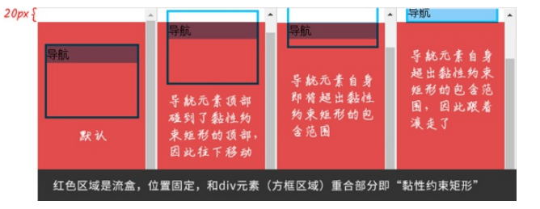

# position 属性的增强

- positon: sticky
  - 黏性定位
- position: relative
  - 相对定位
- position: absolute
  - 绝对定位
- position: fixed
  - 固定定位
- position: static
  - 静态定位

## 目录

- [position 属性的增强](#position-属性的增强)
  - [目录](#目录)
  - [深入了解 sticky 属性值与黏性定位](#深入了解-sticky-属性值与黏性定位)
    - [黏性定位是相对定位的延申](#黏性定位是相对定位的延申)
    - [可滚动元素对黏性定位的影响](#可滚动元素对黏性定位的影响)
    - [深入理解黏性定位的计算规则](#深入理解黏性定位的计算规则)
    - [黏性定位的堆叠规则](#黏性定位的堆叠规则)
    - [其他细节](#其他细节)
  - [position: sticky 声明的精彩应用 -- 层次滚动](#position-sticky-声明的精彩应用----层次滚动)
    - [实现原理](#实现原理)

## 深入了解 sticky 属性值与黏性定位

sticky 属性值的设计初衷：将原来由 JavaScript 才能实现的黏性效果改由 CSS 实现。

关键代码：

```css
nav {
    position: sticky;
    top: 0;
}
```

[黏性定位实现](https://demo.cssworld.cn/new/3/4-1.php)

[黏性定位实现 - 备份](demo/05-黏性定位实现.html)

### 黏性定位是相对定位的延申

黏性定位和相对定位相似的地方

- 元素发生偏移时，元素的原始位置是保留的
- 创建了新的绝对定位包含块
  - 黏性定位元素中若有绝对定位的子元素，那么该元素设定的方向偏移属性均**相对于当前黏性定位元素**
- 支持设置 z-index 属性值来改变元素的层叠顺序
  
黏性定位和相对定位不一样的地方

- 偏移计算元素不一样
  - 相对定位偏移计算的容器是父元素
  - 黏性定位偏移计算的元素是层级最近的可滚动元素（元素 overflow 属性值不为 visible），直到相对浏览器视窗进行位置偏移
- 偏移定位计算规则不一样
  - 黏性定位的计算规则比较复杂，涉及多个黏性定位专有的概念
- 重叠表现不一样
  - 相对定位元素彼此独立，元素重叠时表现为**堆叠**
  - 黏性定位元素在特定布局结构下，元素重叠时视觉表现为**元素相互排斥**

### 可滚动元素对黏性定位的影响

通常的 Web 页面都是**窗体滚动**，而黏性定位偏移计算的元素是层级最近的滚动元素。

```html
<style>
    div {
        overflow: hidden;
    }

    nav {
        position: sticky;
        top: 0;
    }
</style>
```

对于上述代码，滚动页面时，\<nav> 元素没有黏性效果，由于此时 \<nav> 元素黏性定位的偏移计算相对于父级 \<div> 元素计算，黏性效果只有在 \<div> 元素滚动时才能够体现。

因此，如果网页使用窗体滚动，且希望有黏性效果，那么**务必保证黏性定位元素的祖先元素中没有可滚动元素**。

### 深入理解黏性定位的计算规则

如果黏性定位元素的父元素的高度和黏性定位元素的高度相同，则垂直滚动时，黏性定位效果不会出现。

黏性定位中**流盒**（flow box）概念，指**黏性定位元素最近的可滚动元素的尺寸盒子**，如果没有可滚动元素，则表示浏览器视窗盒子。

黏性定位中**黏性约束矩形**概念，指黏性定位元素的包含块（通常是父元素）在文档流中呈现的矩形区域和流盒的 4 个边缘在应用黏性定位元素的 left、top、right、bottom 属性的偏移计算值后的新矩形的交集。

由于滚动时流盒不变，黏性定位元素的包含块会随之滚动，因此黏性约束矩形随着滚动的进行实时变化。

代码示例：

```html
<style>
    body {
        height: 2000px;
    }

    div {
        height: 100px;
        margin-top: 50px;
        border: 1px solid deepskyblue
    }

    nav {
        position: sticky;
        top: 20px;
        background: lightskyblue;
    }

    .flow-box {
        position: fixed;
        top: 20px;
        left: 0;
        right: 0;
        bottom: 0;
        background-color: #d30000;
        opacity: 0.7;
    }
</style>

<div>
    <nav>导航</nav>
</div>
<s class="flow-box"></s>
```

随着滚动的进行，\<nav> 元素的黏性约束矩形范围和实际的渲染表现如图所示：



[黏性约束矩阵](https://demo.cssworld.cn/new/3/4-2.php)

[黏性约束矩阵 - 备份](demo/06-黏性约束矩阵.html)

由于 \<nav> 黏性定位元素的 top 偏移是 20px，因此，流盒矩形就是滚动窗口矩形再往下偏移 20px 即图示中的所示区域。

而 \<nav> 黏性定位元素的包含块就是其父元素 \<div>，黏性约束矩形指的是流盒矩形和包含块的重叠区域。

当黏性定位元素的父元素和自身高度计算值一样时，没有黏性效果，因此此时包含块高度和黏性定位元素的高度相同，导致黏性约束矩形的最大高度和粘性定位元素的高度相同，黏性定位元素已经完全没有了实现黏性效果的空间。

### 黏性定位的堆叠规则

黏性定位元素的偏移由容器决定，如果多个黏性定位元素在同一容器中，则这几个黏性定位元素会产生元素重叠的情况。

如果黏性定位元素分布在不同在容器中，同时这些容器在布局上是紧密相连的，则视觉上会表现为新的黏性定位元素挤开原来的黏性定位元素，形成依次占位的效果。

场景：按字母排序的通讯录页面，希望在页面滚动时将 26 个字母依次在页面的顶部

关键代码：

```html
<style>
h6, dt {
    position: sticky;
    top: 0;
}
</style>

<h6>A</h6>
<ul>
<li>Alice</li>
</ul>
<h6>B</h6>
<ul>
<li>贝贝王爷有点萌</li>
</ul>
------
<dl>
<dt>A</dt>
<dd>Alice</dd>
</dl>
<dl>
<dt>B</dt>
<dd>贝贝王爷有点萌</dd>
</dl>
```

在第一种 HTML 代码结构中，随着页面的滚动，A~Z 所在字母元素相互重叠。

在第二种 HTML 代码结构中，随着页面的滚动，A~Z 所在的字母元素会依次推上去。

[黏性元素的重叠表现](https://demo.cssworld.cn/new/3/4-3.php)

[黏性元素的重叠表现 - 备份](demo/07-黏性元素的重叠表现.html)

当黏性定位元素分布在不同容器时，会分别产生不同的黏性约束矩形。这些黏性约束矩形依次排列，随着流盒的滚动，黏性约束矩形依次向上。

而当黏性定位元素共用一个黏性约束定位矩形时，便表现为互相覆盖了。

### 其他细节

Safari 浏览器使用黏性定位需要添加 -webkit- 私有前缀。

黏性定位元素同时设置 top 属性、bottom 属性，此时上下两个方位的黏性效果会同时生效。水平方向的 left、right 属性，同理。

---

## position: sticky 声明的精彩应用 -- 层次滚动

配合 top 黏性定位和 bottom 黏性定位可以实现带有视差效果的层次滚动。

[黏性定位与层次滚动效果实现](https://demo.cssworld.cn/new/3/4-4.php)

[黏性定位与层次滚动效果实现 - 备份](demo/08-黏性定位与层次滚动效果实现.html)

### 实现原理

为标题和评论元素都设置黏性定位，评论元素同时设置 z-indexL: -1，将其隐藏在内容元素后面

```css
h4 {
    position: sticky;
    top: 0;
}

footer {
    position: sticky;
    bottom: 50vh;
    /* 默认隐藏在其他元素之后 */
}
```

每一段标题和评论元素都使用 \<section> 元素进行包裹，让黏性定位元素隶属于不同的容器元素，实现依次置顶占位的效果。
