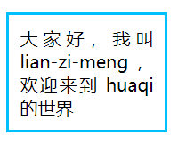

# 字符单元的中断与换行

有大量的 CSS 特性可以对**字符单元的中断与换行进行精确控制**。

## 目录

- [字符单元的中断与换行](#字符单元的中断与换行)
  - [目录](#目录)
  - [字符单元默认的中断与换行规则](#字符单元默认的中断与换行规则)
  - [使用 keep-all 属性值优化中文排版](#使用-keep-all-属性值优化中文排版)
  - [break-all 属性值的问题和 line-break 属性](#break-all-属性值的问题和-line-break-属性)
    - [意外情况](#意外情况)
  - [hyphens 属性与连字符](#hyphens-属性与连字符)
    - [中文场景下没有用处的 hyphens: auto](#中文场景下没有用处的-hyphens-auto)
    - [设用 hyphens 属性的默认特性以设置类似 auto 属性值的排版体验](#设用-hyphens-属性的默认特性以设置类似-auto-属性值的排版体验)
  - [\<wbr> 与精确换行的控制](#wbr-与精确换行的控制)
    - [\<wbr> 实现换行原理](#wbr-实现换行原理)
    - [IE 浏览器的兼容处理](#ie-浏览器的兼容处理)
    - [\<wbr> 与 \<br> 换行的区别](#wbr-与-br-换行的区别)
    - [其他](#其他)
    - [word-break:keep-all 与 \<wbr> 配合使用](#word-breakkeep-all-与-wbr-配合使用)
    - [总结](#总结)

## 字符单元默认的中断与换行规则

- Space 普通空格、Enter（回车）空格和 Tab（制表符）空格这三种空格无论怎么样组合都会**合并为单个普通的空格**。
- 文字可以在 CJK 文本、普通空格和短横线连字符处换行，连续英文单词和数字不换行。

若不希望 Enter（回车）空格合并为普通空格，需要保留换行效果，可以声明 white-space 属性进行设置。

如何实现 CJK 文本不换行，但在空格处正常换行？

---

## 使用 keep-all 属性值优化中文排版

word-break 属性语法如下：

> word-break: normal | break-all | keep-all | break-word

元素声明 word-break: keep-all 可以使 CJK 文本不换行排版，同时又不影响非 CJK 文本的排版行为。

结合上述说明，word-break: keep-all 可以优化中文词语的显示，例如，并不会将“会议人员”如默认情况下，将四个字断开进行显示。

---

## break-all 属性值的问题和 line-break 属性

元素声明 word-break: break-all 可以使连续英文字符和数字断开，以优化内容溢出容器时的渲染效果。

并不推荐诸如下述声明：

```css
* {
    word-break: break-all;
}
```

应用 word-break: break-all 声明是为了少数场景下可能出现的排本问题，使用全局声明牺牲了大多数场景的阅读体验。

```html
<style>
    p {
        width: 150px;
        padding: 10px;
        border: solid deepskyblue;
    }

    .break-all {
        word-break: break-all;
    }
</style>

<p>本节会大量出现“CJK文本”这个词</p>
<p class="break-all">本节会大量出现“CJK文本”这个词</p>
```

渲染结果如下图所示：


站在用户阅读体验的角度来看，使用 word-break: break-word（表现为尽量不断开单词）所带来的收益要大于声明 word-break: break-all。

在大多数产品经理和设计师眼中，视觉上的愉悦要比阅读时的舒适度更重要，因为 word-break: break-word 声明在有大段连续英文字符的情况下会留下较大的空白。因此在现实世界中，只要**文本内容是用户动态生成的，都是使用 word-break: break-all 声明。**

### 意外情况

连续的破折号、连续的点字符，以及避首标点在设置 word-break: break-all 声明后无法换行。

修改 HTML 内容，在最后每行文字后插入一段连续的破折号，Edge 浏览器的渲染效果如下图所示：


破折号不换行的问题在 Chrome 浏览器和 Firefox 浏览器中同样存在，想要让连续的破折号换行，可以使用 break-word 属性值。

CSS 中有 3 个属性都有 break-word 属性值，且它们的作用都一样。

```css
word-break: break-word;
word-wrap: break-word;
overflow-wrap: break-word;
```

上述代码中，考虑到 IE 浏览器和 Edge 浏览器不支持 overflow-wrap 属性，以及 IE 浏览器和 Edge 浏览器虽然支持 word-break 属性，却不支持 word-break: break-word 声明，**最终动态内容的换行控制可以优化为下述代码**：

```css
p {
    /* 字符换行主力 */
    word-break: break-all;
    /* 兼容 IE 浏览器和 Edge 浏览器的破折号换行 */
    word-wrap: break-word;
    /* 希望中文标点也能换行 */
    line-break: anywhere;
}
```

---

## hyphens 属性与连字符

hyphens 是专为英文场景设计的一个属性，这个属性可以让英文单词断开换行的时候带上连字符（即短横线），使读者知晓上一行的尾部与下一行的头部是一个完整单词。

语法：

> hyphens: none | manual | auto

属性值 auto 可以让英文单词在行尾自动换行，同时带上短横线。

注：英文单词换行不需要设置 word-break 或者 word-wrap 属性，hyphens 属性自带换行能力。若设置 word-break: break-all 声明，反而不会有短横线效果。

### 中文场景下没有用处的 hyphens: auto

具体原因：

- 需要在英语环境下，即祖先元素设置 lang="en" 属性
- 由于中文语句中随时可以换行，因此在中文场景下，没有 hyphen 属性发挥的地方
- 若中文场景下遇到长串的连续字母和单词，大概率是 URL 网址或特殊字符串，而在网址换行位置添加短横线会导致原本正确的网址变为错误的网址
- 只有在 Android 操作系统下和 macOS 下的 Chrome 浏览器中才有效果，在用户量较大的 Windows 操作系统中无效

### 设用 hyphens 属性的默认特性以设置类似 auto 属性值的排版体验

hyphens 属性的默认值是 manual，表示单词在有换行机会的时候才换行，其中一个常见的换行机会就是连字符。

连字符总共分为两种：

- 硬连字符（U+2010）
  - 可见的换行机会
  - 即键盘上的短横线“-”
- 软连字符（U+00AD）
  - 不可见的换行机会
  - 通常情况下隐藏
  - 若浏览器觉得有必要在软连字符所在位置打断单词，则该连字符会变为可见

在 HTML 中，&shy 表示软连字符，也可以用 Unicode 编码表示 &#x00AD。

两端对齐中使用软连字符进行布局优化：

```html
<style>
    p {
        width: 120px;
        padding: 10px;
        border: solid deepskyblue;
        text-align: justify;
        text-justify: inter-ideograph;
    }
</style>

<p>大家好，我叫lian&shy;zi&shy;meng，欢迎来到 huaqi 的世界</p>
```



对比上图中的一二行，可以明显感受到软连字符在两端对齐中对文字渲染的优化。

由于软连字符需要提前手动插入，因此，这种排版优化只适合固定文本内容的静态场景。

若需要取消软连字符的换行特性，可以使用 hyphens: none，但 Chrome 浏览器中并不支持 hyphens: none 声明，因此没有实用价值。

**软连字符兼容性极好**。

---

## \<wbr> 与精确换行的控制

HTML 中的 \<wbr> 元素标签，可以**实现英文和数字的精确换行**。

具体效果：

- 宽度足够
  - 不换行
- 宽度不足
  - 在 \<wbr> 元素所在位置进行换行
  - 即 \<wbr> 元素提供了一个换行机会

### \<wbr> 实现换行原理

\<wbr> 会创建一个带有换行特性的宽度为 0px 的空格。

该空格的 Unicode 编码为 U+200B，因此 \<wbr> 标签也可以替换为 &#x200b。

### IE 浏览器的兼容处理

IE 浏览器并不支持 \<wbr> 标签，但有简单的方法可以使 IE 浏览器兼容 \<wbr> 的换行特性，即：

```css
wb:after {
  content: "\00200B";
}
```

### \<wbr> 与 \<br> 换行的区别

\<wbr> 是 “Word Break Opportunity” 的缩写，表示**有机会就断开换行**。

\<br> 直接换行显示，无论宽度是否足够。

### 其他

\<wbr> 换行和 &shy; 换行的区别在于 \<wbr> 在换行时不会有额外的字符显现。

\<wbr> 非常适合用于非英文单词的内容换行，例如 URL 网址或名称字符较长的 API 名称。

### word-break:keep-all 与 \<wbr> 配合使用

word-break: keep-all 声明可以让 CJK 文本不换行，在此基础上，可以在 CJK 文本的恰当位置插入 \<wbr> 标签，优化在容器宽度不足时，文本的排版效果。

### 总结

动态文本内容换行使用 word-break: break-all 和 word-wrap: break-word 组合代码，若要彻底换行，还可以使用 line-break: anywhere。

静态内容排版不建议使用 word-break 属性、word-wrap 属性或 line-break 属性，若是英文单词，则使用 &shy;、软连字符优化排版；若是非英文单词，则使用 \<wbr> 元素优化排版。
