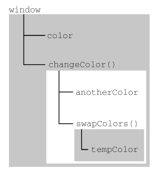

# JavaScript 的执行上下文和作用域

## 目录

- [JavaScript 的执行上下文和作用域](#javascript-的执行上下文和作用域)
  - [目录](#目录)
  - [概念](#概念)
  - [全局上下文](#全局上下文)
  - [执行上下文的销毁](#执行上下文的销毁)
  - [函数调用与执行上下文](#函数调用与执行上下文)
  - [作用域链](#作用域链)
    - [变量对象和活动对象](#变量对象和活动对象)
    - [作用域链的作用](#作用域链的作用)
      - [局部作用域定义的变量可用于在局部上下文中替换全局变量](#局部作用域定义的变量可用于在局部上下文中替换全局变量)
  - [作用域链增强](#作用域链增强)
    - [with 语句代码示例](#with-语句代码示例)

## 概念

变量或函数的执行上下文决定了它们可以访问哪些，也决定了它们的行为。

每个执行上下文都有一个与之关联的**变量对象**（ variable object ），该执行上下文中定义的所有变量和函数都保存在变量对象中。

**无法通过代码访问变量对象。**

后台处理数据会使用变量对象。

---

## 全局上下文

全局上下文是最外层的上下文。根据 ECMAScript 实现的宿主环境，表示全局上下文的对象可能不一样。

在浏览器中，全局上下文即 window 对象，所有通过 var 定义的全局变量和函数都会称为 window 对象的属性和方法。

**使用 let 和 const 的顶级声明不会定义在全局上下文中**。

使用 var 与 使用 let 和 const 的全局变量和函数声明在作用域链解析上效果是一样的。

---

## 执行上下文的销毁

执行上下文在其所有代码都执行完毕后会被销毁，包括定义在其上面的所有变量和函数。

全局上下文在应用退出前才会被销毁，别入关闭网页或退出浏览器。

---

## 函数调用与执行上下文

每个函数调用都有自己的上下文。（为方便理解，笔者将函数体类比作函数的执行上下文）。当代码执行流进入函数时，函数的执行上下文会被推到一个**执行上下文栈**上。每当一个函数执行完毕，执行上下文栈会弹出该函数的执行上下文，将控制权返还给之前的执行上下文。

**ECMAScript 程序的执行流由上述执行上下文栈控制**。

---

## 作用域链

执行上下文中的代码在执行时，根据自身的变量对象的创建一个**作用域链**（ scope chain ）。该作用域链决定了**各级上下文中的代码在访问变量和函数时的顺序**。

正在执行的代码的执行上下文的变量对象，始终位于作用域链的最前端。

如果上下文是函数，则其变量对象就是其**活动对象**（ activation object ）。

### 变量对象和活动对象

笔者认为，变量对象和活动对象是同一种I在不同时期的不同叫法。

当执行上下文栈调用函数时，**进入该函数的执行上下文创建时期，此时称为变量对象**，在 JS 环境中不可访问。

**在执行上下栈开始执行该函数的执行上下文时，变量对象被激活为活动对象**。

活动对象最初只有一个定义变量：arguments。（全局上下文以及箭头函数上下文没有这个变量），作用域链中的下一个变量对象来自此时包含上下文，以此类推，全局上下文的变量对象始终是作用域链的最后一个变量对象。

### 作用域链的作用

代码执行时的标识符解析，**通过沿作用域链逐级搜索标识符名称完成**。搜索过程始终从作用域链的最前端开始，然后逐级往后，直到找到标识符；或找到全局上下文仍未找到，则报错。

```javascript
var color = "blue";

function changeColor() {
    if (color === "blue") {
        color = "red";
    } else {
        color = "blue";
    }
}

changeColor();
```

由于 JS 采用词法作用域，函数 changeColor() 的作用域链包含两个对象：第一个自己的变量对象，第二个则是全局上下文的变量对象。该函数之所以能够访问变量 color，是因为可以在其作用域中查找到变量 color 。

#### 局部作用域定义的变量可用于在局部上下文中替换全局变量

```javascript
var color = "blue";

function changeColor() {
    let anotherColor = "red";

    function swapColors() {
        let tempColor = anotherColor;
        anotherColor = color;
        color = tempColor;

        // 这里可以访问 color、anotherColor、tempColor
    }

    // 这里仅可以访问 color、anotherColor
}

// 这里尽可以访问 color
changeColor();
```

上述代码所涉及的上下文及其包含的变量和函数

- 全局上下文
  - 一个变量 color
  - 一个函数 changeColor()
- changeColor() 的局部上下文
  - 一个变量 anotherColor
  - 一个函数 swapColor()
- swapColors() 的局部上下文
  - 一个变量 tempColor

上述代码的作用域链图示



上图中的不同颜色的矩形表示不同的上下文。**内部上下文可以通过作用域链访问其外部上下文的一切，但外部上下文无法访问其内部上下文的任何东西**。

作用域链的上下文之间的连接是线性其有序的。

swapColors() 局部上下文的作用域链有 3 个对象，从前到后依次是 swapColors() 的变量对象、changeColor() 的变量对象、全局上下文的变量对象

changeColor() 局部上下文的作用域链有 2 个对象，从前到后依次是 changeColor() 的变量对象、全局变量对象。

---

## 作用域链增强

执行上下文种类：

- 全局上下文
- 函数上下文
- eval() 调用内部存在第三种上下文

JS 有其他方式以增强作用域链。**某些语句会导致在作用域链前端临时添加一个上下文**，该上下文在代码执行后会被删除。

通常在两种情况下会出现上述现象：

- try/catch 语句的 catch 块
  - 创建一个新的变量对象，该变量对象会包含要抛出的错误对象的声明。
- with 语句
  - 向作用域链前端添加指定的对象

### with 语句代码示例

```javascript
function buildUrl() {
    let qs = "?debug=true";

    with(location) {
    let url = href + qs;
    }

    return url; // undefined
}
```

**with 语句将 location 对象作为执行上下文**，因此 location 会被添加到作用域链前端。

buildUrl() 函数中定义了变量 qs。

当 with 语句中的代码引用变量 href 时，实际上引用的时 location.href，即自身变量对象的属性。在引用变量 qs 时，引用的则是 buildUrl() 函数上下文中的变量对象定义的变量 qs。

上述代码中，若使用 var 声明变量 url，则变量 url 会称为函数上下文的变量对象的一部分，此时可以作为函数的值返回。但此时使用 let 声明变量 url，则变量 url 被限制在块级作用域中，在 with 块之外为 undefined。

对于 let 变量声明所定义的块作用域，可以看看[变量声明 - 《JavaScript 高级程序设计》笔记](https://blog.csdn.net/huaqi_/article/details/125983279)
